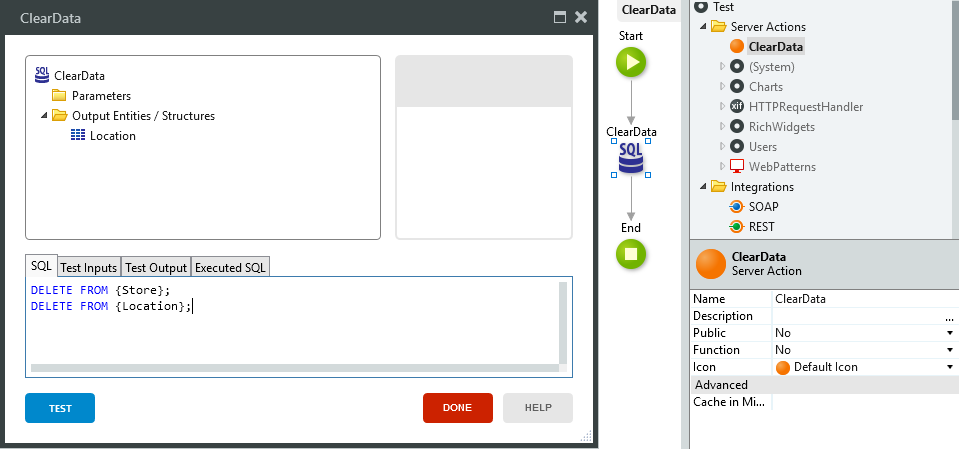
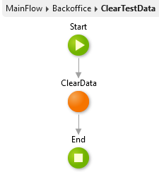

# How to delete data from Entities

How do I erase test data from Entities? 

For example: I have two Entities (`Location` and `Store`) with test data, and I wish to clear them both. 

Note: My `Store` Entity has a Foreign Key to my `Location` Entity.

## Answer

To delete all test data from your Entities you need to create your own logic and a back office screen. Follow these steps:

1. Create a new Server Action (in this case **ClearData**) and add a SQL Query. Add a "dummy" Output Entity/Structure to the SQL Query, in this case `Location`.

1. Add the following SQL snippet to the SQL Query:

        DELETE FROM {Store};
        DELETE FROM {Location};

    This will first delete all data from the `Store` Entity and then it will delete all data from the `Location` Entity. The order of deletion is important, first delete data from the child Entity (that references another Entity) and only then delete data from the parent Entity.
    
    

1. Create a new Web Screen (in this case **BackOffice**), add a Button to it and set the `On Click`>`Destination` to a new Screen Action, in this case **ClearTestData**.

1. Inside the **ClearTestData** Screen Action call the **ClearData** Server Action.

    
    
    
