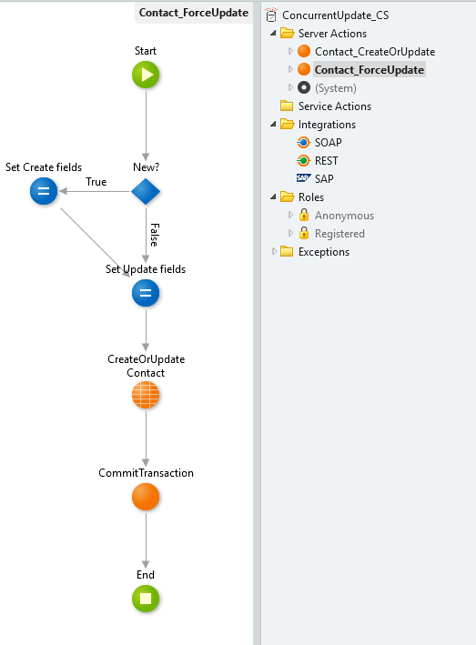
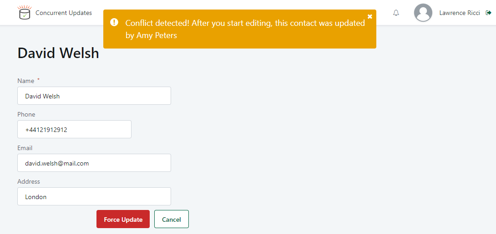

# How To Handle Concurrent Updates on Application Data Records

When you have several users collaborating on the same process, eventually you may have several users updating the same data record simultaneously.

How should we handle concurrent updates to avoid users smashing each other updates?

## Answer

In this article we’re going to see how we can deal with this challenge, implementing a **optimistic concurrency strategy**, trying to detect update conflicts on the saving of the record and allow the user to act up on them.

To prevent other transactions from accessing a record, OutSystems entities have a **GetForUpdate** action that allows to lock the record while it’s being updated. This will handle concurrency, but you still need to deal with the conflicts on record updates, as a user is still able to overwrite a record without knowing it has been updated by another use.

To better understand how the requests are processed, check the documentation on [Handling Transactions](https://success.outsystems.com/Documentation/11/Reference/OutSystems_Language/Data/Database_Reference/Handling_Transactions).

In order to avoid data being overwritten, due to simultaneous updates of different users, a possible approach is to implement some logic to **control the save operation**.

### Control Save Operation

Looking at the Save action flow we can see that it already contains the logic for the record creation and edition.

On this action, we’ll be adding a new business rule that checks if any update has occurred after you access it, and raises an exception if that’s the case, canceling the save operation.

An advantage of abstracting the saving operation of a data record into an isolated action is that you can easily change it, adding new business rules without changing its inputs and outputs.

To help with this, we’ll take advantage of a commonly used pattern, the audit attributes (e.g.: CreatedBy, CreatedOn, UpdatedBy, UpdatedOn). With these attributes, we will be able to check if the record you are trying to save has been updated since the last time you accessed it from the database.

This is how the action looks like after adding the control logic:

**1-** We’ll start by getting the record currently in the database, locking it for update to prevent others to access it while the update is not concluded. GetForUpdate entity action is especially important when you have high volume of users editing the same record, what increases the chance of simultaneous update transactions.

**2-** Then, validating if that record was updated, comparing the UpdatedOn attribute with the record we are currently saving. Use the condition:
`GetSavedContact.List.Current.Contact.UpdatedOn > Contact.UpdatedOn`

**3-** If we detect a concurrent update, we raise a User exception, doing a rollback on this transaction. Otherwise, the flow proceeds to the normal record update, also updating the audit fields (Updatedby, UpdatedOn).
Note that in this example, we are also getting the information of the user that has updated the record, for context.

#### Force Update

In some use cases (depending on your business requirements), you may want to force the update, as you’re certain that you have the latest information.

If that’s the case you can slightly change the interface to force the update on the database, with the information you have input.

As we saw before we are raising a User exception when there’s a concurrency conflict. Then, on the user action of the interface, let’s catch this exception and enable the Force Update option that the user can then decide to go for.

The Force Update action would be a simple Contact update server action, as we had before the Concurrency validation (don’t forget the auditing fields).

## Sample

To better support you on the implementation, a sample application - [**Concurrent Updates Sample**](https://www.outsystems.com/forge/Component_Overview.aspx?ProjectId=6779&ProjectName=Concurrent+Updates+Sample) - is available for download in the OutSystems Forge. Follow the steps to test the above solution:

1. With two different users (User A - Amy Peters and User B - Lawrence Ricci) logged in, access the same record.

1. Amy Peters (User A) edits a field and saves the changes.

    

1. Lawrence Ricci (User B) edits a field (it can even be the same) and tries to save the changes. A warning message will be prompted indicating that a conflict was detected.

    

1. Lawrence Ricci (User B) can then decide to force the update with its data or to cancel, keeping the data that User A has saved.

    
