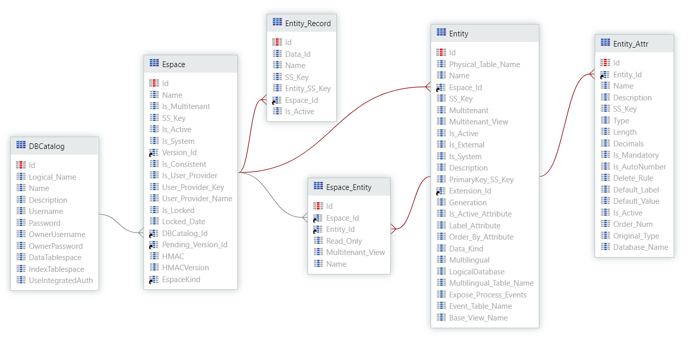

# Factory Database

When creating new Modules and publishing new versions with Entities and Static Entities this information is managed and maintained in the system’s entities.

## Entity-Relationship Model

The following diagram shows the relationships between Entities, Entity Records, Entity attributes, DB Catalogs, and Modules.

<div class="info" markdown="1">

Espace is the old name used by OutSystems for Module. This diagram uses the term Espace.

</div>



* Service Studio
    * Publishing Modules or Cloned Modules with new or changed Entities  

* Integration Studio
    * Publishing Extensions with new or changed Entities  

* Service Center
    * Uploading and Publishing Applications, Solutions, Modules and Extensions  

* Lifetime
    * Pushing Applications other Environments  

* References to the Exposed Entities and methods

* API
    * [DB Cleaner API](https://success.outsystems.com/Documentation/11/Reference/OutSystems_APIs/DbCleaner_API)
    * [Lifetime API](https://success.outsystems.com/Documentation/11/Reference/OutSystems_APIs/LifeTime_API_v2)  

## Considerations

<div class="info" markdown="1">

Espace is the old name used by OutSystems for Module. The metamodel still uses the term Espace.

</div>

Take the following considerations into account:

* Check the Application Module Entities Catalog differences between Environments

* SS_Keys
    * The Module always have a unique ``SS_Key`` generated and stored in the metamodel and equal in all environments

    * SS_Keys are not unique for Entity and ``Entity_Attr``, for example, cloned Module

    * ``Entity_Record`` has a composed key with ``SS_Key`` and ``Entity_SS_Key``

* Check the flag `Is Active` to include or exclude inactive - soft-deleted - Modules, Entities, Entity Attributes and Entity Records

* Entity Attribute has an attribute named Type which contains:
    * Run Time types: `rtTime`; `rtText`; `rtPhoneNumber`; `rtLongInteger`; `rtInteger`; `rtEntityReference`; `rtEmail`; `rtDecimal`; `rtDateTime`; `rtDate`; `rtCurrency`; `rtBoolean`; `rtBinaryData`

    * Reference Id types with the format:  ```‘bt’+<Espace_SS_Key>+’*’+<Entity_SS_Key>```

* Be aware of Exposed Systems Entities that can be referenced and used on User Applications

* Deleting Entities, Static Entities, Static Entities Records and/or Entities Attributes in Service Studio and publishing the Module does delete the values from the physical tables, and info on the corresponding System tables only set the flag `Is_Active` to False

* When a Module with Entities is cloned, all the information inside the Module is replicated to the Clone Module. The new generated Entities have the same `SS_KEY` and `Primary_SS_Key` from the original Module and have the same structures are the same, and the difference between the original Entities and cloned Entities are their Physical Table Names and the related Module ``SS_Key``. This means that the Entity ``SS_Key`` is not unique and has to be composed with the Entity related Module ``SS_Key`` to be unique.

## How the OutSystems Platform Manages Application Entities - Example

This section shows an example of how to publish a Module with new Entities and new Static Entities.

### Publish a Module with new Entities

To publish a Module with new entities, create a new Module called “People” and then create three new Entities:

1. City, with the Name attribute.
1. Icon, and the attributes are:
    2.1. Name, Tex type.
    2.1. BinaryInfo, BinaryData type.
1. Person
    * Name, Text type.
    * DateofBirth, Data type.
    * IsAlive, Boolean type.
    * City Id, City Identifier type.
    * IconId, Icon Identifier type.
    * Suggestion: right-click this Entity, click `More options` and choose wisely the:
        * `Label` Attribute
        * `Order By` Attribute
        * `Is Active` Attribute

After publishing the Module, you can search for it and the newly created Entity details in the database:

```SELECT * FROM OSSYS_ESPACE WHERE Name = ’People’```

|                  |                        |
|------------------|------------------------|
|id                |240                     |
|Name |People  |
|SS_Key | 02632668-1434-43c2-82b1-e59ea75a0388 |
|Is_Active | True |
|Version_Id | 4085 |
|DbCatalog_Id | 1 |
|Pending_Version_Id | |
|EspaceKind | WebResponsive |

```
SELECT 
    ID,
    NAME,
    PHYSICAL_TABLE_NAME,
    ESPACE_ID,
    SS_KEY,
    PRIMARYKEY_SS_KEY,
    IS_ACTIVE_ATTRIBUTE,
    LABEL_ATTRIBUTE,
    ORDER_BY_ATTRIBUTE
FROM OSSYS_ENTITY 
WHERE Espace_Id = (SELECT ID FROM OSSYS_ESPACE WHERE Name = ’People’)
```

|Id|Name|Physical_Table_Name|Espace_Id|SS_Key|Primary_SS_Key|Is_Active_Attribute|Label_Attribute|Order_By_Atttribute|
|--- |--- |--- |--- |--- |--- |--- |--- |--- |
|1493|City|OSUSR_7i3_City|240|0f3b6288-e5b3-4804-97e2-9b1ea18fc12e|ab9b9108-55a5-42a6-bdf0-85238d963c58||||
|1494|Icon|OSUSR_7i3_Icon|240|a280d501-0a34-4fe0-9626-0f825f10c999|7ebc6cae-dc3c-44b0-a8e9-f3f54a111edd||||
|1495|Person|OSUSR_7i3_Person|240|ceaae4ec-0c65-4e1c-964a-52edd72bb7c1|953a931a-57e6-48b8-90f1-db7b0b2db387|e7e604c0-2b2d-454a-b84d-9309fa8316df|b2db87d9-093f-41b5-b881-972f5229809c|953a931a-57e6-48b8-90f1-db7b0b2db387|

The entities attribute details are stored in OS Platform entities and can be searched:

```
SELECT
    OSSYS_ENTITY.NAME ENTITY_NAME,
    OSSYS_ENTITY_ATTR.*
FROM OSSYS_ENTITY 
INNER JOIN OSSYS_ENTITY_ATTR 
    ON OSSYS_ENTITY.ID =  OSSYS_ENTITY_ATTR.ENTITY_ID
WHERE Espace_Id = (SELECT ID FROM OSSYS_ESPACE WHERE Name = ’People’)
```

|Entity_Name|Id|Entity_Id|Name|Type|Length|Decimals|Is_Mandatory|Is_AutoNumber|Delete_Rule|
|--- |--- |--- |--- |--- |--- |--- |--- |--- |--- |
|City|11012|1493|Id|rtLongInteger|0|0|TRUE|TRUE|Protect|
|City|11013|1493|Name|rtText|50|0|FALSE|FALSE|Protect|
|Icon|11014|1494|Id|rtLongInteger|0|0|TRUE|TRUE|Protect|
|Icon|11015|1494|Name|rtText|50|0|FALSE|FALSE|Protect|
|Icon|11016|1494|BinaryInfo|rtBinaryData|0|0|FALSE|FALSE|Protect|
|Person|11017|1495|Id|rtLongInteger|0|0|TRUE|TRUE|Protect|
|Person|11018|1495|Name|rtText|70|0|TRUE|FALSE|Protect|
|Person|11019|1495|DateofBirth|rtDate|0|0|FALSE|FALSE|Protect|
|Person|11020|1495|IsAlive|rtBoolean|0|0|TRUE|FALSE|Protect|
|Person|11021|1495|CityId|bt2848df88-835f-427a-b0db-e29a1d8e9766*0f3b6288-e5b3-4804-97e2-9b1ea18fc12e|0|0|FALSE|FALSE|Protect|
|Person|11022|1495|IconId|bt2848df88-835f-427a-b0db-e29a1d8e9766*a280d501-0a34-4fe0-9626-0f825f10c999|0|0|FALSE|FALSE|Ignore|

Notice that the Attribute ``SS_Key`` is present in the database but is not shown above.
Besides the normal basic types with a prefix `rt` (Run Time), you can see the relation types like the example ```bt2848df88-835f-427a-b0db-e29a1d8e9766*0f3b6288-e5b3-4804-97e2-9b1ea18fc12e```.

The types starting with the prefix ``bt`` are composed with the Module ``SS_Key`` and then after the ``*`` there’s the Entity ``SS_Key``. The ``CityId`` and ``IconId`` are other type identifiers (City and Icons).

The SQL command below shows how to fetch Entities using the ``SS_Key``:

```
SELECT OSSYS_ESPACE.NAME [ESPACE]
    ,OSSYS_ENTITY.NAME [ENTITY]
FROM OSSYS_ENTITY 
INNER JOIN OSSYS_ESPACE 
    ON OSSYS_ENTITY.ESPACE_Id = OSSYS_ESPACE.ID
    AND OSSYS_ESPACE.SS_KEY = '2848df88-835f-427a-b0db-e29a1d8e9766'
WHERE OSSYS_ENTITY.SS_KEY = '0f3b6288-e5b3-4804-97e2-9b1ea18fc12e'
UNION ALL
SELECT 
    OSSYS_ENTITY.NAME
    ,OSSYS_ESPACE.NAME
FROM OSSYS_ENTITY 
INNER JOIN OSSYS_ESPACE 
    ON OSSYS_ENTITY.ESPACE_Id = OSSYS_ESPACE.ID
    AND OSSYS_ESPACE.SS_KEY='2848df88-835f-427a-b0db-e29a1d8e9766'
WHERE OSSYS_ENTITY.SS_KEY = 'a280d501-0a34-4fe0-9626-0f825f10c999'
```

|**Module**        |**Entity**              |
|------------------|------------------------|
|People            |City                    |
|People            |Icon                    |

Use the Module `SS_Key` when searching for other OS objects like Entities since the Entity `SS_Key` is only unique when combined with the Module SS_Key.
For example, if the Module is cloned, every Entity generated in the clone Module gets the same `SS_Key` as the other Entities in the original Module.

The following table shows the Entities that belong to the People Module that was previously created. If you focus your attention on ``Physical_Table_Name``, you see that it is possible to display what is inside the City Entity by doing ``SELECT * FROM OSUSR_7i3_City``.

|Id|Name|Physical_Table_Name|Espace_Id|SS_Key|Primary_SS_Key|Is_Active_Attribute|Label_Attribute|Order_By_Atttribute|
|--- |--- |--- |--- |--- |--- |--- |--- |--- |
|1493|City|OSUSR_7i3_City|240|0f3b6288-e5b3-4804-97e2-9b1ea18fc12e|ab9b9108-55a5-42a6-bdf0-85238d963c58||||
|1494|Icon|OSUSR_7i3_Icon|240|a280d501-0a34-4fe0-9626-0f825f10c999|7ebc6cae-dc3c-44b0-a8e9-f3f54a111edd||||
|1495|Person|OSUSR_7i3_Person|240|ceaae4ec-0c65-4e1c-964a-52edd72bb7c1|953a931a-57e6-48b8-90f1-db7b0b2db387|e7e604c0-2b2d-454a-b84d-9309fa8316df|b2db87d9-093f-41b5-b881-972f5229809c|953a931a-57e6-48b8-90f1-db7b0b2db387|

```
SELECT * FROM OSUSR_7i3_City
```

|**id**            |**Name**                |
|------------------|------------------------|
|1                 |Kinshasa                |
|2                 |Reykjavik               |
|3                 |Beja                    |

In this case, ``OSUSR_7i3_City`` is the physical database name of the table that holds the information belonging to the City Entity.

### Publish a Module with new Entities

To find information about the Static Entities refer to the [Static Entities](06-static-entities.md) for more details.

[Proceed to the next section](04-applicational-entities.md)
