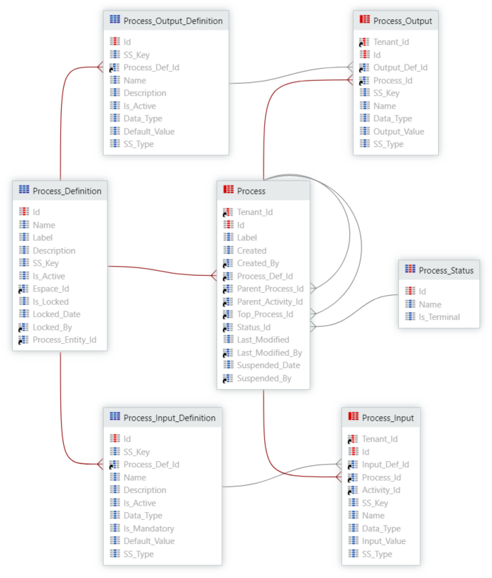
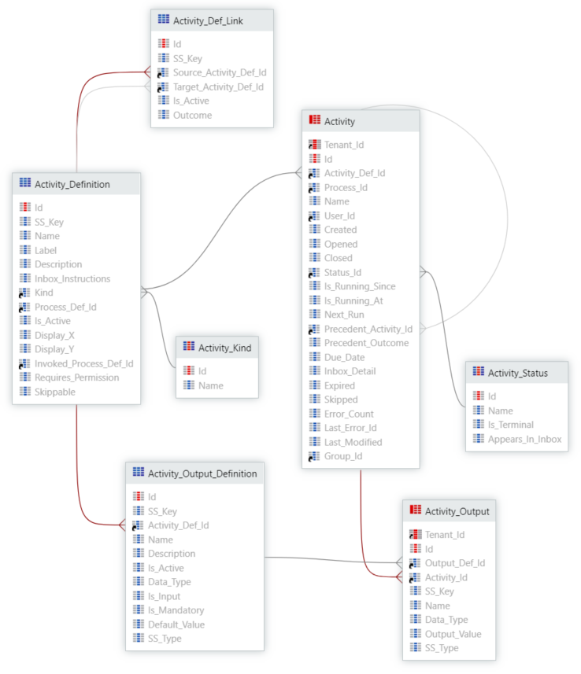
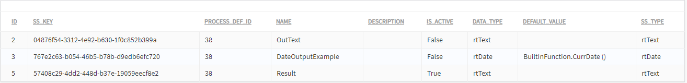
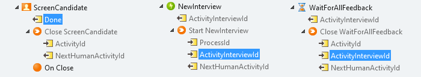

# Business Process Technology (BPT)

One of the most critical topics in data migration relates to Business Process Technology (BPT). This is mainly because in this case there are some entities that are system and others that are hybrid, which makes the migration process more complex.

## Entity-Relationship Model

The following diagram shows the relationships between the BPT process related entities, Process Definition and Input/Output Definitions, and Process applicational instances with the corresponding Input/Output instances and their relation with the definitions.



And there is also the Activities that belong to the Process:




The records for the entities in the previous can be generated from the following sources:

* Service Studio 
    * Publishing Espaces with new or changed Processes and Activities

* Service Center
    * Reading and Modifying the state of Processes and Activities

* Lifetime
    * Pushing Applications to another Environment with Processes and Activities
    * APIs

* For more information refer to the [OutSystems APIs](https://success.outsystems.com/Documentation/11/Reference/OutSystems_APIs) documentation.

The instance entities (in red) are hybrid since their source is the application usage in runtime. In this case, the entities are not changed by the application development and are managed by the OutSystems Platform. But the data is populated into these by the application usage in runtime.


## Considerations

### Global

* System Definitions Entities (Read-Only)
    Definition entities are populated and changed after publishing the Espace where the BPT flows are designed and implemented. This info should not be migrated and changed in a data migration process

* Foreign Keys Dependencies 
    Don’t forget to map the foreign keys that differ between environments, like the User identifiers (``Created_By``, ``Last_Modified_By``, ``Syspended_By``, ``User_Id``, ``Group_Id``)

* Mapping Ids Between Environments with ``SS_Keys`` 
    The Definitions Entities Identifiers can be mapped between different environments using the ``SS_Key`` composed with the Espace ``SS_KEY``. These SS_Keys are unique and equal between environments if always used together.

    It’s possible to have different solutions and approaches on how to map IDs between different environments, and then apply the changes to the foreign keys that are migrated, depending on if the ID is already mapped or if it will only be mapped after an insert. Then, there is the option to use a 2-steps approach to insert records with null foreign keys, and then a second iteration to update the foreign keys if needed, or another possible approach of using temporary tables.

* Multi-Tenant Entities
    Processes instances, Activity instances, and related input-output instances entities can be multi-tenant. Check if the Tenant being used has the same Id between environments

* Inactive Definitions
    Check if there is the need or requirement to also migrate Inactive processes and related info (flag ``Is_Active`` set as False). Processes from inactive definitions and/or processes with inputs/outputs from inactive input/output definitions, and there are also activity definitions and activity output definitions that can be inactive.

* Process Status
    Check if there is the need or requirement to migrate all or just a subset of Process Status (Active, Closed, Suspended, Terminated)

* Scheduler
    Please check the Pre-Requirements in the Migration Guide.

### Processes

* Process Definition, Input/Output Definition and Process Status (Static) are not migrated. These entities are managed by the OutSystems platform based on the implemented solution.
* Processes definition entities are set while they are designed and implemented in the Espaces. After publishing the Espace, the process info is populated into the Process Definition accordantly on how it is was designed and implemented
* Processes can be set to start with a database Trigger (Note that this is done during the development of the Applications). In this case, after publishing the Espace, the OutSystems Platform creates a new Trigger on the target entity being triggered. The process has a mandatory input of this entity identifier and creates a record on the ``OSEVT`` Entity related to the entity being triggered. For example, a Process called ``OrderProcesa`` triggered to start on ``Order Create`` has an input ``OrderId``, a new Trigger is created on the database for the Order Entity (``OSUSR_ABC_Order``) and a new record is inserted on the corresponding Order Event entity (``OSEVT_ABC_Order``)
* Be aware of the cyclic foreign key dependency. In the Activity instance case, you can see that the Process entity has the ``Parent_Process_Id`` and ``Top_Process_Id`` which are foreign keys to itself (cyclic foreign keys). For example, if the process is not a subprocess, then the ``Top_Process_Id`` is the same value as the Id

### Activities

* Activity Definition, Activity Output Definition, Activity Kind (Static) and Activity Status (Static) are not migrated. These entities are managed by the OutSystems Platform based on the implemented solution
* Conditional Start is a kind of Activity that can be Triggered to start on create or update of another entity. When in this kind of activity defined with a “Start On” condition is instantiated, the system subscribes and inserts a new row per activity on the event entity (``OSEVT``) of the entity being triggered. For example, a Conditional Start activity triggered to Start On an Order update, when the process or subprocess containing this activity starts, a new row is inserted in the Order Event Entity (``OSEVT_ABC_Order``), subscribing the Trigger of the Order Entity (``OSUSR_ABC_Order``)
* Human Activity and Wait Activity are a kind of Activities that can be Triggered to close on create or update of another entity. When one of these kinds of activities defined with a “Close On” condition is instantiated, the system subscribes and inserts a new row per activity on the event entity (``OSEVT``) of the entity being triggered. For example, a Wait activity triggered to Close On an Order update, when the process or subprocess containing this activity starts, a new row is inserted in the Order Event Entity (``OSEVT_ABC_Order``) subscribing the Trigger of the Order Entity (``OSUSR_ABC_Order``)
* The Activity instance table contains a self-reference ``Precedent_Activity_Id`` foreign key that you need to take care of when migrating data.

### Events Queues

The Scheduler uses two ``OSSYS`` Entities queues to execute BPT-triggered tasks:

* ``OSSYS_BPM_Event`` - for light Processes jobs
* ``OSSYS_BPM_Event_Queue`` - for normal Processes jobs

Before the migration process, you should assure that these entities are empty, meaning that the schedule already processed everything it was in the queue for processing and does not change anything in the middle stage of the migration process.

When a Process is developed and defined to start on another entity event, for example, on another entity record creation, or if exist an Activity in the process the OutSystems Platform:

* Creates or updates a Trigger assigned to the entity being triggered by the process (``OSUSR_``)
* Inserts a new record on the Event Entity related with the entity being triggered by the process (``OSEVT_``) - with the Process Definition Identifier relation

Also, when an Activity is developed to start on (Activity type of Conditional Start) or to close on (Activity type of Human or Wait) another entity event, the OutSystems Platform:

* Creates or updates a Trigger assigned to the entity being triggered by the process (``OSUSR_``)
* When a new Activity is instantiated, Insert a new record on the Event Entity related with the entity being triggered by the activity (``OSEVT_``) - with the Activity Identifier relation

Then, when a new record is created or updated in the triggered entity the trigger checks the event entity related and inserts a job to be treated by the schedule into the queues, based on the process configuration or the activity and what is in the Event Entity. 

## How the OutSystems Platform Manages BPT Entities - Example

This section shows an example of how the OutSystems Platform Manages BPT Entities.

### Start a Process {#start-process}

#### Process

Consider you have a Process called "Candidate Selection" and it is triggered by a "Candidate Insertion". 
Create a candidate called "John Doe" filling out an entity record form Candidate. This creates a new process instance in runtime with a Process Id.
The process can be found in Service Center:


The Process is stored in the Process Entity. You can use the following command to display the last inserted Process:

```
SELECT Top 1 
	OSSYS_BPM_Process.*
	, OSSYS_BPM_Process_Status.NAME StatusName
FROM OSSYS_BPM_Process
INNER JOIN OSSYS_BPM_Process_Status 
	ON OSSYS_BPM_Process.STATUS_ID = OSSYS_BPM_Process_Status.id
ORDER BY ID Desc
```

<table>  
<tr>  
<td>
Id
</td>  
<td>
11266
</td></tr>  
<tr>  
<td>
Label
</td>  
<td>
John Doe
</td></tr>  
<tr>  
<td>
Created
</td>  
<td>
11/26/2019 12:03:25 PM
</td></tr>  
<tr>  
<td>
Created_By
</td>  
<td>
</td></tr>  
<tr>  
<td>
Process_Def_Id
</td>  
<td>
38
</td></tr>  
<tr>  
<td>
Parent_Process_Id
</td>  
<td>
</td></tr>  
<tr>  
<td>
Parent_Activity_Id
</td>  
<td>
</td></tr>  
<tr>  
<td>
Top_Process_Id
</td>  
<td>
11266
</td></tr>  
<tr>  
<td>
Status_Id
</td>  
<td>
1
</td></tr>  
<tr>  
<td>
Last_Modified
</td>  
<td>
11/26/2019 12:03:25 PM
</td></tr>  
<tr>  
<td>
Last_Modified_By
</td>  
<td>
</td></tr>  
<tr>  
<td>
Suspended_At
</td>  
<td>
1/1/1900 12:00:00 AM [Null]
</td></tr>  
<tr>  
<td>
Suspended_At
</td>  
<td>
</td></tr>  
<tr>  
<td>
StatusName
</td>  
<td>
Active
</td></tr>
</table>

It is possible to find some information about the launched process. The ``StatusName`` is not part of that record. It was included for you to know what the Process initial state is. The Process was launched by Candidate creation but it is not on this entity where we can find the Candidate ID. This process has an Identifier. Let's use it to fetch input variables from the ``Process_Input`` and relate with ``Process_Id`` 11266.

#### Process Input

```
SELECT
	OSSYS_BPM_Process_Input.*
FROM OSSYS_BPM_Process_Input
WHERE OSSYS_BPM_Process_Input.Process_Id = 11266
```

<table>  
<tr>  
<td>
Id
</td>  
<td>
32973
</td></tr>  
<tr>  
<td>
Input_Def_Id
</td>  
<td>
79
</td></tr>  
<tr>  
<td>
Process_Id
</td>  
<td>
11266
</td></tr>  
<tr>  
<td>
SS_Key
</td>  
<td>
ff1e6212-66f3-4eaf-9018-6eb58b8ed465.#EventGeneratedInput
</td></tr>  
<tr>  
<td>
Name
</td>  
<td>
CandidateId
</td></tr>  
<tr>  
<td>
Data_Type
</td>  
<td>
rtInteger
</td></tr>  
<tr>  
<td>
Input_Value
</td>  
<td>
21
</td></tr>  
<tr>  
<td>
SS_Type
</td>  
<td>
bt44832b6b-eaf6-481b-b355-2eaaa488dbc4*8bfa817a-1092-472c-a14e-bc9e2ad9403b
</td></tr>
</table>

This record is all the input that you can find about this Process, one parameter called ``CandidateId``. you can see that the Basic Type is Integer but in fact it is an identifier.
If the ``SS_Type`` has this kind of content, then it indicates that it is an Entity Identifier.
To find out which Entity is, you should look at it: 

bt**44832b6b-eaf6-481b-b355-2eaaa488dbc4*8bfa817a-1092-472c-a14e-bc9e2ad9403b**

The bold **44832b6b-eaf6-481b-b355-2eaaa488dbc4** is the Espace ``SS_Key``, and 

**8bfa817a-1092-472c-a14e-bc9e2ad9403b** is the Entity ``SS_key``.
The following command shows the Entity Name and Entity Physical Table that is related to this Process.

```
SELECT 
	Name,
	Physical_Table_Name 
FROM OSSYS_ENTITY
INNER JOIN OSSYS_ESPACE 
	ON OSSYS_ENTITY.ESPACE_ID = OSSYS_ESPACE.Id 
		AND OSSYS_ESPACE.SS_KEY = '44832b6b-eaf6-481b-b355-2eaaa488dbc4'
WHERE OSSYS_ENTITY.SS_KEY = '8bfa817a-1092-472c-a14e-bc9e2ad9403b'
```

The result is ``Candidate`` and ``OSUSR_3ar_Candidate`` (Entity Name, and Physical Table Name) to find which Candidate is related to this Process.


```
SELECT
	*
FROM OSUSR_3ar_Candidate
WHERE Id = 21
```

Tip: Usually the Identifier is named ``Id``. You can fetch the Identifier name if you step back to that screen on the Service Center, and click on the link with the Process Name or Instance Id, by using the following command:

```
SELECT OSSYS_ENTITY_Attr.Name
FROM OSSYS_ENTITY
INNER JOIN OSSYS_ENTITY_Attr 
	ON OSSYS_ENTITY.PRIMARYKEY_SS_KEY = OSSYS_ENTITY_Attr.ss_Key 
	AND OSSYS_ENTITY_Attr.IS_ACTIVE=1
	AND OSSYS_ENTITY.ID = OSSYS_ENTITY_Attr.ENTITY_ID
WHERE OSSYS_ENTITY.Physical_Table_name = 'OSUSR_3ar_Candidate'
```

#### Activities

The following image displays all the Activities connected to the Process. There are two activities which are on the "Listening" State. But the current Activity is "Screen Candidate" with the "Ready" State.


To see what is inside the Activity, use the following command:

```
SELECT 
	OSSYS_BPM_Activity.ID
	,OSSYS_BPM_Activity.ACTIVITY_DEF_ID
	,OSSYS_BPM_Activity.PROCESS_ID
	,OSSYS_BPM_Activity.NAME
	,OSSYS_BPM_Activity.USER_ID
	,OSSYS_BPM_Activity.CLOSED
	,OSSYS_BPM_Activity.STATUS_ID
FROM OSSYS_BPM_Activity
WHERE OSSYS_BPM_Activity.Process_Id = 11266
```

|Id|Activity_Def_Id|Process_Id|Name|User_Id|Closed|Status_Id|
|--- |--- |--- |--- |--- |--- |--- |
|213828|245|11266|Start||11/26/2019 12:03:25 PM|5|
|213829|242|11266|ScreenCandidate||1/1/1900 12:00:00 AM|9|
|213830|249|11266|NewInterview||1/1/1900 12:00:00 AM|8|
|213831|247|11266|Dismiss||1/1/1900 12:00:00 AM|8|

You have completed the Start a Process step.

### Finish a Process

To finish a process, you need to complete the following instructions and see what changes.

#### Process

Run the following command:

```

SELECT OSSYS_BPM_Process.*,OSSYS_BPM_Process_STATUS.Name
FROM OSSYS_BPM_Process
INNER JOIN OSSYS_BPM_Process_STATUS 
	ON OSSYS_BPM_Process.Status_Id = OSSYS_BPM_Process_STATUS.Id
WHERE OSSYS_BPM_Process.Id = 11266
```

You get the following results:

<table>  
<tr>  
<td>
Id
</td>  
<td>
11266
</td></tr>  
<tr>  
<td>
Label
</td>  
<td>
John Doe
</td></tr>  
<tr>  
<td>
Created
</td>  
<td>
11/26/2019 12:03:25 PM
</td></tr>  
<tr>  
<td>
Created_By
</td>  
<td>
</td></tr>  
<tr>  
<td>
Process_Def_Id
</td>  
<td>
38
</td></tr>  
<tr>  
<td>
Parent_Process_Id
</td>  
<td>
</td></tr>  
<tr>  
<td>
Parent_Activity_Id
</td>  
<td>
</td></tr>  
<tr>  
<td>
Top_Process_Id
</td>  
<td>
11266
</td></tr>  
<tr>  
<td>
Status_Id
</td>  
<td>
2
</td></tr>  
<tr>  
<td>
Last_Modified
</td>  
<td>
11/26/2019 5:27:25 PM
</td></tr>  
<tr>  
<td>
Last_Modified_By
</td>  
<td>
</td></tr>  
<tr>  
<td>
Suspended_At
</td>  
<td>
1/1/1900 12:00:00 AM [Null]
</td></tr>  
<tr>  
<td>
Suspended_At
</td>  
<td>
</td></tr>  
<tr>  
<td>
StatusName
</td>  
<td>
Closed
</td></tr>
</table>

You can see that these fields changed: the Status_Id is set to 2 [Closed], and the Last_Modified changed as well.

#### Process Output

The process input is not described here because the Input parameter did not change the full process. An output text parameter was created to keep how the Interview turned out to John Doe. Use the following command to display the result:

```
SELECT OSSYS_BPM_Process_Output.*
FROM OSSYS_BPM_Process_Output
WHERE OSSYS_BPM_Process_Output.Process_Id = 11266
```

<table>  
<tr>  
<td>
Id
</td>  
<td>
1
</td></tr>  
<tr>  
<td>
Output_Def_Id
</td>  
<td>
5
</td></tr>  
<tr>  
<td>
Process_Id
</td>  
<td>
11266
</td></tr>  
<tr>  
<td>
SS_Key
</td>  
<td>
57408c29-4dd2-448d-b37e-19059eecf8e2
</td></tr>  
<tr>  
<td>
Name
</td>  
<td>
Result
</td></tr>  
<tr>  
<td>
Data_Type
</td>  
<td>
rtText
</td></tr>  
<tr>  
<td>
Output_Value
</td>  
<td>
Passed with distinction
</td></tr>  
<tr>  
<td>
SS_Type
</td>  
<td>
rtText
</td></tr>
</table>

The ``Process_Id`` is the same found on this Process, ``Output_Def_Id`` is the value found on the ``Process_Output_Def``.  Check the third line in the following image. In this case, the value is not an Identifier, just a piece of text.



#### Activity

Use the command below to show all the Activities involved in the Process.

```
SELECT 
	OSSYS_BPM_Activity.ID
	,OSSYS_BPM_Activity.ACTIVITY_DEF_ID
	,OSSYS_BPM_Activity.PROCESS_ID
	,OSSYS_BPM_Activity.NAME
	,OSSYS_BPM_Activity.USER_ID
	,OSSYS_BPM_Activity.CLOSED
	,OSSYS_BPM_Activity.STATUS_ID
FROM OSSYS_BPM_Activity
WHERE OSSYS_BPM_Activity.Process_Id = 11266
ORDER BY OSSYS_BPM_Activity.Created
```

The result shows the first two records and the last rows. Each Activity row which is related to the process ID has an Activity Definition. You can see the Label, the closed date, because this Process is fully Closed. The ``Status_Id`` is ``5`` in all rows. If you check the value ``5`` in the ``Activity_Status`` static entity, you see that ``5`` means Closed:

|Id|Activity_Def_Id|Process_Id|Name|Closed|Status_Id|
|--- |--- |--- |--- |--- |--- |
|213828|245|11266|Start|11/26/2019 12:03:25 PM|5|
|213829|242|11266|ScreenCandidate|11/26/2019 5:09:15 PM|5|
|213876|273|11266|SetResult|11/26/2019 5:27:25 PM|5|
|213877|244|11266|End|11/26/2019 5:27:25 PM|5|

#### Activity Output

To see where the Input and Output parameters that passed through the Activities involved in the Process are stored, run the following command:

```
SELECT 
	OSSYS_BPM_Activity.Name Activity,
	OSSYS_BPM_Activity_Output.*
FROM OSSYS_BPM_Process
INNER JOIN OSSYS_BPM_Activity 
	ON OSSYS_BPM_Process.Id = OSSYS_BPM_Activity.Process_Id 
INNER JOIN OSSYS_BPM_Activity_Output 
	ON OSSYS_BPM_Activity.Id = OSSYS_BPM_Activity_Output.Activity_Id 
WHERE OSSYS_BPM_Process.Id = 11266
```

|ActivityName|Id|Output_Def_Id|Activity_Id|Name|Data_Type|Output_Value|SS_Type|
|--- |--- |--- |--- |--- |--- |--- |--- |
|ScreenCandidate|69729|33|213829|Done|rtBoolean|TRUE|rtBoolean|
|WaitForAllFeedback|69733|30|213841|ActivityInterviewId|rtInteger|17|bt4...190|
|NewInterview|69737|29|213868|ActivityInterviewId|rtInteger|19|bt4...190|
|WaitForAllFeedback|69738|30|213870|ActivityInterviewId|rtInteger|19|bt4...190|

By using this query, it is possible to see the ``ActivityName``, the Parameter Name found on the fifth column, and it is possible to compare the values of the sheet with the screenshot below:




### BPT Scheduler

#### Triggered process and activities

The Scheduler manages Processes and Activities based on Activity and Process definition, Queue and Event_Queue. The source of data for Queue and Event_Queue are the triggers.

An example:
An Entity called Person and another named Animal were created.
Use the following command repeatedly to show trigger names and its content.

```
SELECT t.name Name, m.definition Definition
FROM sys.triggers t
INNER JOIN sys.sql_modules m 
	ON t.object_id = m.object_id
```

The following table shows the 20 results found. First, create the ``ChangePerson`` Process and fill the ``LaunchOn`` parameter with the entity action ``CreatePerson``. Then, publish the Espace. Finally, run the command again and check if a new trigger is created.

|Name|Definition|
|--- |--- |
|OSTRG_EI__OSUSR_EP8_THEENTITY|CREATE TRIGGER [OSTRG_EI__OSUSR_EP8_THEENTITY]|
|OSTRG_EI__OSUSR_GTU_PERSON|CREATE TRIGGER [OSTRG_EI__OSUSR_GTU_PERSON]|
|OSTRG_EI__OSUSR_EUG_THEENTITY|CREATE TRIGGER [OSTRG_EI__OSUSR_EUG_THEENTITY]|

The trigger content is activated by each Insert or Update operation done into the ``OSUSR_GTU_PERSON`` table. The trigger execution checks for information inside the ``OSEVT_GTU_PERSON`` table and, in case of any relevant configuration, inserts a row into ``OSSYS_BPM_EVENT`` (if it is a light Process) or into ``OSSYS_BPM_EVENT_QUEUE`` (if it is not a light Process). Then the Scheduler processes the ``OSSYS_BPM_EVENT`` and the ``OSSYS_BPM_EVENT_QUEUE`` table.

You created a process that is triggered to be ``LaunchOn`` of the action ``CreatePerson``, that belongs to the ``Person`` entity.

Now you can create one activity that is triggered to be ``ClosedOn`` during the ``UpdatePerson`` action.

The trigger created for the process defined to be ``StartOn`` is also the same used for the activities defined to be ``StartOn`` or ``ClosedOn``. 
In this example the name of the trigger is ``SOSTRG_EI__OSUSR_GTU_PERSON``.
