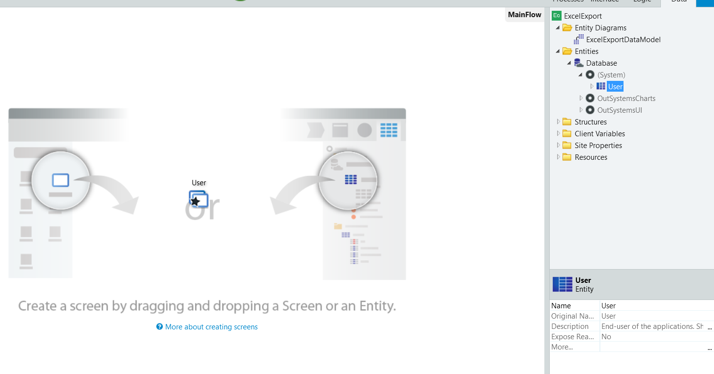
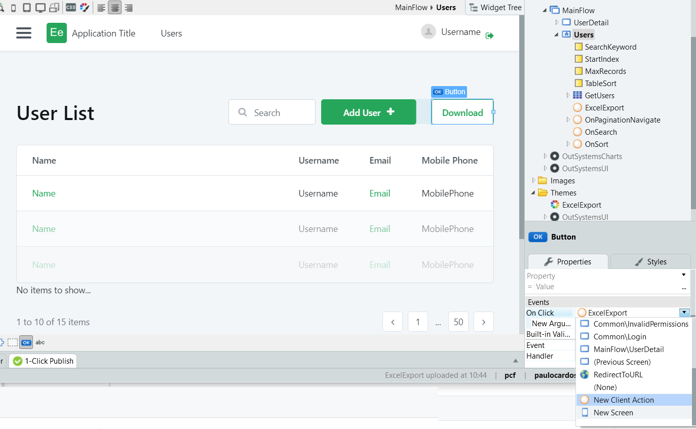
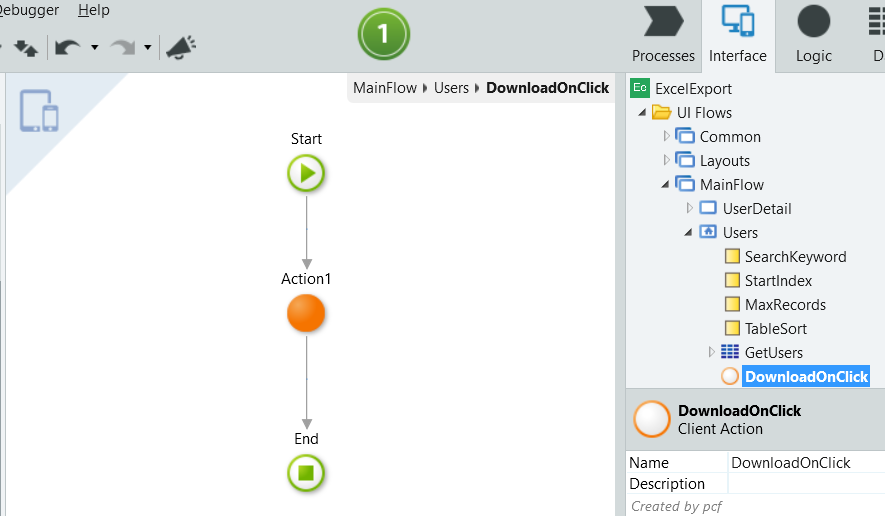
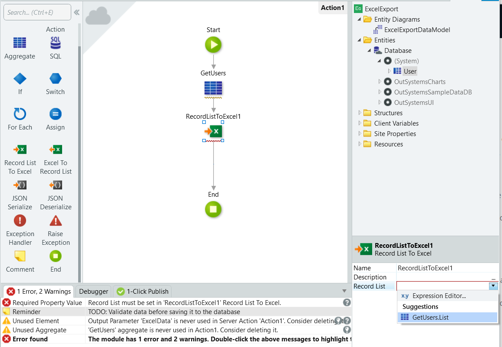
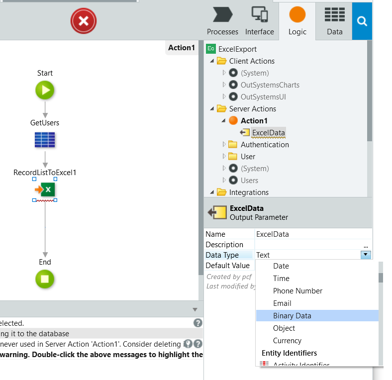
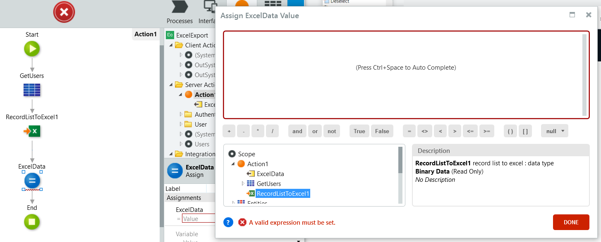
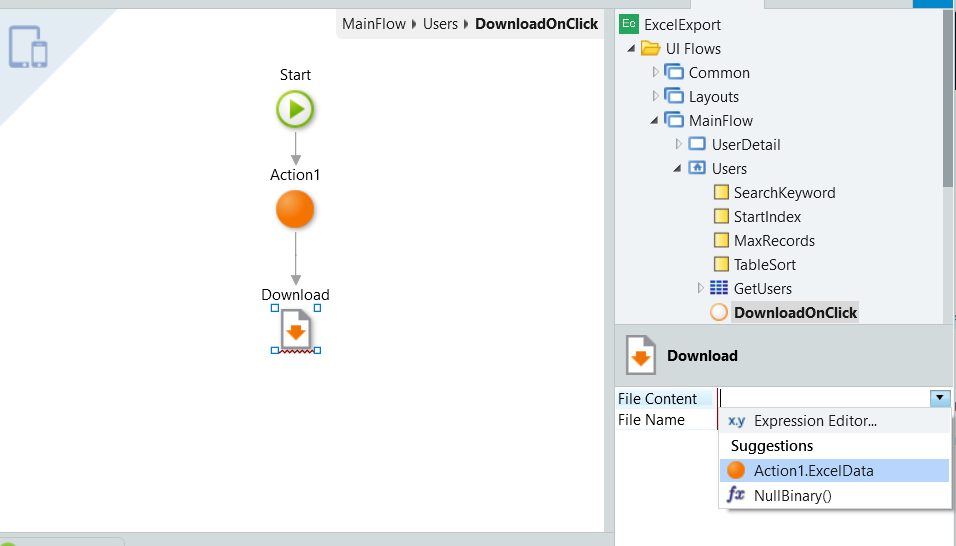

# How to Export Entity Data to Excel

To export the data you must use the **Record List To Excel** action. This generates an Excel worksheet with the data existing on a selected entity. You then need to enable the user to download the generated Excel file.

This article shows how it's done in both [Reactive Web](#reactive) and [Traditional Web](#traditional-web).

In Reactive Web the **Record List To Excel** action is only available in server actions.  
In Traditional Web, although the action is available in screen actions, it's strongly advised that you use it in server actions only.

## Exporting data to Excel in Reactive Web { #reactive }

In this example lets start by creating a users list screen, by dragging the Users entity to the main flow. To do it, open your app in Service Studio and do the following:

1. In the **Interface** tab, double-click on **Main Flow**.

1. On the **Data** tab, expand the **(System)** entry of the **Database**, and drag the **User** entity to the development main editor:

     

1. Double-click the **Users** screen to open the screen.

1. Add a link or button to your screen that showing data in a list.

1. In the **On Click** event of your link or button, select **New Client Action**:

    

### Creating the download logic { #reactive-logic }

Now that you have done all required actions on the screen is time to create the logic.

**In your client action:**

1. Add a Server Action to your flow:

    

1. When the pop-up displays, select **New Server Action**.

1. Double-click the Server Action to enter its flow.

    **In the server action:**

    1. Go to the **Data** tab a drag the User entity to your flow creating a **GetUsers** aggregate.

    1. Add a Record List to Excel to you flow, after the aggregate.

    1. In the Record List to Excel properties, select the `GetUsers.List`:

        

    1. Select the attributes you want to export to Excel, by checking them. These are your Excel columns.

    1. Add an Output parameter to your server action, and change its type to binary data.

        This Output parameter enables your screen action to consume the Excel data exported in the server action:

        

    1. Finally, add an **Assign** to your flow, and assign the your Output Parameter with the RecordsListToExcel value:

        

    1. Having this done, go back to your Client Action.

1. Back in the client action, delete the **End** point of your flow.

1. Add a **Download** as the end of your flow:

    

1. Finally, in the **Download** details, select the Server Action Output Parameter as the file content.

    In the **File Name** just type your desired file name within quotation marks. For example, `Users.xlsx`.

  

If it's expected that the user downloads the file several times, you may want to concatenate the name with CurrDateTime().

## Exporting data to Excel in Traditional Web { #traditional-web }

1. In this example lets start by creating a users list screen, by dragging the **Users** entity to the main flow. To do it, open your app in Service Studio and do the following:

    1. In the **Interface** tab, double-click on **Main Flow**.

    1. Click on the **Data** tab, expand the **(System)** entry of the **Database**, and drag the **User** entity to the development main editor:

        

1. Double-click on the Users screen to open the screen.

1. Add a link or button to your screen that showing data in a list. In the link or button details:

    * Set the **Method** to `Submit`.
    * Create a New Screen Action in the Destination.

    

Now that you have created everything on the screen, from this moment on you can follow the [same instructions as in Reactive Web](#reactive-logic) to add the necessary logic.

## Video example

<iframe width="560" height="315" src="https://www.youtube.com/embed/tFrD54mhgiM" frameborder="0" allow="accelerometer; autoplay; encrypted-media; gyroscope; picture-in-picture" allowfullscreen="allowfullscreen"></iframe>
