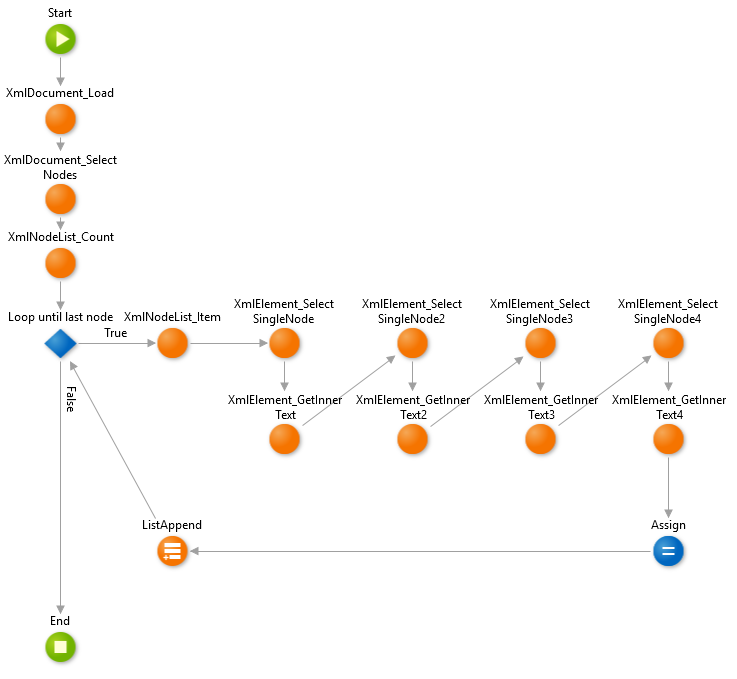

# How to parse XML files with XPath expressions

How can I use XPath to extract values from an XML file?

For example: The following XML file contains books from different categories (cooking books, children books and web books) with information about each book's title, author, publishing year and price.

    <?xml version="1.0" encoding="UTF-8"?>

    <bookstore>
        <book category="children">
            <title lang="en">Harry Potter</title>
            <author>J K. Rowling</author>
            <year>2005</year>
            <price>29.99</price>
        </book>
        <book category="web">
            <title lang="en">XPath Basics</title>
            <author>Omar Little</author>
            <year>2002</year>
            <price>5.08</price>
        </book>
        <book category="web">
            <title lang="en">Learning XML</title>
            <author>Erik T. Ray</author>
            <year>2003</year>
            <price>39.95</price>
        </book>
    </bookstore>

How can I extract the information only for the web books?

## Answer

OutSystems has an XML Extension that can parse, manipulate and serialize XML files. It includes support for XPath expressions.

To extract the web books information from the XML file follow these steps:

1. Add the following Dependencies to your Module:

    * **BinaryDataToText** from the **BinaryData** Extension
    * **XmlDocument_Load_v2** from the **Xml** Extension
    * **XmlDocument_SelectNodes** from the **Xml** Extension
    * **XmlElement_GetInnerText** from the **Xml** Extension
    * **XmlElement_SelectSingleNode** from the **Xml** Extension
    * **XmlNodeList_Count** from the **Xml** Extension
    * **XmlNodeList_Item** from the **Xml** Extension

1. Create a `Book` Structure with `Title` (Text), `Author` (Text), `Year` (Integer) and `Price` (Decimal) Attributes.

1. Create a Server Action and add the following Variables: 
    
    * `XML`: Mandatory Input Parameter of Binary Data `Data Type`
    * `Encoding`: Optional Input Parameter of Text `Data Type`
    * `Current`:  Local Variable of Integer `Data Type` with a `Default Value` of `0`
    * `Book`: Local Variable of Book `Data Type` 
    * `Books`: Output Parameter of Book List `Data Type` 

    The Server Action will receive an XML file and an optional `Encoding` argument and will return a List of Books extracted from the XML file.

1. Add a **XmlDocument_Load_v2** Action from the XML Extension and set the `Xml` input to:

        BinaryDataToText(XML,Encoding)
    
    This converts the XML Binary file to text and loads it into a DOM object.

1. Add a **XmlDocument_SelectNodes** Action from the XML Extension after the previous action. Set the `XmlDocument` input to `XmlDocument_Load_v2.XmlDocument` and set the `XPathString` input to `"/bookstore/book[@category='web']"`.

    This returns an XPath filtered list of books that belong to the web category. 
    
1. Add a **XmlNodeList_Count** Action from the XML Extension after the previous action and set the `XmlNodeList` input to `XmlDocument_SelectNodes.XmlNodeList`.

    This counts the total number of web books in the filtered list. 

1. Add an **If** node after the previous Action and set the `Condition` to `Current < XmlNodeList_Count.Count`.

    This creates a loop that stops when the `Current` Variable is equal to the total number of web books in the filtered list.

1. Add a **XmlNodeList_Item** Action from the XML Extension to the side of the **If** and link it to the True Branch. Set the `XmlNodeList` input to `XmlDocument_SelectNodes.XmlNodeList` and `Index` input to `Current`.

    This fetches one of the web books (using the `Current` Variable).

1. Add a **XmlElement_SelectSingleNode** Action from the XML Extension after the previous Action. Set the `XmlElement` input to `XmlNodeList_Item.XmlNode` and the `XPathString` input to `"title"`.

    This selects the title node of the current web book.

1. Add a **XmlElement_GetInnerText** Action from the XML Extension after the previous Action and set the `XmlElement` input to `XmlElement_SelectSingleNode.XmlNode`.

    This fetches the title of the current web book.

1. Repeat the previous 2 steps for the `author`, `year` and `price` attributes. Make sure you change the inputs accordingly. 

    This selects and fetches the remaining information of the current web book.

1. Add an Assign node after the **XmlElement_GetInnerText4** Action and set the following Assignments: 

    * `Current` = `Current+1`
    * `Book.Title` = `XmlElement_GetInnerText.InnerText`
    * `Book.Author` = `XmlElement_GetInnerText2.InnerText`
    * `Book.Year` = `TextToInteger(XmlElement_GetInnerText3.InnerText)`
    * `Book.Price` = `TextToDecimal(XmlElement_GetInnerText4.InnerText)`

    This assigns the gathered information to the `Book` Local Variable.

1. Add a **ListAppend** after the Assign and connect it to the **If** . Set the `List` input to `Books` and the `Element` input to `Book`.

    This adds the information of the current web book to the `Books` Output.

The Server Action will look similar to the following image:

