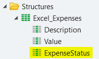
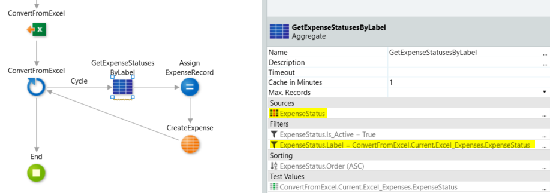

# How to update a Bootstrap Action to fetch an entity identifier from Excel

When I Bootstrap Data from Excel, how can I import a column as an entity identifier?

For example, I want to update my Bootstrap action to handle a third entity attribute ExpenseStatusId, which is an identifier in the ExpenseStatus entity. In my excel, the first two columns are attributes of my entity and the third one is the Status, as text.

```
Description          Value          Status
Gas                  50             Approved
```

## Answer

You must run a query to convert the label that you get from Excel into an entity identifier.

You can always change the behavior of the Excel bootstrap operation to handle entity changes you need to perform after using our scaffolding mechanism.

In our Excel spreadsheet, we have added a column that registers the expense status, either approved or rejected.


When update the action to bootstrap data from the excel by selecting the entity advanced option, we can see that the new column won't be included in the bootstrap action. 


So, we need to manually add a new column ExpenseStatus to the Excel_Expenses structure (previously created by the scaffolding mechanism).



Now we need to update the bootstrap action to handle the new column. The bootstrap timer is on the Processes tab, which maps to the actual action on the Logic tab.


Now we need to convert the label that we get from Excel into an actual identifier.

* We use an aggregate to run a query on the ExpenseStatus entity.

* We configure a 1 minute cache on the aggregate to avoid repeated queries during the record loop.



After getting the correct identifier, we just need to add the ExpenseStatusId to the assign operation. All the columns of the Excel worksheet are now correctly mapped and stored into the entity record.


<div class="info" markdown="1">

Please note that these steps are valid based on the assumption that there is no data in the Expenses entity. 
In case you already have data in your entity, you can either clear it or adapt the bootstrap logic to allow record updates, depending on the stage of your application development.

</div>

## See Also

[Bootstrap an Entity Using an Excel File](https://success.outsystems.com/Documentation/11/Developing_an_Application/Use_Data/Bootstrap_an_Entity_Using_an_Excel_File)

[How to bootstrap numeric data from Excel with blank cells](https://success.outsystems.com/Documentation/Development_FAQs/How_to_bootstrap_numeric_data_from_Excel_with_blank_cells)
