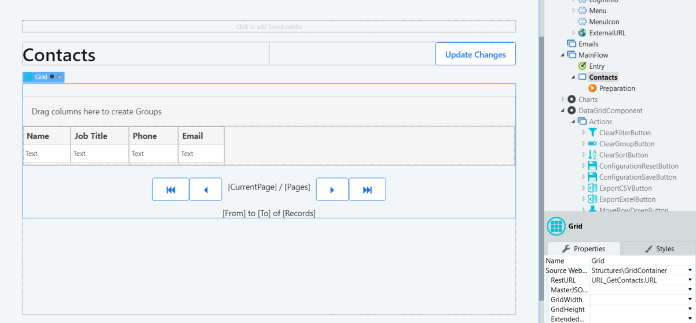
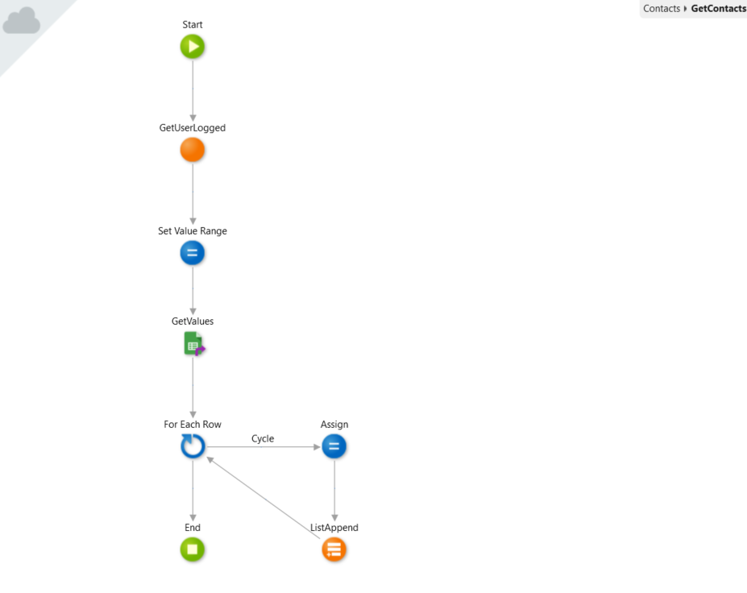
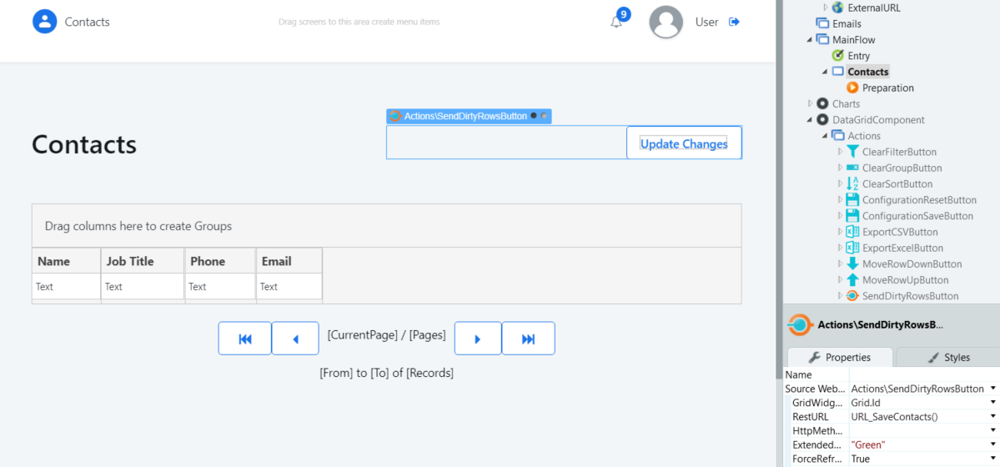

# How to Use a Spreadsheet as Your Data Source

This guide shows how you can use a spreadsheet as data source in an OutSystems App.

OutSystems provides a [Google Sheet Connector](https://www.outsystems.com/forge/component-overview/3058/google-sheets-connector) that allows you to use a Google Spreadsheet as a data source, by allowing users to execute Read and Write operations on it.

To retrieve data, you can use the **GetValue** or **GetValues** actions to read data from a single cell or from a range of cells, respectively.

For instance, you can add a [Data Grid component](https://www.outsystems.com/forge/component-overview/5554/data-grid) to your screen, and populate it with the data from the Data Sheet.

In the **RestURL** defined in the data grid:

1. Set the cell, or cell range you want to retrieve, the Spreadsheet ID and Spreadsheet Name
1. Call the GetValue or GetValues action
1. Populate the output list with the information retrieved, so it can be mapped into the Data Grid

To save data back into the spreadsheet, use the **SetValue** or **SetValues** actions to write data into a single cell, or into a range of cells, respectively.

For instance, using the previous scenario, you can add a button to write all the changes performed in the Data Grid.

In the RestURL defined to save the data:

Deserialize the received JSON
Iterate the generated Record List
Set the Spreadsheet ID, Spreadsheet Name and Range, and use the SetValues function to store the information

For Excel files, OutSystems provides a similar component that leverages the Microsoft Graph API to use an Excel File as a data source, the [Microsoft Graph Connector](https://www.outsystems.com/forge/component-overview/5552/microsoft-graph-connector).
