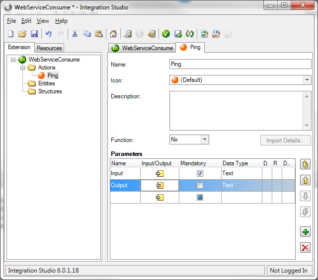
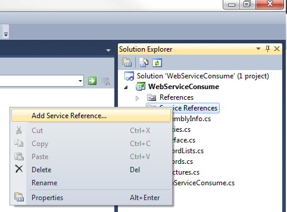
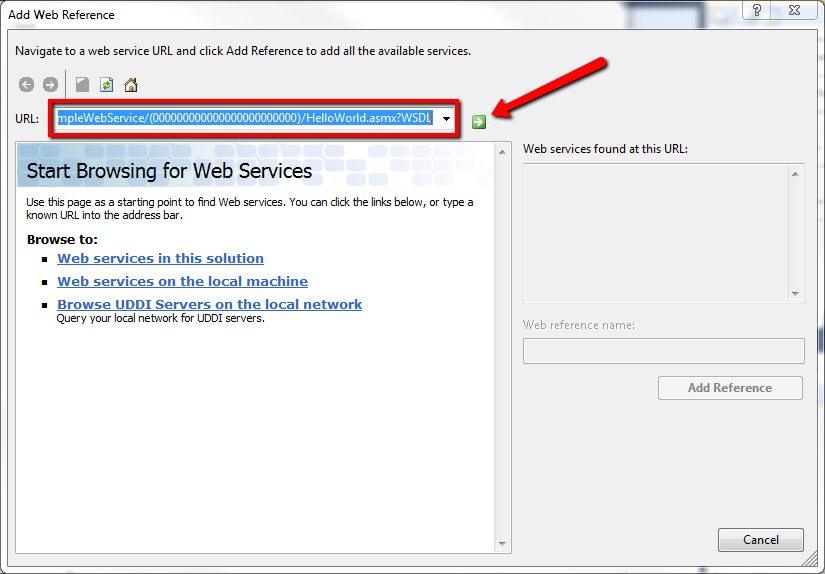

# How to consume a Web Service in Integration Studio

The OutSystems Platform includes a feature to import Web Services and automatically create the code and data structures to be able to call Web Service methods just like if we were using actions built with Service Studio.

However, there are some patterns of web services which cannot be natively consumed with this feature. For these cases, the alternative will most of the times be to consume the Web Service in Integration Studio.

This post explains step by step how to create an Extension to consume a web service using Integration Studio and then using it in Service Studio. The basic layout of what you need to do is the following:

1. Create an extension with one Action for every web service method you need to use

2. Create a data model (structures) to represent the data types in your web service

3. Import the web service in the extension's code using Visual Studio

4. In the action implementation you'll need to call the web service method by mapping the inputs and outputs from the web service datatypes to your extension data model.

This post will cheat through steps 2 and 4 by having a very simple data model, but that is usually where most development time will be spent.

To illustrate how to consume a web service, I have created an eSpace which provides the web service to be consumed by our extension. This simple web service is called HelloWorld and contains only one method named Ping which returns the input Text with "pong: " prepended to it.

To consume this webservice you need to create an Action for the Ping method, and setup its inputs and outputs according to the data types defined in the web service. In this case, the types are simple Texts, in most cases this might get a bit more complex with structures to hold more complex data types.



Once the action is created, we need to implement it. For that we open the extension's source code by clicking the "Edit Source Code .NET" button on the toolbar.


This will open Visual Studio and now we need to import the Web Reference in .Net.

Right Click on "Service References" and click "Add Service Reference..."



Click "Advanced..."


Click "Add Web Reference..."


Fill the URL Field with the path to your WSDL and click the little green arrow.



After the WSDL is loaded and all the information seems correct, click "Add Reference" to add it to your project.


Now all there is to do is implement our Ping Action so that it calls the web service.

Edit the WebServiceConsume.cs file to add 

```
using  OutSystems.NssWebServiceConsume.vmos60netx64;
```

to the header and implement the MssPing method with:
```
HelloWorld webservice = new  HelloWorld();
ssOutput = webservice.Ping(ssInput);       
```

Close Visual Studio, Verify and Save the Extension and publish it on the server.

Now eSpaces will be able to reference this extension's Ping Action and use the HelloWorld web service.

You can find the eSpace (with an example usage of the Ping Action in the entry Web Screen) and the extension used in this tutorial in attachment so you can inspect the code yourself.

With this you can import any Web Service supported by Visual Studio into the OutSystems Platform.

