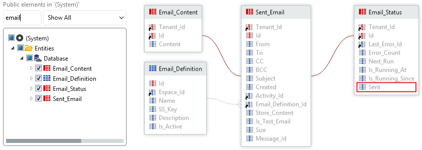

# How to find when the last email was sent

How can I get the timestamp of the last sent email?

## Answer

To check the timestamp of sent emails at runtime in your Application reference the **Systems** Entities **Sent\_Email** and **Email\_Status** and use the **Sent** Date Time Attribute from the **Email\_Status** Entity. 

You can also check the timestamp of sent emails in Service Center in the **Email Log** screen of the **Monitoring** Tab.