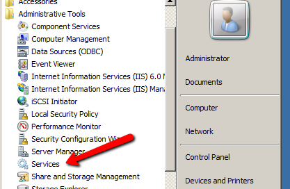
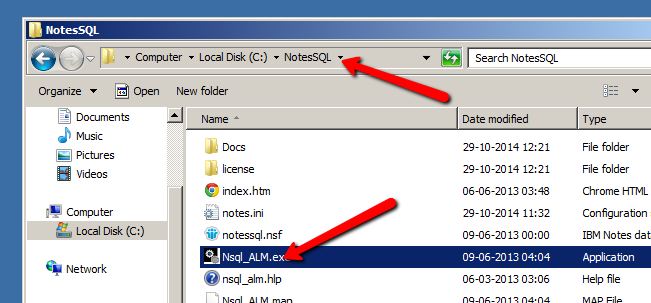
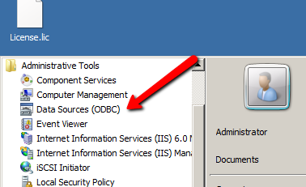
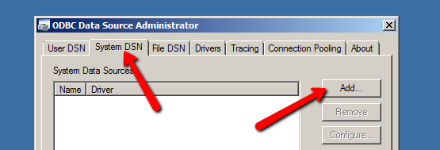
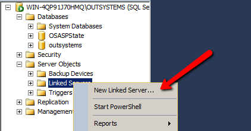
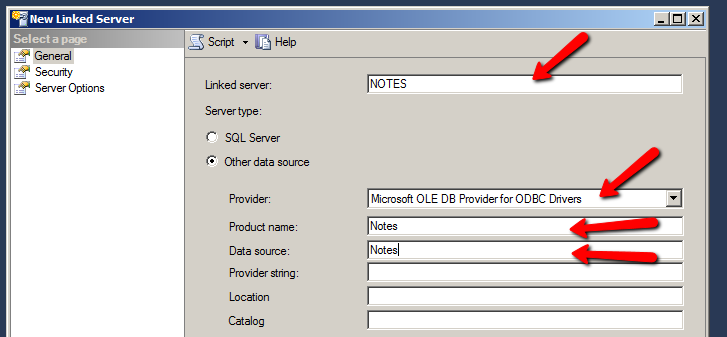
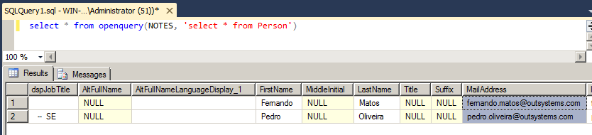

# How to access legacy data from Lotus Notes / Domino applications

How can I access existing data from legacy Lotus Notes / Domino applications?

## Answer

Use ODBC to expose the underlying tables of a Domino application.

Create a Linked Server in MS SQL Server to abstract the environment from the ODBC connection.

The steps below are for setting up the connection for a **64-bit SQL Server** . The steps for 32-bit SQL Server are different.

Perform the following steps on the computer that runs the database server.

### Download and install Lotus Domino Server

1. [Download Trial](http://www.ibm.com/developerworks/downloads/ls/lsndad/). 
    1. You'll have to login with an IBM login. Create one if you don't have it. 
    1. In the next screen choose "IBM Domino Enterprise Server V9.0.1 Social Edition Multiplatform English Trial eAssembly" and click continue. 
    1. After accepting the legal agreement, you'll get to a screen where you should download the file "DOMI_SRV_9.01WIN_64_EN_FULL_-TRIAL.exe (935 MB)". 
1. Install the downloaded file. 
    * When asked choose to configure it as a "Domino Utility Server". 
    * You can use the defaults for everything. 

### Configure Lotus Domino Server

Even though you will not actually use the server. You need to configure it as if it was a real server.

1. Double click "IBM Domino Server" on your desktop and follow the wizard. Just click next until the last step. 
    * You'll just need to set some passwords. 
    * You can use the defaults for everything else. 

    

1. Disable the Lotus Domino services to make sure they don't start when you restart the machine. 

    

    

    

### Download and install NotesSQL ODBC drivers

1. Go to this [link](http://www14.software.ibm.com/webapp/download/nochargesearch.jsp?cat=&q0=&pf=&k=ALL&pn=&pid=&rs=&S_TACT=104CBW71&status=Active&S_CMP=&b=&sr=1&q=IBM+ODBC+Driver+for+Notes%2FDomino&ibm-search.x=0&ibm-search.y=0).
    1. Click the only option that shows on the page and, in the following page, click Continue. 
    1. You may have to login and accept the legal agreement again. 
    1. Download the file "ODBC_ND_9.0_W64_EN.zip (97 MB)". 
1. Install it. You can use all defaults. 

### Configure authentication for NotesSQL

1. Open the "NotesSQL Authentication List Manager" by opening Windows Explorer in the NotesSQL installation folder and double clicking Nsql_ALM.exe. 

    

1. Fill in the "Path to NOTES.INI..." as shown in the screenshot below, click "Display list" and then, "Add user..." 

    

1. Set the "Location of Notes ID" as shown below and click OK. 

    

1. Click "Save List" and then "Close". 

### Change your system Path variable

1. Go to the "Control Panel". 
1. Open "System". 
1. Click "Advanced system settings" on the left. 
1. Click "Environment Variables". 
1. In "System variables" double click "Path". 
1. Add ";C:\Progra~1\IBM\Domino\data;C:\Progra~1\IBM\Domino;C:\NotesSQL" to the end of the Value and click OK. 

### Configure the ODBC data source pointing to a local file or to a server

1. Open to ODBC Data Source Administrator. 

    

1. Go to the "System DSN" tab and click "Add...". 

    

1. Select "Lotus Notes SQL Driver (*.nsf)" and click Finish. 
1. Fill in details as shown in the screen below (in this scenario I'm connecting to a local file on the same location as the DB server). 

    

1. Click OK and close the ODBC Data Source Administrator. 

### Configure the Linked Server in MS SQL Server

1. Open SQL Server Management Studio and connect to your Database. 
1. Expand "Server Objects" and right click "Linked Servers". 

    

1. Select "New Linked Server" and fill in the form as shown in the screenshot below. 

    

1. Click OK and your Linked Server is ready! 

### Test it

* Create a new query window and test it by using, as an example `**SELECT * from openquery(NOTES, 'select * from Person')**` and you should get some nice results. 

    

### Create Views to allow introspection with Integration Studio

You may create views by using, for example `**CREATE VIEW LN_Person AS SELECT * from openquery(NOTES, 'select * from Person')**` . This will allow you to then create introspect and create a connection using Integration Studio.

### Change the permissions of the OSRuntime database user

For the OutSystems applications to be able to access the data of the linked server in runtime you need to change the permissions of the OSRuntime database user. The environment uses this user to access data for the running applications.

As a proof of concept, give this user sysadmin permission to check that everything works. We currently do not know what are the exact permissions needed.

