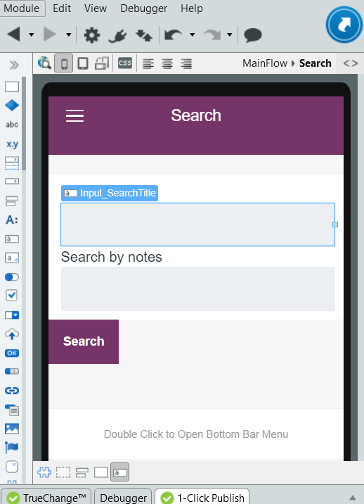

# How to maintain the state of a mobile screen

How can I maintain the state of a screen in a mobile app while navigating across screens?

For instance, in this app, the home screen has a list of To-Do items and notes concerning each item. 

If I click on the search icon, I am redirected to a Search screen where I can search the list of To-Dos by title and by the contents in the notes. 

I want to maintain the user input in the Search screen across navigation to other screens.

## Answer

Note that the state of the previous screens in a mobile app is automatically maintained if you use the back button.

To maintain the values of the fields in the Search screen after you navigate forward to other screens and come back to it:

1. In the **Data** tab, create an entity SearchFormData in the Local Storage with attributes SearchTitle and SearchNotes, both of type Text, and change the type of the Id to User Identifier.

    

1. In the **Interface** tab, in the Elements Tree, right-click the screen Search, select Fetch Data from Local Storage and set the source as the SearchFormData entity. Filter the resultant GetSearchFormData aggregate by UserId.

    

1. In the properties of the widgets, assign **Input_SearchTitle** with `GetSearchFormDataByUserId.List.Current.SearchFormData.SearchTitle` and **Input_SearchNotes** with `GetSearchFormDataByUserId.List.Current.SearchFormData.SearchNotes`.

1. In the properties of SearchForm that encloses the Input widgets, create a new **onchange** event and select **(New Client Action)** from the dropdown.

    

1. In the action flow of the Input_FieldOnChange, assign the current User Id as the value of the Id of that aggregate record.

1. From the Data tab, drag the CreateOrUpdateSearchFormData client action to the action flow and set the source record to `GetSearchFormDataByUserId.List.Current.SearchFormData`.

   

At the end of the user session, clear the temporary data stored in the SearchDataForm entity.