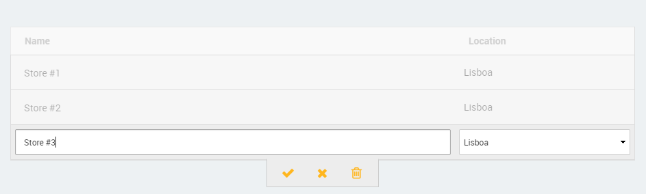
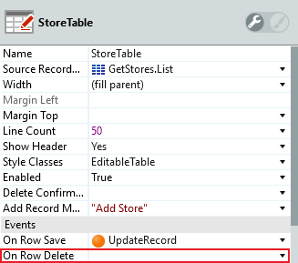

# How to remove the Add or Delete features from an Editable Table

How can I disable the **Add Record** and **Delete Record** features in an **Editable Table** so the end-user can only edit information in the existing Records?

## Answer

### Remove the **Add Record** feature

Before you start: Set the `Source Record List` property (`GetStores.List`in this case) and assign a new Server Action to the `Event`>`On Row Save` property of the Editable Table (**UpdateRecord** in this case).

To disable the ability to add a Record from your Editable Table follow these steps:

1. Modify the Action assigned to the `Event`>`On Row Save` property of the Editable Table: (1) change the **CreateOrUpdate&lt;Entity&gt;** Entity Action to an **Update&lt;Entity&gt;** Entity Action and (2) delete any logic associated with the creation of new Records. In this case delete the **Set Row Id** Assign node.

    

    This ensures that it is not possible to create new Records using the Editable Table.

1. Add the following **CSS snippet** to the Web Screen where the Editable Table is used:

        .EditableTable tfoot {
            display: none;
        }

    This hides the Add Record icon/link from the Editable Table.

1. Set the `Style Classes` property of the last input field of the Editable Table to a unique class, in this case `LastColumn`. 

    

1. Add the following **JavaScript snippet** to the Web Screen where the Editable Table is used:

        $(document).ready(function() {
            // Select the last column from the second to last row of the Editable Table (the last input row)
            $(".LastColumn").eq(-2).on("keypress keyup keydown", function (event) {
                var keyCode = event.keyCode ? event.keyCode : event.which;
                //  TAB but not SHIFT
                if (keyCode === 9 && !event.shiftKey) {
                    event.preventDefault();
                    return false;
                }
            });
        });

    This snippet disables the action associated with the TAB key only for the last column of the last row of inputs of the Editable Table. By default if you are on the last input of the last row of an Editable Table, the platform automatically adds a new row to insert a new Record.

After these steps:

* The action associated with the **Add Record** Event will not create new Records;
* The Add Record icon/link is no longer displayed;
* Pressing the TAB key while on the last column of the last row of the Editable Table will not create a new row. 

### Remove the **Delete Record** feature

To disable the ability to delete a Record from your Editable Table follow these steps:

1. Leave the `Event`>`On Row Delete` property **empty**.

    

    This ensures that no server-side action takes place when the delete icon is pressed.

1. Add the following **CSS snippet** to the Web Screen where the Editable Table is used:

        /* hide the delete icon and link */
        .EditableTable tr.OnEdit + tr.RowControlGroup .ControlActions a.DeleteRowAction  {
            display: none;
        }
        /* recenter the action box */
        .EditableTable tr.OnEdit + tr.RowControlGroup .ControlActions, .EditableTable tr.Selected + tr.RowControlGroup .ControlActions {
            margin-left: -57px;
        }

    This CSS snippet hides the delete icon/link and recenters the add and cancel icons/links in the action box.

After these steps the **Delete Record** event no longer triggers any server-side action and the Delete Record icon/link is no longer displayed. 

