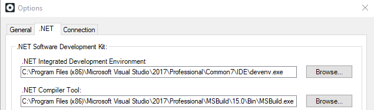

# How to Use .NET Standard libraries in OutSystems extensions

## Requirements

* Microsoft Visual Studio 2017
* .NET Framework 4.7.2
* OutSystems Platform Server 11 - Release Apr.2019 or higher

## Use .NET Standard libraries in your extension

Windows improved .NET Standard support for .NET Framework applications in version 4.7.2. You can take advantage of this improvement and use .NET Standard libraries in your extensions.

Do the following:

1. Install .NET Framework 4.7.2 and Visual Studio 2017 in your development machine.

1. Change the Integration Studio options to start using Visual Studio 2017 and associated MSBuild to compile the extension.

    

1. Change the extension's main project target framework from ".NET Framework 4.6.1" to ".NET Framework 4.7.2".

    

1. Build your extension.
