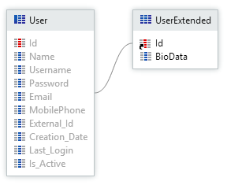
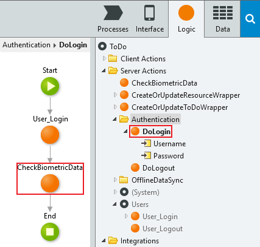

# How to add extra logic to Users' login

How can I add additional logic to **Users**' login and associate custom information with a **User**'s Entity Record?

For example: I want to store biometric data and use that biometric data as an extra layer of security during login.

## Answer

To associate custom information with a **User**'s Entity Record create an extension Entity with a 1-to-1 relationship with the non-editable **User**'s Entity.

Create a **UserExtended** Entity, modify the `Data Type` of the Identifier to `User Identifier` and add Attributes to store custom information.

To add extra logic to the **Users**' login, include the extra authentication logic in an Action and add this Action to the login flow. 

For **Web Applications** modify the login flow in the **Login** Action located in the **Login** Screen of the **Common** UI FLow.

For **Mobile Apps** modify the login flow in the **DoLogin** Server Action located in the Authentication Folder.

