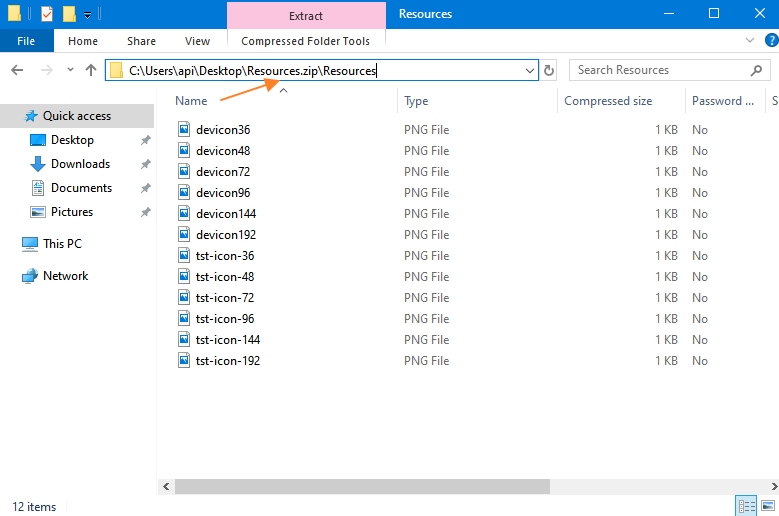
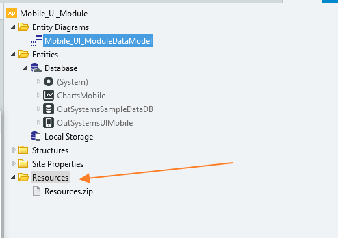

# How to change a mobile application icon by environment 

This guide provides information for having a mobile application with different icons in all environments to able to know which one to test. To do it, follow the next steps.

## Adding the necessary files and configurations to have each environment apk generated with a different icon

1. Create a zip with your icons, this one for demonstration purposes is called "Resources.zip" but you can name however you desire.
    
    
    

2. Add the zip file to the Mobile App module
    
    

3. Add the JSON as shown in the image below, with the format as per the specification in the documentation presented in the top of this communication.
    
    

4. Publish and generate app
    
    Once you install the app it will show in the device with the icon you chose.

    For version 10 of the OutSystems Platform, the code either needs to be deployed and the JSON changed to QA icons or repeat the whole process directly in QA environment.

    In version 11 of the Platform, you only need to add the resources zip to the module. After having the file in both environments you can change the extensibility configurations through LifeTime in the application settings.

    

    In both versions of the platform, after changing these configurations, a new build needs to be generated to display the icons correctly.

