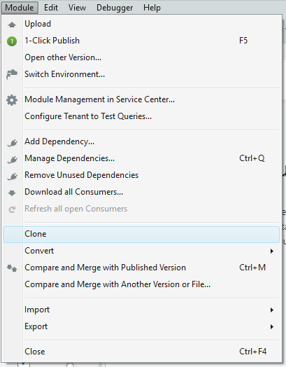
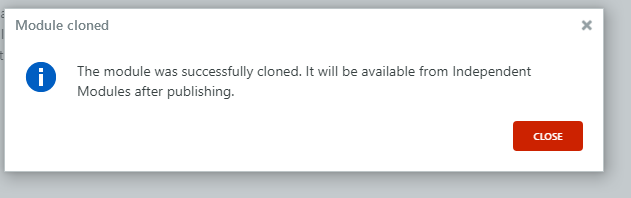
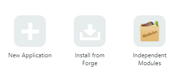
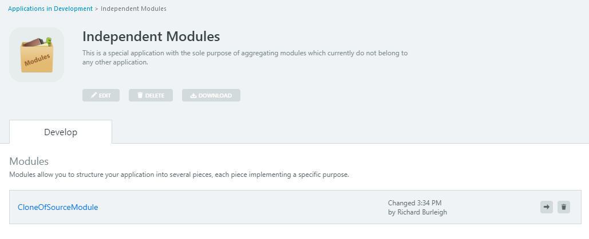
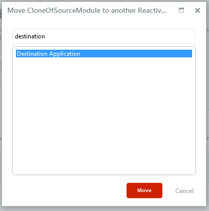
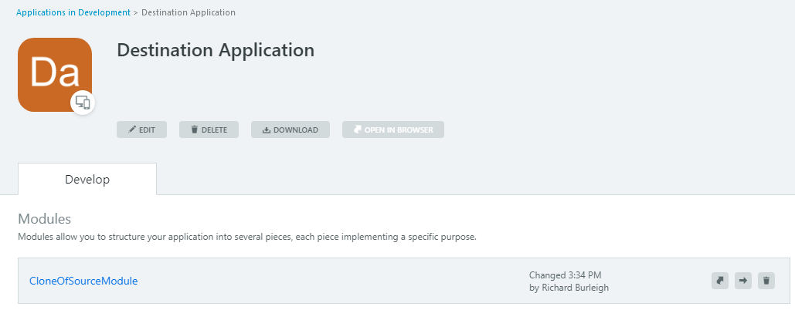

# How to Clone a Module into Another Application

## Question

How do I clone a module into another application in Service Studio?

## Clone the module

1. Open the module you wish to clone in Service Studio

1. Click the 'Module' menu at the top of your screen and click 'Clone':

    

A clone of the module has now been created.

    
Press the 1-Click Publish button to publish it to your environment:

The published module will reside in the 'Independent Modules' Application.

## Move the module to new application

1. Open the 'Independent Modules' Application in Service Studio:

    

1. Press the arrow button on the right of the cloned module:

    
    
1. Select the application you would like to move the cloned module to and press the 'Move' button:

    

You have now successfully cloned a module from one application to another.

