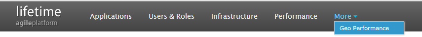
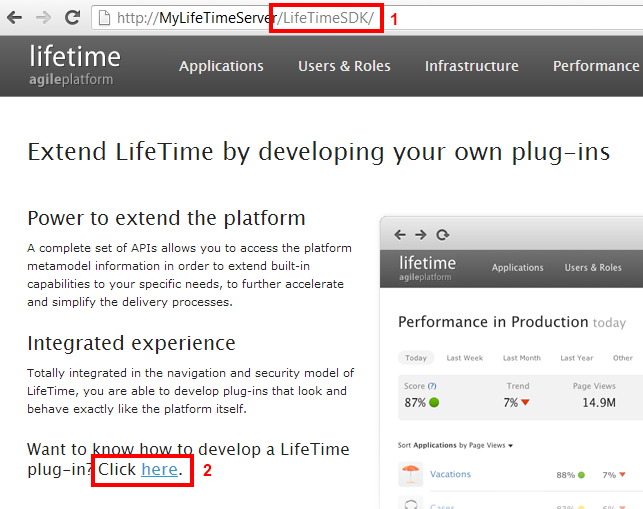
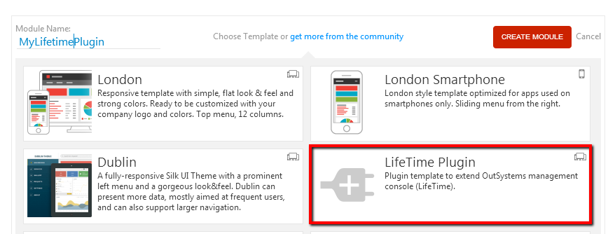
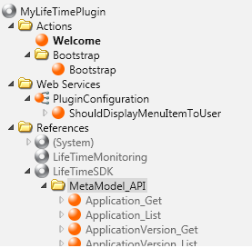
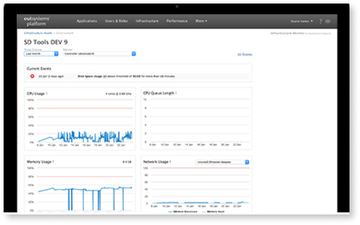

# How to create a LifeTime Plugin

## Question

How can I create a LifeTime Plug-in?

## Answer

Plugins are special applications that are seamlessly integrated into LifeTime:

If you want to create a LifeTime plugin, do the following:

1. Access LifeTimeSDK by typing "LifeTimeSDK" in the URL of your LifeTime environment.

2. Follow the 'click here' link at the end of the page.

3. Choose your LifeTime Plugin development Environment

4. Install LifeTime SDK on the environment. If you have a LifeTime already installed in that environment, the LifeTime SDK installation will fail. In this case, you must [remove LifeTime from the environment](https://success.outsystems.com/Support/Enterprise_Customers/Maintenance_and_Operations/Remove_the_infrastructure_management_console_from_an_environment) before proceeding with LifeTime SDK installation, which involves deleting LifeTime's applications. Note: If you disable LifeTime's applications without deleting them, you will not be able to install LifeTime SDK.

5. You should take this opportunity to also export Sample Data to your plugin development environment. This is important because all the data provided by the APIs is located in LifeTime's server (e.g. the Environment List [Development, Quality, Production]), so if you call any API action from a Development server, those calls won't return any data unless, of course, you have exported it to that environment.

6. Now you can start the coding part. You can do this in two different ways, by clicking on the "Start developing you plugin now!" link:

... or by creating a new application in the Studio while connected to the environment where the SDK was installed. A new template for the creation of lifetime plugins should now be present:

This template already has:

* The bootstrap action to register the plugin in LifeTime

* The WebService to configure if the plugin is visible to the current LifeTime user

* A UI template and styles to make your plugins look like part of LifeTime

* All the APIs ready to use!

7. Check our sample plugin! With the version 8.0 we have made available in the [forge](http://www.outsystems.com/forge/) a sample plugin called [Geo Performance](http://www.outsystems.com/forge/component/405/geo-performance/) that gives you an idea of how to create a simple plugin that uses all the APIs. It is also an example of how we built some parts of the brand new Performance Monitor, including the data aggregation process!

8. Plug it! Since the plugin was developed in a separate environment from LifeTime you need to integrate it once you finish developing and testing it. For that, simply grab the Solution and publish it in LifeTime Environment's Service Center.

