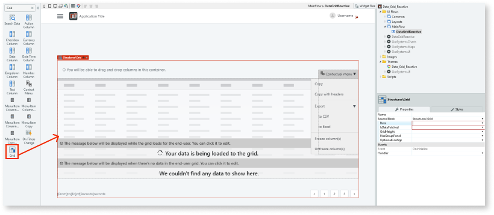
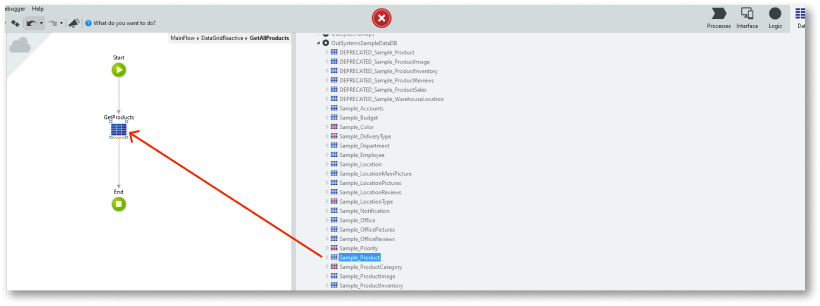
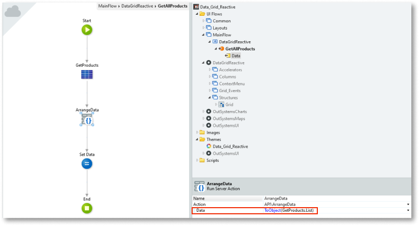
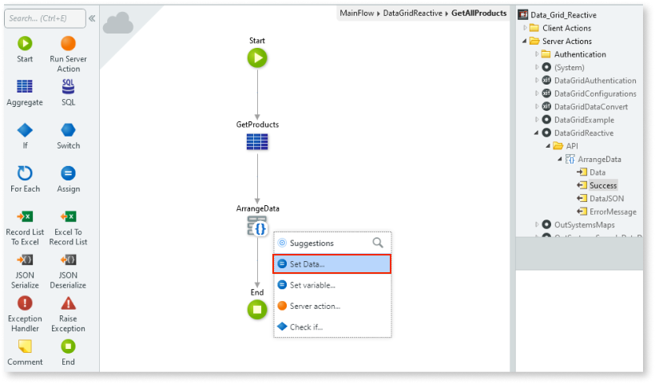
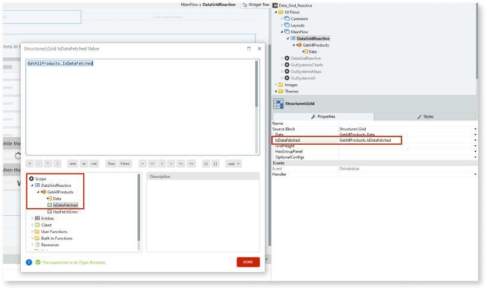

#  How to use the Data Grid component

This example This example does not define any column structure. 

1. In Service Studio, in the Toolbox, search for Grid.

    The Grid widget is displayed.

    

1. From the Toolbox, drag the Grid widget into the Main Content area of your application's screen.

    

    By default, the Grid widget contains the following placeholders:

    * ContextMenu
    * Loading (displayed while data is being fetched from teh server)
    * NoResults (displayed when no results are returned)
    * GridColumns

    

    You can change the content of these placeholders as required.

1. Create an Action to fetch the data you want to display in the grid.

    

1. Enter a name for the Action's output parameter (for example, Data) and ensure the **Data Type** is **Text**.

    

1. On the **Data** tab, drag the data source entity onto the flow.

    

    An aggregate (in this example, GetProducts) is automatically created. 

1. On the **Logic** tab, drag the **ArrangeData** Server Action onto the flow.

    

1. Set the **Data** property to the aggregate result. 

    **Note:** The **ArrangeData** Server Action action can receive any data structure so you must use the **ToObject** function. 

    

1. Click on the flow and add a **Set Data** data action.

    

1. Assign the **Set Data** property to the **ArrangeData** Server Action output.

    

1. Return to the main screen and select the Grid. On the **Properties** tab, set the **Data** property to the output of the Data Action you created earlier (step. 3).

    

1. Bind the **IsDataFetched** property to the Data Action property **IsDataFetched**.

    
