---
summary:
tags:
guid: 51f5ab7a-1280-479f-96cd-2c1c9b111134
locale: en-us
---

# How to create reports using HTML2PDF

This article was written by [Fabio Fantato](https://www.outsystems.com/profile/40762/), OutSystems MVP.

This article guides you on how to create reports using the HTML2PDF component. Get it [here](https://www.outsystems.com/forge/component-overview/209/html2pdfconverter). Also, before you continue reading this article it’s recommended that you read this [FAQ](https://www.outsystems.com/forums/discussion/17923/html2pdfconverter-faq/).
How does this component works
The HTML2PDF is a wrapper to an [external toolkit](https://wkhtmltopdf.org/) that converts HTML pages to a PDF file. This component allows you to create a report as a regular web screen and call the provided actions to simulate a print directly to a PDF file.

## Before you begin

Before proceeding with this how-to read the following notes attentively. 

* **Anonymous Screens** — Screens must have an anonymous role. It's a security concern, but it's mandatory. 

    The screen should be rendered directly by the toolkit on the server-side and shouldn't share any session variables, for example, the user roles. 

    To better secure the data it's suggested to implement a One-Time-Token to call your screen and keep your data safe.

* **UI Patterns** — The responsive frameworks have some issues with this toolkit. This happen mainly because the toolkit doesn't wait for all JavaScript to load in the page. Also, it doesn’t support CSS variables. 
    
    This means that you should do all customization on the report output by customizing the theme and all the CSS classes for a report.

* **Last row on pages** — There is lack of control on the last row of the behavior on the tables for each page. This means that a row can be cut by the middle in the resulting pdf.

    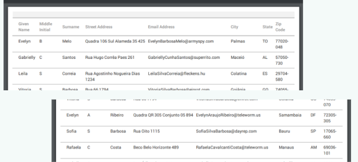

    To avoid this behavior use this CSS to force the toolkit to keep the entire line together:

        .keeptogether {page-break-inside:avoid;}`

    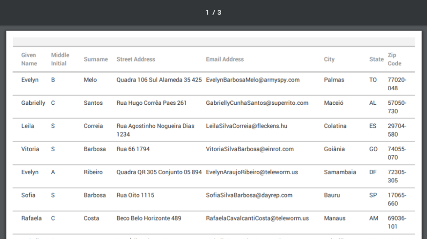    

* **Pagination/Header and Footer** — These features aren't out of the box in this component.
    * To include header and footers you need to include the OtherArgs in the GeneratePDF properties: 
    
            “ — header-spacing 5 — header-html <Replace with URL Header>
            — footer-spacing 5 — footer-html <Replace with URL Footer>”
    
        Also, you need to define two extra anonymous screens for the header and the footer.

    * To include Pagination (Page Numbering) you should add the JavaScript code below into your header (or footer) and define an expression for the Current Page with the style class ‘page’, and other for the Total Pages with the style Class ‘topage’
        
            function pagination(){
                var vars = {};
                var x = document.location.search.substring(1).split('&');
                for (var i in x){
	                var z = x[i].split('=', 2);
	                vars[z[0]] = unescape(z[1]);
	            }
	            var x =['frompage','topage','page','webpage','section','subsection','subsubsection'];
	            for (var i in x){
		            var y = document.getElementsByClassName(x[i]);		
                    for (var j = 0; j < y.length; ++j){
		            y[j].textContent = vars[x[i]];
		            }
	            }   
            }

* **Queries** — All the queries and aggregates to manipulate the data must be created from scrach for your report.

## Setting up HTML2PDF

To use this component correctly you need to install the component and add some references in Service Studio. 

### Installing the component:

1. [Download the binary  and other libraries](https://wkhtmltopdf.org/downloads.html) for the right version of the toolkit and there are some differences if you are using a cloud, an on-premise installation or even if you are in your personal environment.
    
    
    
    The toolkit repository has several versions, but you need to follow exactly the versions detailed in the component documentation. If you use anything different might be a nightmare to put it to work.
    

1. Get the 7z Archive and extract it to a local folder. Inside the folder wkhtmltox\bin, you find the files: wkhtmltopdf.exe, wkhtmltoimage.exe and wkhtmltox.dll.

1. [Install the HTML2PDF component](https://success.outsystems.com/Documentation/11/Getting_started/Use_a_Forge_Component_Made_by_the_Community) in your OutSystems environment and open the application to do the setup. 

    

    You should do the setup procedure in all environments you have in your infrastructure. (Dev, QA, Prod, …)
    

1. Inside the application admin panel, select the tab administration. 

1. For the PDF Generator browse and upload the wkhtmltopdf.exe file. On the image Generator browse and upload the wkhtmltoimage.exe file, and lastly on the Additional Binaries, browse and upload the wkhtmltox.dll file.

    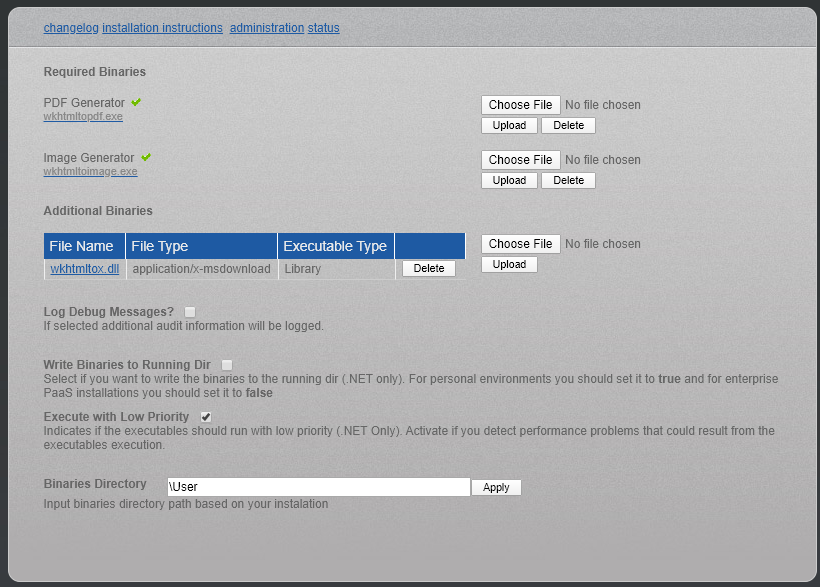

With these selections completed your setup and you are ready to create reports.

### Configuring references

To configure the usage on Service Studio:

1. Inside Service Studio access the Manage Dependencies screen. 

1. Add reference to the GeneratePDF action from HtmlToPdfConverter.

    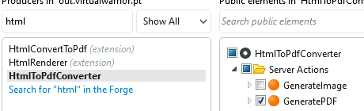

1. Also, add references to MakeAbsoluteURL and GetEntryURL from HHTPRequestHandling.

1. Apply the selection to finish the setup.

## Creating a report
To create a report, follow these steps:

1. Create a ‘Sample’ screen and select the role Anonymous.

    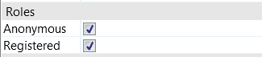

1. Drag an aggregate of the data you want to be in the report to the screen preparation. In this example a list of people with contact information is used.

    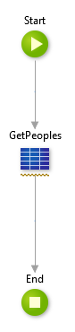

1. Back to your screen, in the widget tree, remove the layout web block from this screen.

1. Add a Table Records widget to the screen and add the following fields as the columns of the table: Surname, GivenName, City, State and Email. 
Use as your source records the data from the aggregate you added above.

    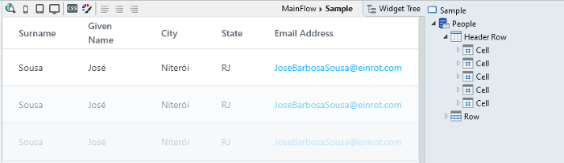

You now have data to export in the report. To generate the report:

1. Create a new screen to call the reports. 

1. In the screen preparation call the GeneratePDF server action. In its parameters use MakeAbsoluteURL and pass as parameter the GetEntryURL of the screen where you have your report. 
 
   ** Info:** The toolkit requires the Absolute URLs to your screens to run properly.

    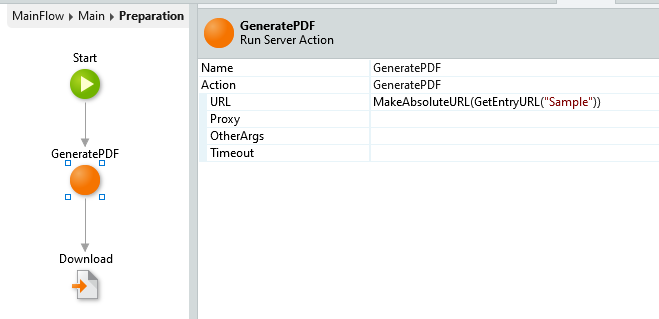

1. In the same flow, delete the End node and add a Download action with the following parameters:

    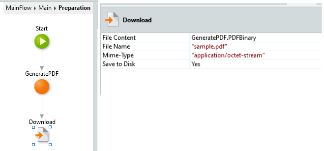

1. Run the application, go to the screen you have created and download the PDF. 

The output should be:

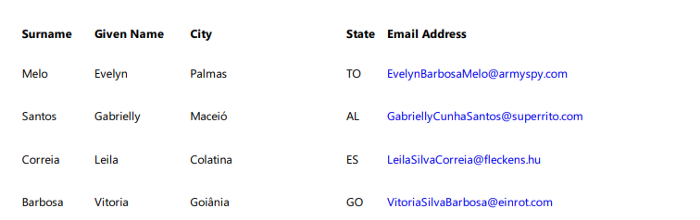

## Sample
[You can find a sample](https://www.outsystems.com/forge/component-overview/1242/pdf-header-and-footer) including a Custom Theme, Header and Pagination using the PDF Header and Footer in the forge.

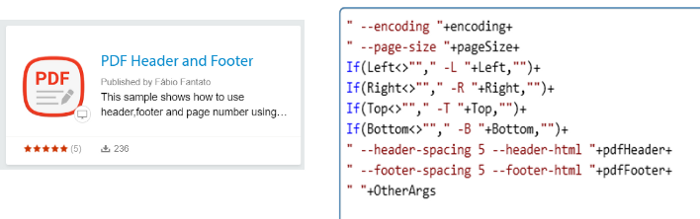
