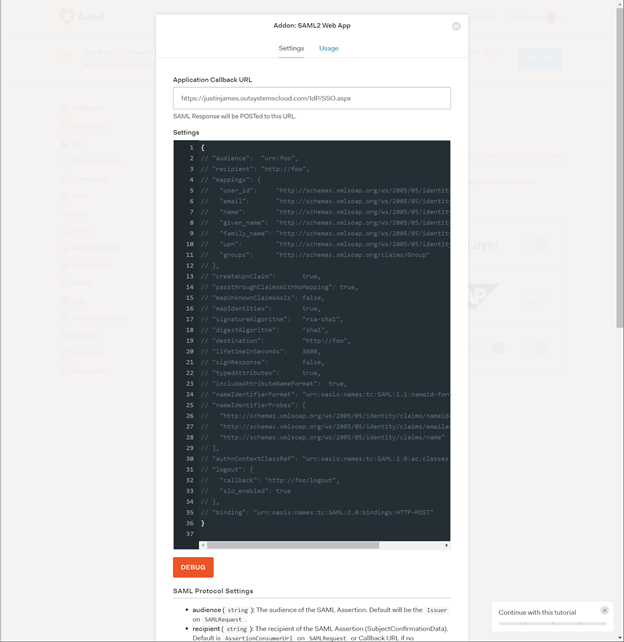
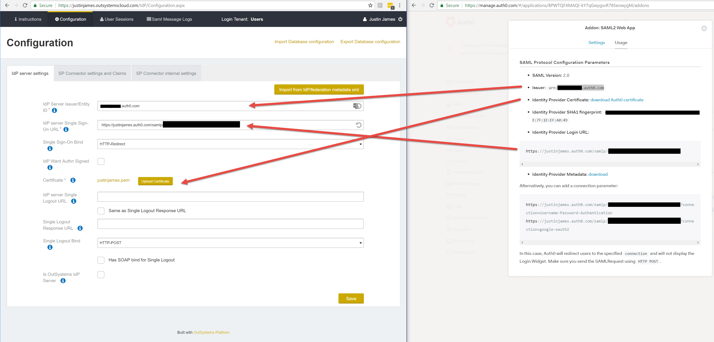

# How to integrate Auth0 with OutSystems

This article was written by [Justin James](https://www.outsystems.com/profile/5685/justin-james/), OutSystems MVP.

[Auth0](https://auth0.com/) is an authentication and authorization service that lets you easily provide single sign-on services. This way, your application can use other services, such as Azure and Dropbox, as the source of the user accounts. 
Integrating them into your OutSystems application makes it much faster for your users to log in to your application because they will have fewer accounts to manage and do not need to go through a lengthy signup process with your application.

## Integrating Auth0 with OutSystems

Auth0 supports the SAML protocol and the IdP component in the OutSystems Forge implements this protocol, so we will leverage that component for this guide. The only work needed is the configuration of IdP and the modification of your application so it can use it. Here are the steps:

1. [Get IdP from the Forge](https://www.outsystems.com/forge/component-overview/599/idp) and publish it to your server. You can install it directly through Service Studio.
1. Modify your application to use IdP as per the instructions in IdP, found at `https://hostname/IdP/Instructions.aspx` (use your hostname) after installation on the server.
1. [Sign up for an Auth0 account](https://auth0.com/signup).
1. [Turn on and configure SAML in your Auth0 account](https://auth0.com/docs/protocols/saml/saml-configuration/auth0-as-identity-provider).
1. [Set up the generic SAML IdP connection in Auth0](https://auth0.com/docs/protocols/saml/saml-idp-generic). For the `Application Callback URL` parameter, use the value `https://hostname/IdP/SSO.aspx` (filling in the correct hostname for your server).

    

1. Go to the Usage tab of Auth0’s SAML configuration to get the information needed for your IdP Configuration page (`https://hostname/IdP/Configuration.aspx`). Fill out the Configuration parameters according to the picture below:

    

1. Configure your users in Auth0.
1. Test!

One thing that you will note, is that when someone logs in via IdP, it will create a user account for them in OutSystems, but it will also not bring over user information such as name into the OutSystems User record. Your workflow should likely drive people to provide their details after login until they complete enough information for your application to work as expected.
