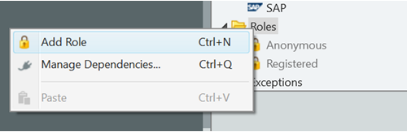
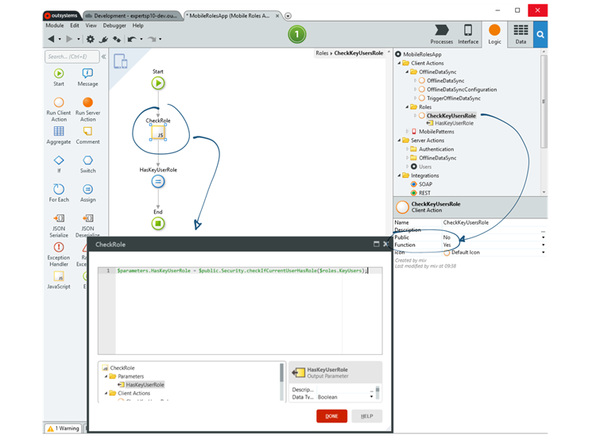
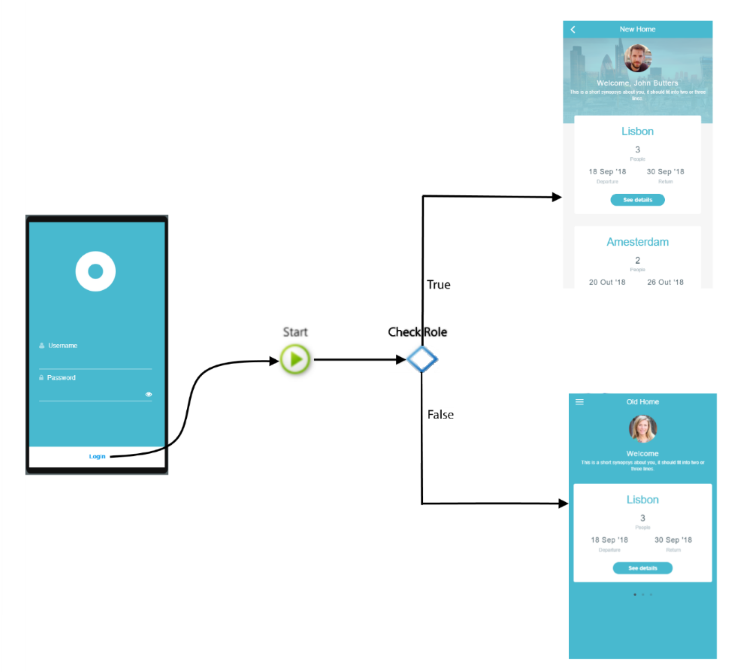
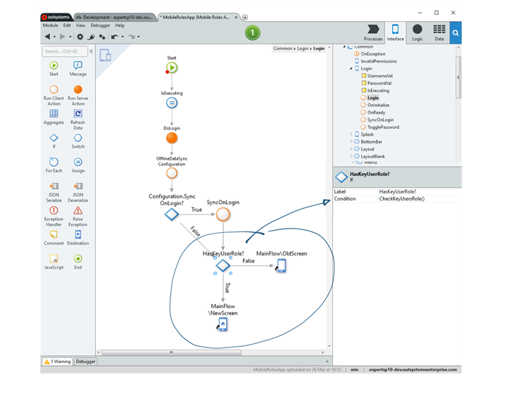
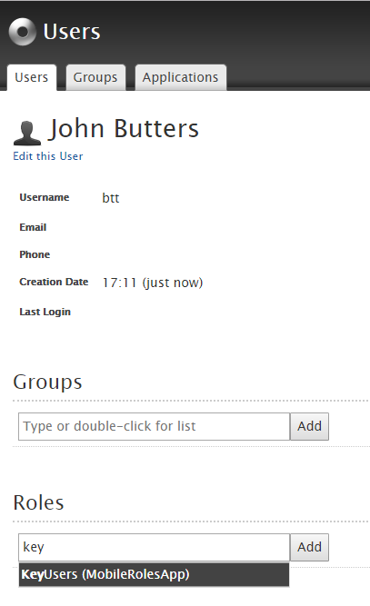
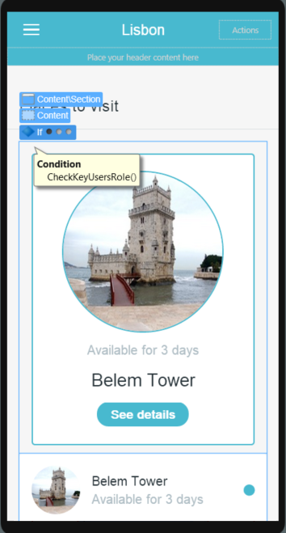
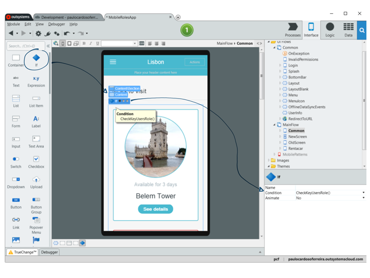
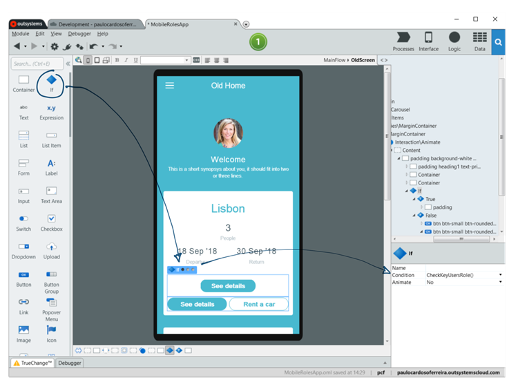
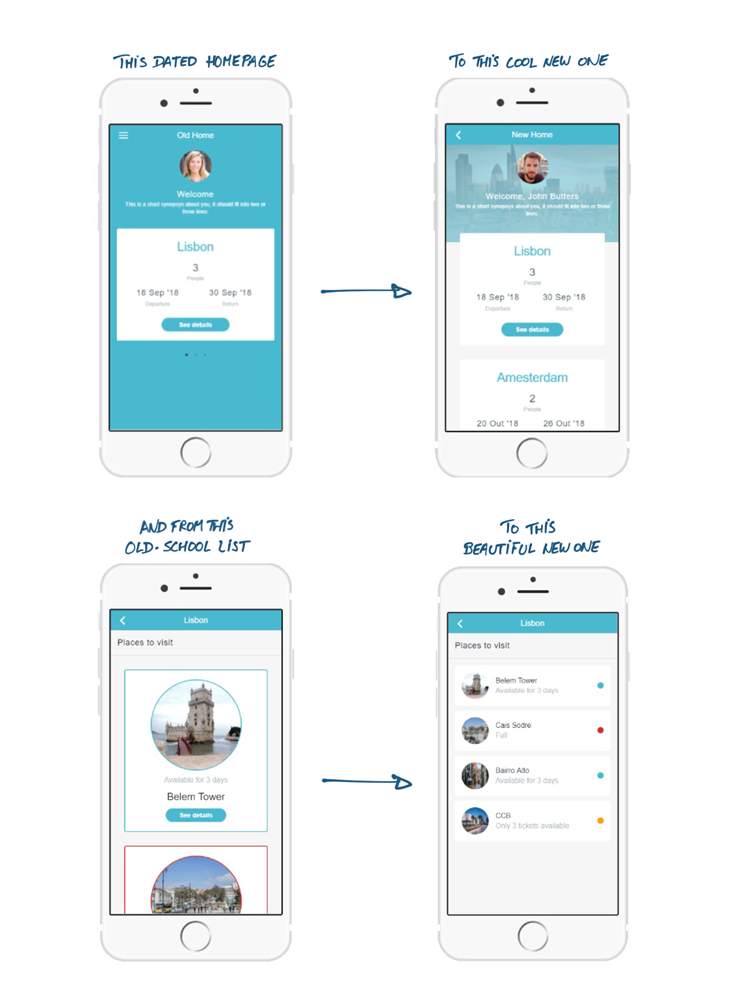

# Feature toggle in OutSystems

When you want to add a new feature or a new screen in OutSystems you don't need to branch and get into merge hell. Instead, you create the new feature in your live application and make it available to key users so you can get their feedback. We call this feature toggling.

In this article, we’ll guide you on how to implement and use feature toggles. All your app will need is to require login.

## Create a new role and a Role-Check Function

Before making any changes in your app, you must create a role for the users to whom you’ll provide the new changes. Here’s how to do it.

### Step 1:  Create a new user role

Add a new role to your application:



### Step 2: Create a Function from a Client Action to Verify the Role

Here’s how to create this function:

1. Create a client action and define it as a function.
1. Add JavaScript to your action, add an output parameter to your JavaScript, and create the role check call. Use this code sample to create your own:
    ```$parameters.<YOUR OUTPUT PARAMETER> = $public.Security.checkIfCurrentUserHasRole($roles.<YOUR ROLE>);```
1. Assign the Javascript output parameter to the output parameter function.

    

    You can now create new content.

## Create a New Home Screen

Our example is a travel app with a home screen that we want to change. This is a total visual overhaul, which calls for a completely different screen. To do this screen, you’ll need to create a new role, assign that role to the users who will test the new screen, and add a bit of logic to the login. At a high-level, this is how it looks.



All you have to do is follow these steps.

### Step 1:  Create Your New 

Create your new screen, add all the desired elements to it, and in the screen parameters, make it available only for the role you have created:


### Step 2: Add the Role Verification in the Login

In the login flow, add an if pattern to verify the role. Depending on the answer, redirect the user to the corresponding screen. Press the 1-Click Publish button.




### Step 3: Assign the Role to Users

Now that you have your new screen ready to showcase, go to the Users app, and assign your key users to the newly created role.



And that’s it! Now the users you assigned to your newly created role just need to log out and log in again to have access to a completely new screen.


## Change a Screen


Changing an existing screen instead of adding a new one is as easy as adding an "if."



Here’s how to do it.

### Step 1: Add an If Condition to the Screen

Drag and drop an If condition into your screen. Add your existing elements to false; to true, add new elements.



### Step 2: Attribute the Check Roles Function to the Condition for the New If

In the **If** details, put your check roles function as the condition to be evaluated. Press the 1-Click Publish button.

### Step 3: Assign the Role to Users

Now that you have your UI ready to showcase, go to the Users app and assign your key users to the newly created role.


And that’s it! Now the users with different roles will see different screens.

## Add a New Feature That Requires a New UI

If you want to make a new feature available to some of your users and it requires a new UI, the logic is very similar to changing a screen. Let’s take a look.


### Step 1: Add an If Condition Where You want to Add the New UI

Drag and drop an **If** condition into your screen. To false, add your existing elements; to true, add the new elements.



### Step 2: Attribute the Check Roles Function to the Condition for the New If

In the details for **If**, put your check roles function as the condition to be evaluated. Press the 1-Click Publish button.

### Step 3: Assigning the Role to Users

Now that you have your UI ready to showcase, go to the Users app and assign your key users to the newly created role.


And that’s it! Now the users with different roles will see a different UI.

<div class="info" markdown="1">

If you create a new button that leads to a new feature, as long as the OnClick action in the new UI is the only way to get to your new screen or feature, only the users with access to the new UI will be able to see the new screen or feature.

</div>

## Results and Publishing

Play around with your applications as you like. In our example, we went from:



Your old and new home pages and lists can live together until you decide to make your changes available to everyone. Then you just remove your If condition from the flows and redirect to your new assets. It's really is that easy.
