# Sales application demo

This page shows a sales application demo that controls access through a [predefined authorization mechanism](hands-on.md). Let’s call it **Sales**.

This application demonstrates how to use the Hierarchical Roles approach. It’s a simple application with only one end-user module. In this module, you can find several screens. Your future business applications that require a Hierarchical Roles approach are going to be similar to this application.

[Download from the OutSystems Forge](https://www.outsystems.com/forge/Component_Overview.aspx?ProjectId=8742) the Hierarchical Roles example described in this article, and publish it in your factory environment. Use it as a reference or adapt the code to implement your business case.

In the [first article](faq.md), you learned about the roles and what they're used for:

* Authorization mechanisms at screen level: who accesses what screens

* Controlling displayed information: who sees what inside screens

* Controlling available actions: who can update/insert/delete what

Let’s see how you can cover these three scenarios with the new hierarchical roles approach.

## Authorization mechanisms at screen level

To control which role in your factory can access the sales screens, you should take advantage of the built-in Screen Roles feature.

In every screen of this application, you have to assign the unique role that you have created before: **Sales**.

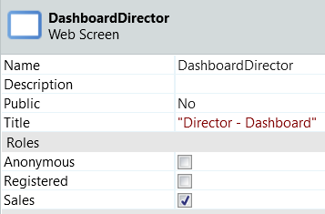

## Controlling the displayed information

Simply call the **HasAccessByFunctionId** action, described previously, in screen preparations. This way you identify if a specific user/function has permission to access the entire screen or parts of the screen.

If the user doesn’t have permission to access the screen, raise an exception, and redirect the user to the Invalid Permissions screen.

The following figure shows the **HasAccessByFunctionId** action and the exceptions in the logic.

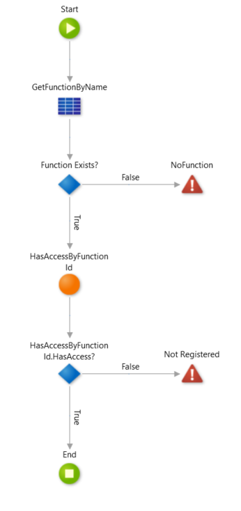

## Controlling the available actions

In screens where users can perform actions such as updating records, importing reports, etc., you may need to validate the user's permissions for each of these actions. To perform this validation, you can call **GetPermissionsByUserId** in those screens’ **Preparation**. Simply check the outputs of this action to understand if the user has permission to read/write or not.

The following figure shows the SalesDashboard screen Preparation.

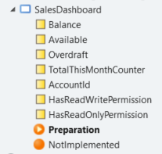

The figures below depict the use of the **GetPermissionByUserId** action in the Preparation logic, and the assignments to check the permissions:

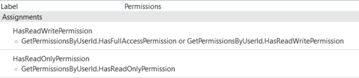

Here's how the **Sales** module looks like:

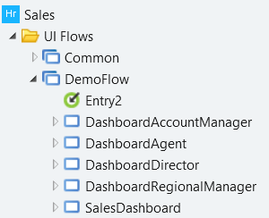

## SalesDashboard screen

Every role can access the SalesDashboard screen. It’s the homepage and it's not restricted by function.

At the preparation, calling the **GetPermissionsByUserId** action shows or hides parts of the screen, or allows or forbids operations on the screen.

Let’s consider two users and two Functions:

* Agnes Marvs, as Account Manager;

* Angela Arthur, as Agent.

At the BackOffice, the configuration of the Account Manager role allows you to have Read/Write permissions, while the Agent role has Read-Only permission.

As an Account Manager, Agnes Marvs can perform the actions "Pay Bills" and “Transfer.”, as depicted in the figure below.

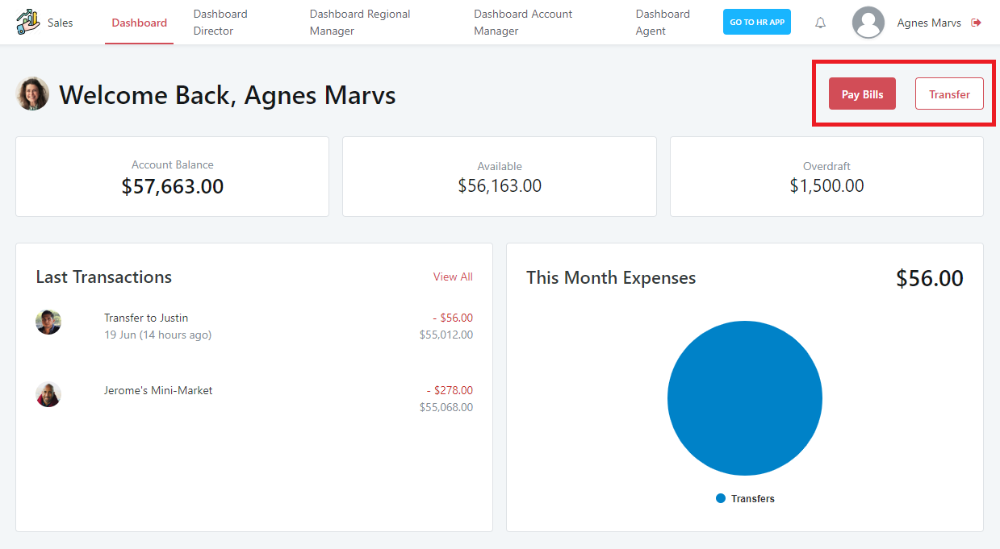

As an Agent, Angela Arthur doesn’t see any actions. 

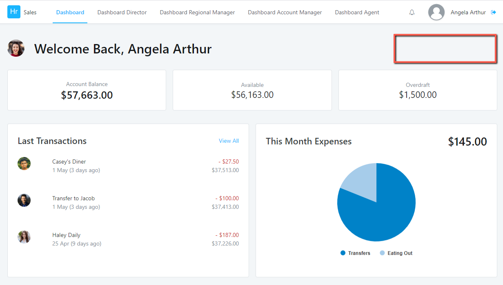

## Other screens

Other dashboards are function-specific. This means that only the designated function or higher functions in the hierarchy can access the dashboard screen. Two examples:

* **DashboardAgent** (Agent specific): since Agent is the lowest level in the hierarchy, every function can access it.

* **DashboardRegionalManager** (Regional Manager-specific): only Regional Manager or above roles can access it. The Account Manager and Agent functions can't enter this screen.

To implement this access, at the preparation you need to add the **HasAccessByFunctionId** action to restrict or allow access to the screen.

Let’s use the same users with the same functions to exemplify - Agnes Marvs (Account Manager) and Angela Arthur (Agent).

The Agent function accesses the Agent Dashboard:

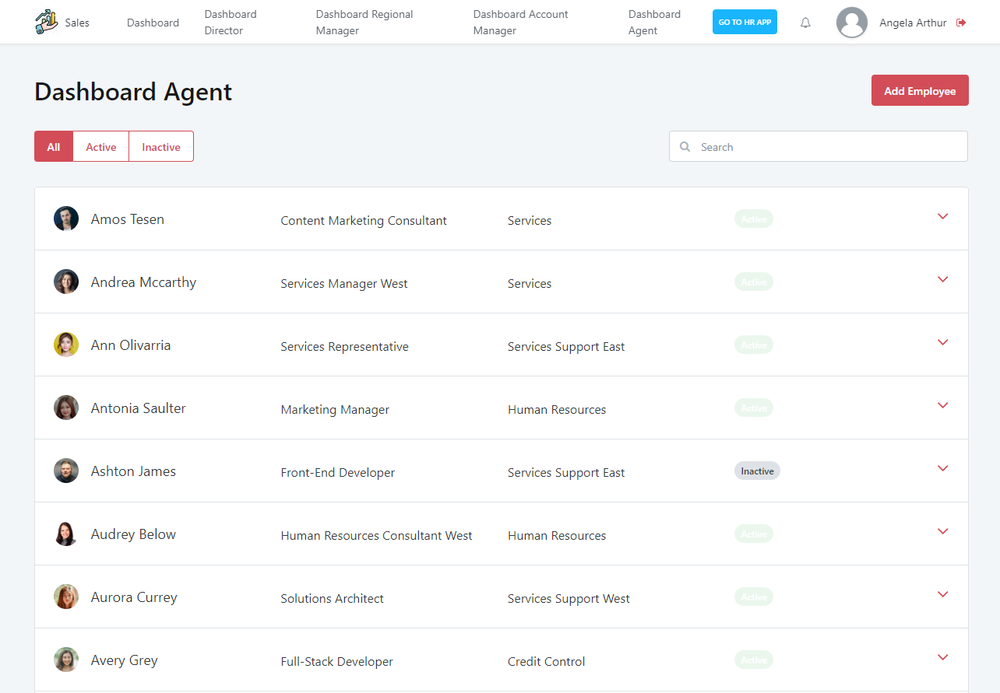

The Account Manager function, or any other function, accesses the Agent Dashboard.

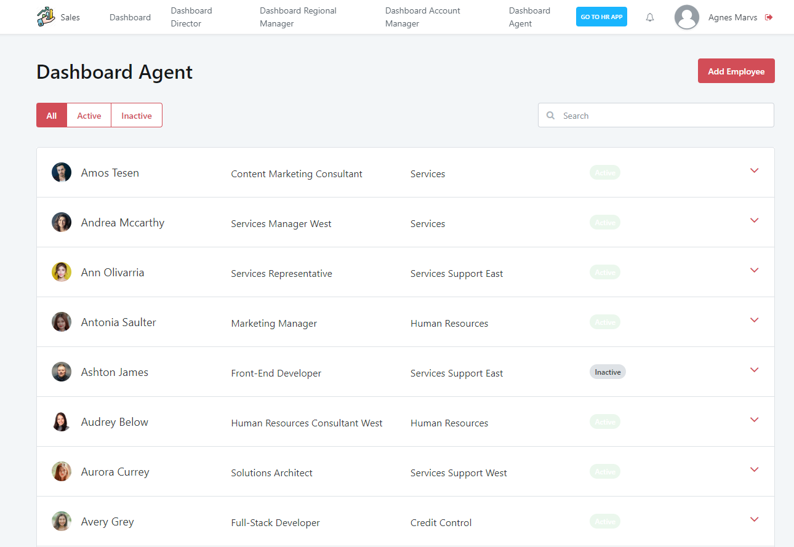

The Account Manager function accesses the Dashboard Account Manager.

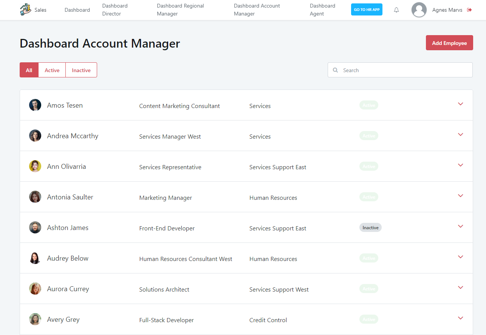

The Agent role can't access the Dashboard Account Manager. 

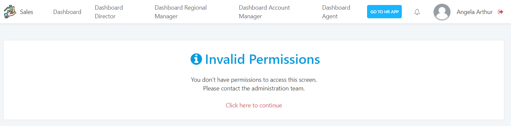
