# How to implement hierarchical roles

Let’s consider a use case for applying Hierarchical Roles, and learn how to do it.

## Use case

Imagine that you have to implement a web application for the sales department of your company. In this app, you have to create dashboards for several people, with different data and metrics.

Within the sales department, there may be several roles, such as VP, Manager, Agent, etc. For this use case, let’s consider the following roles:

* Director

* Regional Manager

* Account Manager

* Agent

The hierarchical organization of roles is the following:

* Agent reports to Account Manager.

* Account Manager reports to Regional Manager.

* Regional Manager reports to Director.

Based on this hierarchy, this article shows the implementation of one solution. This example refers to the different roles as functions.

## Before you start

The Hierarchical Roles app is a generic,  business-agnostic component, and all OutSystems applications in your factory can reuse it. Creating a dedicated application is highly recommended.

Before starting to implement the Hierarchical Roles example, consider the following assumptions:

* A user only has one function.

* One function only reports, at most, to one function.

* The user provider of this application is the OutSystems built-in users application.

Perhaps your use case is slightly different; for instance, you could want to allow one function to report to more than one function at a time. If so, you need to adjust the code suggested in the next chapters. Those requirements are also possible to achieve with Hierarchical Roles, although they weren't included in these articles to keep the example as simple as possible.

 
[Download from the OutSystems Forge](https://www.outsystems.com/forge/Component_Overview.aspx?ProjectId=8742) the Hierarchical Roles example described in this article, and publish it in your factory environment. Use it as a reference or adapt the code to implement your business case.

## Data model

You have four roles identified: Director, Regional Manager, Account Manager, and Agent. From now on, this article is going to refer to roles as  **functions**.

Since you can't organize the OutSystems Roles as a hierarchy natively, you need to store four identified functions in one OutSystems entity. Let’s call this Entity **Function**. Every end-user must have a Function assigned.

However, you need one role to create the basic authorization mechanism. All targeted end-users that need to use the new sales application should have the **Sales** role. This way, you make sure only a subset of your users can access the desired application. The recommendation is for you to create a new module to centralize all roles at your factory, at least the roles for apps that you would like to apply hierarchical levels to; let’s call this module **Roles_Lib**.

Now, it’s important to define permissions and assign them to functions. You can start by creating three simple permissions and then enrich the list with more granular permissions. The Full Access, Read/Write, and Read-Only permissions are the basis. Create a Static Entity--**Permission--** to store these records. Each function should have a permission: create a new entity called **FunctionPermission**.

Now that you have your data model in place to support the Hierarchical Roles feature, you have to assign the new functions to your users. As you know, it’s impossible to change the OutSystems users entity, but you can extend it by creating a new entity, the **UserExtension**. In this entity, you just need to store the FunctionId.

Your data model should look like this:

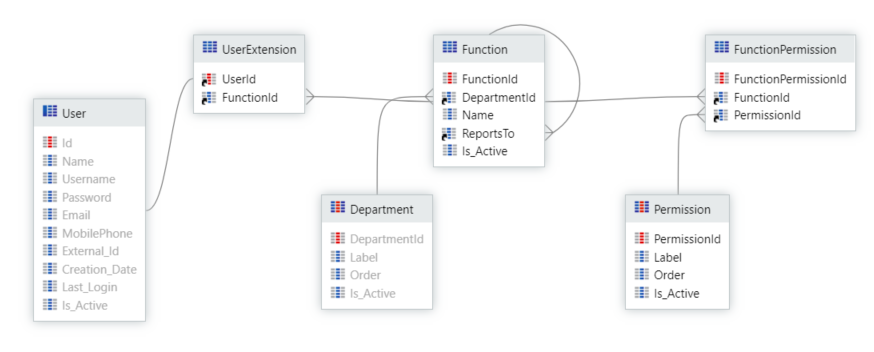

A few notes about the data model:

* To create the hierarchical structure, it was necessary to add a **ReportsTo** attribute in the Function Entity. This attribute is a foreign key to the Function Entity (same table) and represents a link to the function hierarchically, immediately above the given function.

* The functions group contains the **Department** entity. Functions can relate to a specific department or business unit of your company. For instance, the Project Manager function exists in the IT department but it doesn’t exist in the sales department. In the future, the department concept is also going to help you to create a hierarchy inside a group, or department in this example. Don’t forget to adapt according to your business case.

* It’s important to reinforce that the solution described here is only an example; different use cases require different implementations.

## Architecture

This section explains the architecture design of the Hierarchical Roles application.

### Roles_Lib (Library module)

In this module, you can create all OutSystems Roles for apps that require a Hierarchical Roles approach. The current example shows a **Sales** role and a **HierarchicalRolesAdmin** role to use in Hierarchical Roles BackOffice's screens.

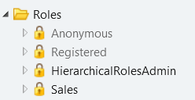

### Department_CS (Core Service module)

This module stores the Department Entity. As previously mentioned, you need to group your functions. This current example shows the Department Entity, used for that purpose.

You can implement this module outside of the Hierarchical Roles app in case you already have the aggregator (for example, Department, Business Unit) implemented somewhere else.

### HierarchicalRoles_CS (Core Service module)

This module implements the data model, and the server actions, to validate the user’s permissions. Also, it shows a few CRUD actions created to expose to the BackOffice screens.

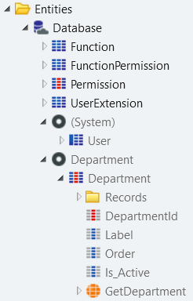

The figure below shows the **GetPermissionsByUserId** action.

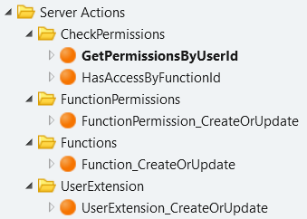

### HierarchicalRoles (End-user module)

This module contains all BackOffice screens. Only users with the **HierarchicalRolesAdmin** role can access those screens.

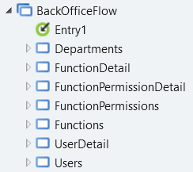

## BackOffice

Now that you implemented the data model, the next step is to build the BackOffice screens to manage the Hierarchical Roles’ data and configure the hierarchy.

BackOffice screens don't require complex logic, and you can take advantage of [scaffolding ](https://www.outsystems.com/learn/lesson/867/scaffolding-and-richwidgets)patterns to accelerate their development.

You need to create the following screens. Each one requires a list and a details screen:

* Departments (or any other concept that you have identified in your company)

* Functions

* Permissions

* Users

The following figure shows the functions list screen, used to create and manage the existing functions.

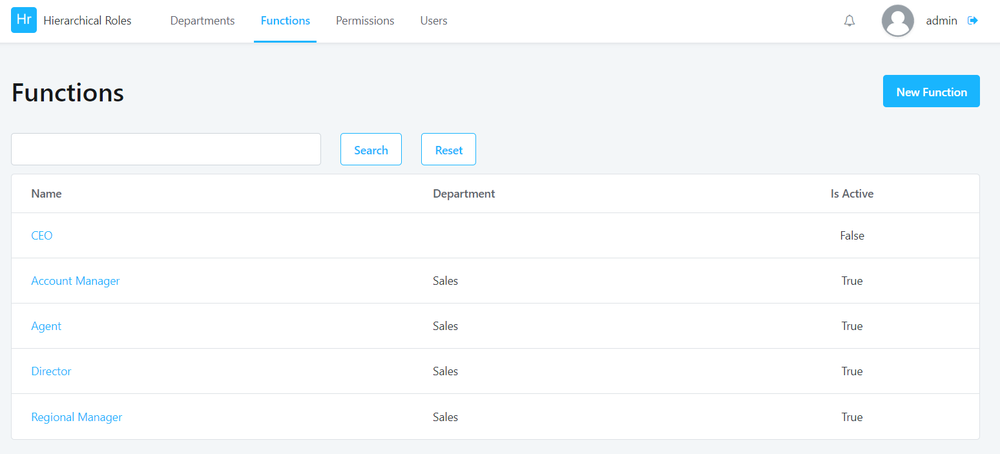

The figure below depicts the function details screen, used to edit the function details, and assign department and direct reports to functions.

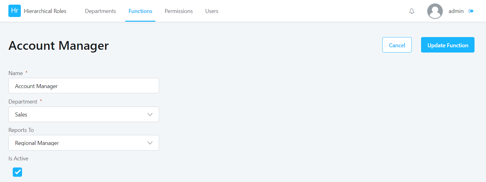

The screen below is the permissions list screen, used to assign permissions to functions.

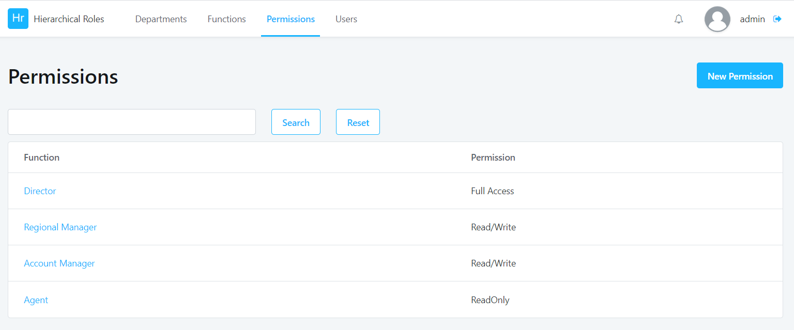

The following screen shows the users list screen, used to assign functions to users.

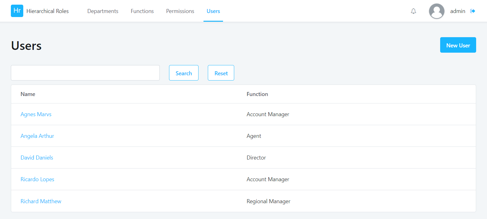

Your Hierarchical Roles app also needs server-side logic to implement the authorization mechanism. 

After creating the BackOffice screens and populating the database with meaningful data, create the logic to validate permissions. Future applications are going to consume those actions.

You can complement this API with other actions that you may need. The following two actions are mandatory: 

### GetPermissionsByUserId action

This server action retrieves the set of permissions and functions assigned to a given **UserId**. When calling this action, you get to know if the user has Full, Read/Write, or Read-Only access. Also, the action retrieves the user's **FunctionId** (Director, RegionalManager, AccountManager or Agent).

The following figure shows the **GetPermissionsByUserId** action.

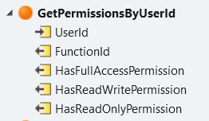

The figure below shows the **GetPermissionsByUserId** action logic.

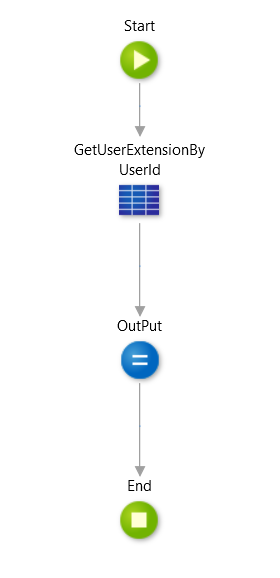

The following image depicts the **CheckPermissions** aggregate query.

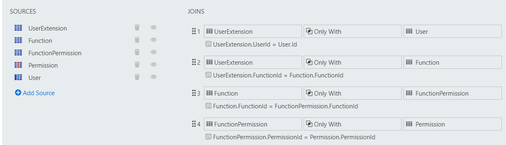

### HasAccessByFunctionId action

Retrieves a boolean value: **HasAccess**. The output variable **HasAccess** indicates if a given user has access to a given function (for example, Director, RegionalManager, etc.).

The input parameter **RequiredFunctionId** represents the function that's required to access a screen. At the screen level, developers should pass the required function to access the screen. 

The **HasAccess** value is true when the user has the function (or a function higher up in the hierarchy) with the **RequiredFunctionId**.

For example: 

* Agnes Marvs is an Account Manager. 

* If she accesses a screen that requires Agent Function, she is going to be able to access the screen. 

* However, if Agnes Marvs tries to access a screen that requires the Director Function, she won't be able to see it.

Please remember the hierarchy of this example: the Director has permissions over the Regional Manager, Account Manager, and Agent; the Regional Manager has permissions over the Account manager and Agent.

The following figure shows the **HasAccessByFunctionId** action.

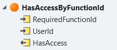

The figure below shows the **HasAccessByFunctionId** action logic.

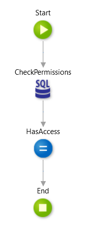

The following image depicts the **CheckPermissions** SQL query.

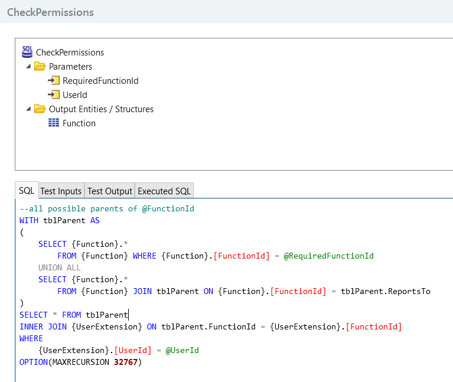

Go to [Sales application demo](demo.md) to see a demo of a sales application.
