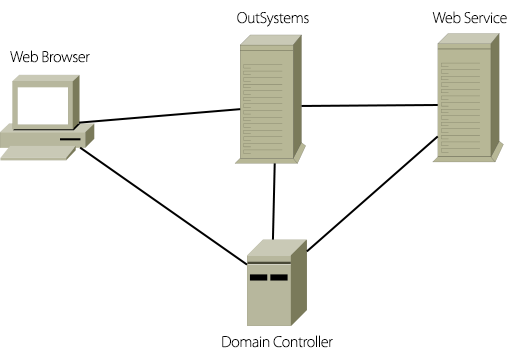

---
summary:
tags:
locale: en-us
Guid: DE66DA4D-B3BA-4F2F-A19E-424C38B5C327
app_type: traditional web apps, mobile apps, reactive web apps
platform-version: o11
figma: https://www.figma.com/file/ZqxffTIAhYyQg8Q2KbSFbb/Development?node-id=1747:88
---

# Integrated Authentication on Web Services - User credentials delegation to Web References in OutSystems

## How to pass the user (browser) credentials onto Web Reference calls 

Assuming your domain controller is properly configured to allow credentials delegation for your Web Server (see next chapter) passing of the user credentials (i.e. the domain login of the user currently using the browser) is very simple:

1. Create a Web Reference to the Web Service that requires Authentication;
1. Set the Web Reference’s Integrated Authentication property to Yes;
1. Make sure that the calls to the Web Reference Actions happen in an Integrated Authenticated context, i.e.:
    * They appear in Actions of a Screen with Integrated Authentication property set to Yes or
    * They appear in Actions of a Screen inside a Flow with Integrated Authentication property set to Yes or
    * They appear in a Web Block included in a Screen under one of the conditions above or
    * They appear in a User Action that is executed under one of the conditions above;

Under these conditions, the credentials that arrive at the Web Service will be the user currently logged in the client machine/browser.

There are a few points worthy of note for the proper operation of this functionality:

1. All the machines involved in this transaction need to be on the same domain: this means that the **machine(s) running OutSystems**, the **Web Service machine(s)** and the **client machine running the browser**.
1. This kind of credential negotiation is only officially supported on Internet Explorer, so this browser is recommended if you require this functionality. Google Chrome in Windows will use the Internet Explorer settings, so you shouldn't have a problem with this browser also.
    * Should the use of Mozilla Firefox be required, Kerberos negotiation can be enabled by typing **about:config** on the address bar of this browser, and setting the configuration keys **network.negotiate-auth.delegation-uris** and **network.negotiate-auth.trusted-uris** to the domain where the machines are (for example outsystems.net). More details can be obtained at [http://www.redhat.com/docs/en-US/Red...g-firefox.html.](http://www.redhat.com/docs/en-US/Red_Hat_Enterprise_Linux/5.2/html/Deployment_Guide/sso-config-firefox.html) These settings have the added effect of disabling the credentials prompt shown by this browser when first accessing an Integrated Authentication screen on a page in the domain, making it behave much like Internet Explorer does.  
    **Please note, however, that this is an unsupported configuration.**

## How to configure Delegation (Active Directory Configurations) 

The scenario is the following:

 

Configuration is made in the domain controller, by configuring the OutSystems server to be trusted for delegation to services in the Web Service server. Here are the steps to be followed [1] on the **Domain Controller Server**:

1. Click **Start**, click **Administrative Tools**, and then click **Active Directory Users and Computers**.
1. Expand domain, and then expand the Computers folder.
1. In the right pane, right-click the computer name for the OutSystems server, select **Properties**, and then click the **Delegation** tab.
1. Click to select **Trust this computer for delegation to specified services only**.
1. Ensure that **Use Kerberos only** is selected, and then click **OK**.
1. Click the **Add** button. In the **Add Services** dialog box, click **Users or Computers**, and then browse to or type the name of the Web Service Server or use Advanced to locate it. Click **OK**.
1. In the **Available Services** list, select the appropriate services (for testing purposes, you may simply select them all). At least W3WP should be selected. Click **OK**.

[1] - [https://technet.microsoft.com/en-us/...for-delegation](https://technet.microsoft.com/en-us/itpro/mdop/appv-v4/how-to-configure-the-server-to-be-trusted-for-delegation)
