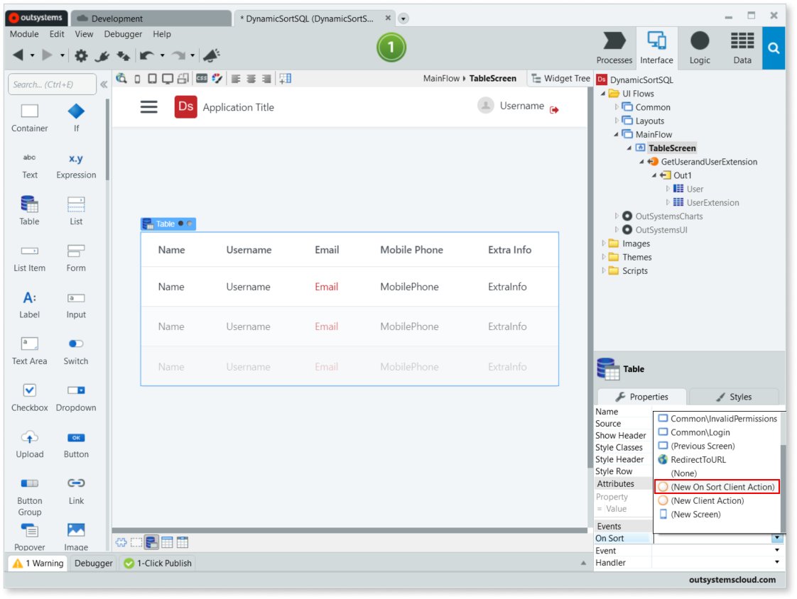
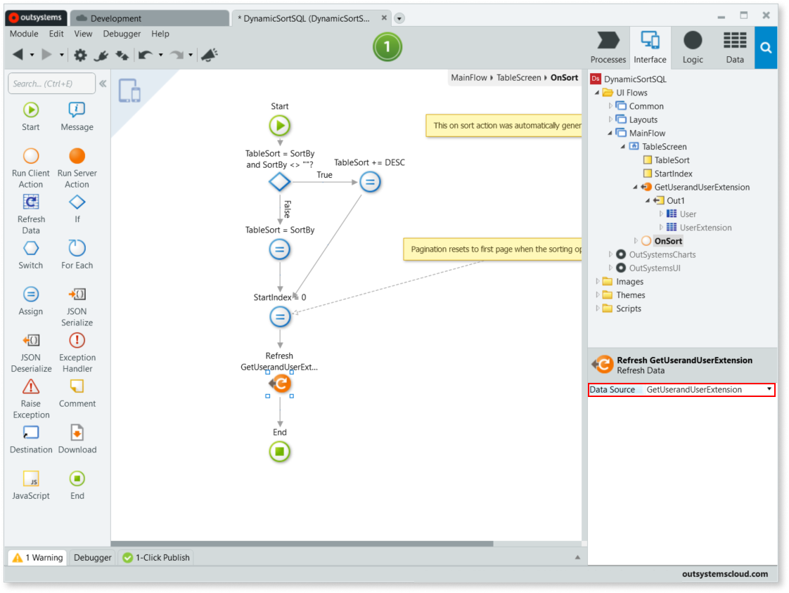
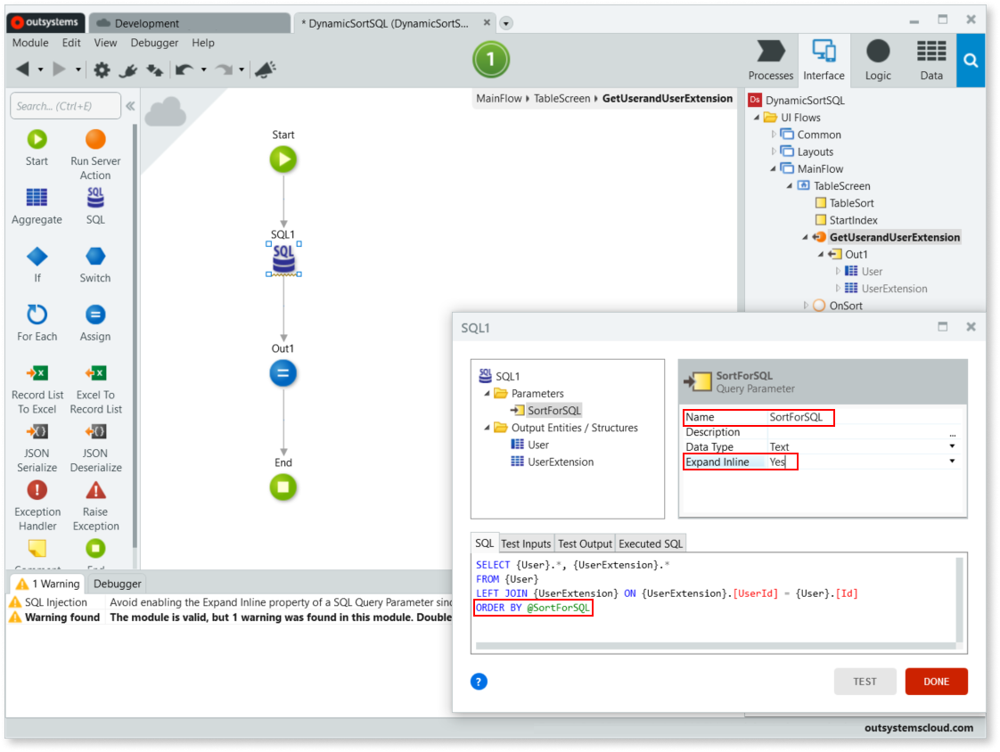
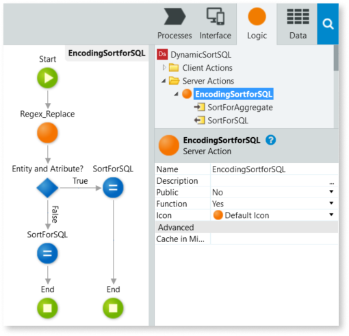
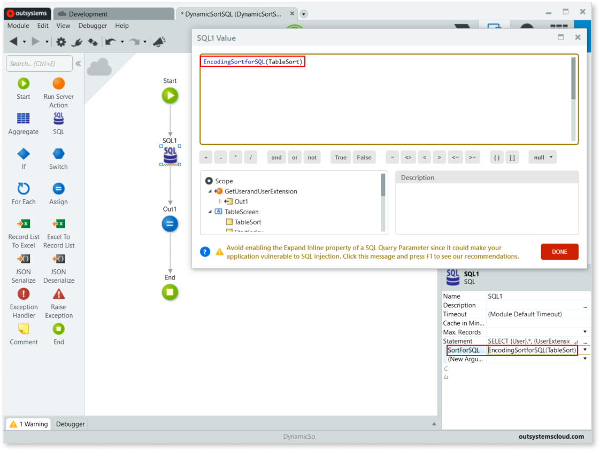

# How to enable dynamic sorting in a table fed by a SQL query

How can I dynamically sort a table that has a **SQL** query as the data source?

## In Reactive Web

You can enable dynamic sorting for a Table by selecting **(New On Sort Client Action)** on the **On Sort** event. Service Studio creates an action with the sorting logic that uses the **Sort Attribute** of each **Header Cell**. The format of the **Sort Attribute** is optimized for Aggregates and the **Sort Attribute** needs to be encoded before using it in a SQL query.

To enable the dynamic sorting in a Table that has a SQL query as the data source follow these steps:

1. To create a new action to handle the On Sort event of the Table, select the **Table** and add a **(New On Sort Client Action)** to the **On Sort** event.

    

    Selecting **(New On Sort Client Action)** on the **On Sort** event also adds two Local Variables, **TableSort** and **StartIndex**.

1. To define the default sort attribute, select the **TableSort** variable, and set the **Default Value** property to `"<Sort Attribute>"`, where `<Sort Attribute>` is the value of the **Sort Attribute** of a **Header Cell**.

    For example, setting the **Default Value** to `"User.Name"` sets the **Name** attribute of the User entity as the default sort attribute.

1. In the new **OnSort** action flow, set the **Data Source** of the **Refresh Data** element to the **Data Action** that contains the **SQL** query that feeds data to your Table.

    

1. Add a **Query Parameter** to the **SQL** query, set the **Name** to `SortForSQL` and set the **Expand Inline** property to `Yes`.

    Setting the **Expand Inline** property to `Yes` allows the use of the Query Parameter as part of the SQL code that's sent to the database at runtime without first being evaluated and turned into a literal by the SQL engine.

1. Add the SQL snippet `ORDER BY @SortForSQL` to your **SQL** query.

    

1. Create a new **Function**, `EncodingSortForSQL`, to encode the TableSort variable used by the OnSort action to a format that's usable by a SQL query.

    

    To create this Function, do the following:

    1. In the **Logic** tab, create a new **Server Action** and add the following Variables:

        * `SortForAggregate` Input Parameter.
        * `SortForSQL` Output Parameter.

    1. Set the **Name** of the new action to `EncodingSortForSQL` and set the **Function** property to `Yes`.

    1. Open **Manage Dependencies**, and from the **Text** producer, add the **Regex_Replace** server action as a dependency.

    1. Add the **Regex_Replace** server action between the **Start** and **End** elements, and set the following properties:

        * **Text** = `SortForAggregate`
        * **Pattern** = `"[^\w. ]"`
        * **Replace** = `""`

        

        This action is used to prevent SQL injection. It removes all characters that aren't a word character (alphanumeric characters and underscore, [^A-Za-z0-9_]), a period (.), or a space ().

        

    1. Add an **If** between the **Regex_Replace** and **End** elements, set the **Label** to `Entity and Atribute?`, and the **Condition** to `Index(SortForAggregate,".") <> -1`.

        

        This If checks if the sort attribute includes both the entity and the attribute by checking for the . separator.

        

    1. In the **False** branch, add an **Assign** between the **If** and **End** elements. Add the following assignments:

        * `SortForSQL = "[" + Regex_Replace.Result + "]"`
        * `SortForSQL = Replace(SortForSQL, " DESC]", "] DESC")`

        

        The first assignment encodes the sort attribute, by wrapping the attribute with square brackets `[]`. The second assignment corrects the encoding when the sort attribute includes a `DESC` command, moving the closing square bracket, `]`, to the correct location.

        

    1. For the **True** branch, add an **Assign** and connect it to the **If**. Add the following assignments:

        * `SortForSQL = "{" + Replace(Regex_Replace.Result, ".", "}.[") + "]"`
        * `SortForSQL = Replace(SortForSQL, " DESC]", "] DESC")`

        

        The first assignment encodes the sort attribute, by wrapping the entity with curly brackets, {}, and wrapping the attribute with square brackets []. The second assignment corrects the encoding when the sort attribute includes a DESCcommand, moving the closing square bracket, ], to the correct location.

        

    1. Add an **End** node and connect it to the previous Assign.

1. In the **OnSort** action flow, set the **SortForSQL** parameter of your **SQL** query to `EncodingSortforSQL(TableSort)`.

    

## In Traditional Web

You can dynamically sort a Table Records fed by a **SQL** query using the List Sort Column Rich Widget. To do that, follow these steps:

1. Add a query Parameter to the **SQL** query define the `Name` as `SORT`, the `Data Type` as `Text` and the `Expand Inline` Property to `Yes`.

    Setting the `Expand Inline` Property to `Yes` allows the use of the Query Parameter as part of the SQL code that will be sent to the database at runtime.

1. Add the SQL snippet `ORDER BY @SORT` to your **SQL** query.

1. Define the `SORT` Parameter of your **SQL** query as `List_SortColumn_GetOrderBy(<TableRecordsName>.Id,DefaultOrder:"{<Entity>}.[<Attribute>]")`, where `DefaultOrder:"{<Entity>}.[<Attribute>]"` defines that by default the **SQL** query will be sorted ascendantly by Attribute `<Attribute>` (of the Entity `<Entity>`), and `<TableRecordsName>` is the name of the Table Records.

    

    The `List_SortColumn_GetOrderBy()` function returns the column to sort by.

1. Implement List Sort Column Rich Widgets in your Table Records Widget as you would do if you were using an Aggregate: 

    

    * Drag a List Sort Column to each of the columns that will be used to sort the **SQL** query.
    * Set the `Column` and `OnNotify` > `Destination` Properties for each List Sort Column.
    * Add a **Refresh Data** node (with the **SQL** query as the `Data Source` to be fetched) and an **Ajax Refresh** node (with the Table Records Widget as the `Widget or Web Block` to refresh).
