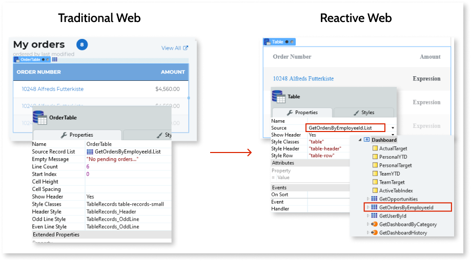
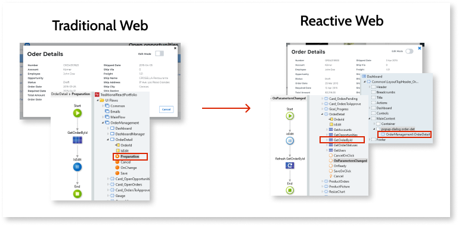

# Core widgets

When creating new UI experiences in the Reactive Web App, keep in mind the client-side development paradigm and the differences outlined in this section.

## General considerations

The following sections provide considerations applicable to all widgets.

### Min. Height, Width, Height

In Reactive Web Apps, use the "style" extended property, for example: `min-height: 15px;`. If you set the width in **chars**, set the length in **em** as an extended style property.

### Style

The **Style** property is an **Expression** in Reactive Web App.

### Visible

Don't use the **Visible** property of the widgets to hide sensitive information.

In Reactive Web Apps, the rendering of the interface occurs primarily on the client side before checking the defined user roles. Be careful when migrating widgets to the Reactive Web App and check that you deliver the right information to the right client side. For more information about security in Reactive Web Apps, see the [Reactive Web security best practices](https://success.outsystems.com/Documentation/Best_Practices/Security/Reactive_web_security_best_practices).

## Widget comparison overview

This section contains notes about widget differences. The table below shows the Traditional Web widgets and their Reactive Web counterparts, where available.

| Traditional Web                 | Reactive Web                   |
| ------------------------------- | ------------------------------ |
| Button                          | Button                         |
| Checkbox                        | Checkbox                       |
| [Combobox](#combobox)           | Dropdown                       |
| [Container](#container)         | Container                      |
| Comment                         | NA                             |
| Edit Records                    | Form                           |
| Editable Table                  | Table with inputs inside cells |
| [Expression](#expression)       | Expression                     |
| Form                            | Form                           |
| If                              | If                             |
| [Image](#image)                 | Image                          |
| Input                           | Input, TextArea                |
| [Input Password](#input)        | Input                          |
| Label                           | Label                          |
| Link                            | Link                           |
| List Records                    | List                           |
| Placeholder                     | Placeholder                    |
| [Radio Button](#radio-button)   | Radio Group                    |
| [Show Records](#show-records)   | Table                          |
| [Table Records](#table-records) | Table                          |
| Text                            | Text                           |

### Container

Convert the **Display** property to a "style" extended property with `if(<expression>, "", "display: none;")`.

### Combobox

Use the **Dropdown** widget in your Reactive Web Apps instead of the **Combobox**. You can use the **Options Content** with **Text Only** to generate `` elements or **Custom** to generate `
` elements for more flexibility.

### Expression

**Expressions** are straightforward to implement. If you used the **Escape Content** option to insert HTML tags in the Traditional App, use the **HTML Element** in the Reactive Web App.

### Form

Check out an example on how to [Validate Form Inputs](<https://success.outsystems.com/Documentation/11/Developing_an_Application/Design_UI/Forms/Validate_Form_Inputs>).

### If

Ensure that you're not bringing confidential information to the conditions of the **If Tool**. For example, if you have information visible only to an admin on the server side, reusing the same logic in the Reactive Web App could fetch confidential information from the server to the client-side UI of the Reactive app. For more information about security in Reactive Web Apps, see the [Reactive Web security best practices](https://success.outsystems.com/Documentation/Best_Practices/Security/Reactive_web_security_best_practices). 

### Image

The **Label** property isn't available in the Reactive **Image** widget. Use the **Extended Property** "title" to set the title of the image.

### Input

You can use the Reactive **Input** widget or the **TextAreat** widget as input. If you need a password field, use the **Input** widget and set the Input **Type** property to **Password**.

### Label

In the Reactive Web App, the **Label** widget only contains the Text property with a text value.

### List Records

To migrate **List Records** from a Traditional Web App, use the **List** widget in the Reactive Web App. The **Line Separator** property impacts the widget generation as follows:

* **None**: set the **Mode** property to **Custom**, with a span tag.
* **New Line**: set the **Mode** property to **Custom**, with a span tag and a trailing Text widget with a `"\n"` text.
* **Bullets**: set the **Mode** property to **Custom**. Needs an enclosing **HTML Element** widget with a span tag. You also need the `ul` tag with another **HTML Element** (with the `li` tag) for each list element.

### Radio button

In Traditional Web Apps, the [Radio Button widget](https://success.outsystems.com/Documentation/11/Reference/OutSystems_Language/Traditional_Web/Web_Interfaces/Designing_Screens/Radio_Button_Widget) allows you to select an option from a group of possible mutually exclusive options. In Reactive Web Apps, you have the [Radio Group widget](https://success.outsystems.com/Documentation/11/Reference/OutSystems_Language/Interfaces/Designing_Screens/Radio_Group) that groups two or more buttons.

You need to set the variable that holds the value of the selected button. Go to the **Radio Group** properties and set it in the  **Variable** field. This variable's value usually comes from a Static Entity. The variable's value depends on which radio button the user selects.

For more information, watch the demo on [how to use the radio group widget](https://www.outsystems.com/learn/lesson/2048/demo-how-to-use-the-radio-group-widget) from the [Building Reactive Web forms](https://www.outsystems.com/learn/courses/129/building-reactive-web-forms/) course.

### Show Records

See the [Table Records](#table-records) section.

### Table

See the [Table Records](#table-records) section.

### Table Records

The **Table** widget in Reactive Apps is a new widget that supports scaffolding, pagination, and sorting for tabular data. For more information, see [Creating and editing tables](<https://success.outsystems.com/Documentation/11/Developing_an_Application/Design_UI/Creating_and_editing_Tables>) and [Table pagination and sorting](<https://success.outsystems.com/Documentation/11/Developing_an_Application/Design_UI/Creating_and_editing_Tables/Table_pagination_and_sorting>).

This section uses an example of an order management app to guide you on the migration of Table Records.

For this scenario, consider a "My orders" Table Record that displays the orders by employee ID. In Traditional Web Apps, a Table Record like this displays data from the record list returned by an Aggregate in the Screen **Preparation**.

To create this Table Record in your Reactive Web App, you must set the list you get from an Aggregate that exists at the Screen level, as the Table Record **Source**. In this example, the **GetOrdersByEmployeeID.List** list from the **GetOrdersByEmployeeID** Aggregate.

The following figure shows the difference between Table Records in Traditional and Reactive Web:

You can use the **IsDataFetched** property of the Aggregate to show the loading spinner while fetching data. Then, use an **If** to check if the Aggregate's output list is empty or not. If the output list is empty, the users see an empty slate. If not empty, the users see the records in a table.

## Rich Widgets overview

Reactive Web Apps and OutSystems UI use modern implementations that replace the legacy Rich Widgets. Use the following table for guidance on how to replace Rich Widgets in your new app.

| Rich Widget                    | Notes                                                                                        |
| ------------------------------ | -------------------------------------------------------------------------------------------- |
| Application Switcher           | Change **Data Source** to **Data Action**.                                                   |
| Dropdown Menu                  | Use the [**Dropdown**](https://success.outsystems.com/Documentation/11/Reference/OutSystems_Language/Interfaces/Designing_Screens/Dropdown) widget from OutSystems UI.                                              |
| Feedback Ajax Wait             | There's no Ajax in Reactive, review the UX and update it.                                            |
| Feedback Message               | Use the [**Message**](https://success.outsystems.com/Documentation/11/Reference/OutSystems_Language/Logic/Implementing_Logic/Logic_Tools/Message) tool on the client side, fetching message from server, if needed.                 |
| Icon                           | Use the new [**Icon**](https://success.outsystems.com/Documentation/11/Reference/OutSystems_Language/Interfaces/Designing_Screens/Icon) widget, with **Size** instead of **Font Size**.                                    |
| Input Autocomplete             | Migrate to an [**Input**](https://success.outsystems.com/Documentation/11/Reference/OutSystems_Language/Interfaces/Designing_Screens/Input) widget with OnChange login or **DropdownSearch** from OutSystems UI. |
| Input Calendar                 | Use the [**Date Picker**](https://success.outsystems.com/Documentation/11/Developing_an_Application/Design_UI/Patterns/Using_Mobile_and_Reactive_Patterns/Date_Picker) widget from OutSystems UI.                                           |
| List Counter                   | Create your own or check the [**Pagination**](https://success.outsystems.com/Documentation/11/Developing_an_Application/Design_UI/Patterns/Using_Mobile_and_Reactive_Patterns/Pagination) UI Pattern from OutSystems UI.                       |
| List Navigation                | Check the [**Pagination**](https://success.outsystems.com/Documentation/11/Developing_an_Application/Design_UI/Patterns/Using_Mobile_and_Reactive_Patterns/Pagination) UI Pattern from OutSystems UI.                                          |
| List Sort Column               | Scaffold a [**Table**](https://success.outsystems.com/Documentation/11/Reference/OutSystems_Language/Interfaces/Designing_Screens/Table) with sorting and inspect the logic, reusing and adapting as needed.     |
| Layout Chicago / Email / Popup | Use [**Blocks**](https://success.outsystems.com/Documentation/11/Reference/OutSystems_Language/Interfaces/Navigating_in_the_Application/Block).                                                                                  |
| Layout London                  | Use [**Blocks**](https://success.outsystems.com/Documentation/11/Reference/OutSystems_Language/Interfaces/Navigating_in_the_Application/Block) and light UI.                                                                      |
| Popup Editor                   | Use [**PopOver Menu**](https://success.outsystems.com/Documentation/11/Reference/OutSystems_Language/Interfaces/Designing_Screens/Popover_Menu) and [**Popup**](https://success.outsystems.com/Documentation/11/Reference/OutSystems_Language/Interfaces/Designing_Screens/Popup).                                                          |
| Popup Info Balloon             | Use [**PopOver Menu**](https://success.outsystems.com/Documentation/11/Reference/OutSystems_Language/Interfaces/Designing_Screens/Popover_Menu) and [**Popup**](https://success.outsystems.com/Documentation/11/Reference/OutSystems_Language/Interfaces/Designing_Screens/Popup).                                                          |

### Popups

To create Popups in Reactive Web Apps, you need to create a **Block** with the popup content and use Aggregates at the Block level to get the data you need.

Use the **OnParametersChanged** Action to refresh the Aggregate according to the input (**OrderId**, in this example, for the popup to show the detail of an order).

Use the popup widget inside the Screen, containing the Block you built with the content.

The following figure shows the difference between popups in Traditional and Reactive Web.

For more information about popups in Reactive Web Apps see [Create and use a Popup](https://success.outsystems.com/Documentation/11/Developing_an_Application/Design_UI/Inputs/Create_and_use_a_Popup).

## Widget events

The following sections contain the migration notes about widget events.

### On click

You can implement the functionalities of the **On Click** set of properties in Traditional Web to Reactive app as follows: 

* **Destination** - point to a Screen Action or Screen
* **Validation** - use the **Built-in Validation** to check the client side, but also implement validation on the server side before committing any values to the database
* **Method Submit** or **Ajax Submit** - set to a Screen Action calling a referenced **Server Action** from the Traditional Web App (reuse old logic)
* **Navigate** - redirect to another destination

### On Render

The **OnRender** event runs every time that data of a Screen or Block changes. For example, changing one label triggers the event. You can use it to update a third-party component.

---

Documents in this section:

* [Introduction to migrating Traditional Web to Reactive Web Apps](intro.md)
* [Differences to consider between Traditional and Reactive Web Apps](differences.md)
* [Suggested stages of Traditional to Reactive Web App migration](stages.md)
* [Traditional to Reactive Web App migration reference](reference.md)
    * [Module elements](ref-module-elements.md)
    * [Front-end](ref-frontend-intro.md)
        * [User Interface](ref-frontend-ui.md)
        * [UI Flow elements](ref-frontend-ui-flows.md)
        * [Screen and Block logic](ref-frontend-screen-and-block.md)
        * [System Actions](ref-system-actions.md)
    * [Core Widgets](ref-core-widgets.md)
