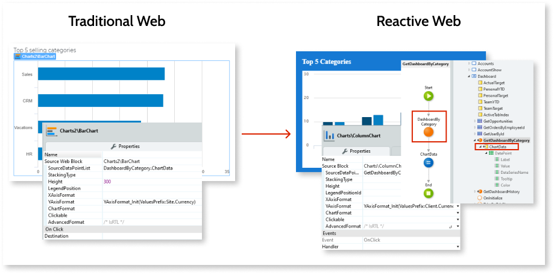
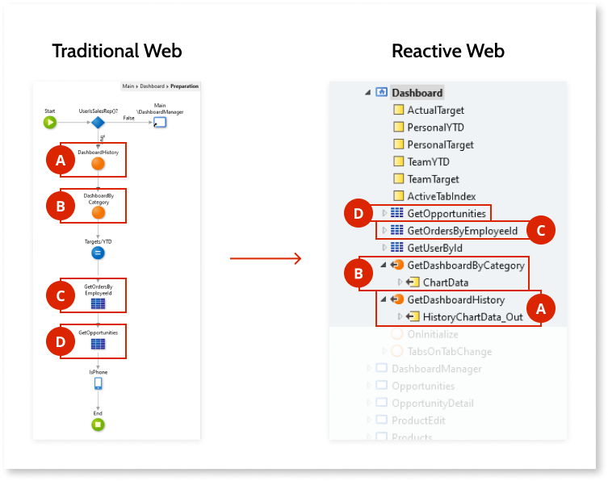

# Screen and Block logic

This section provides you with details on how to migrate logic in your Traditional Web App Screens and Blocks to your new Reactive Web App.

## Ajax Refresh

Reactive Web Apps don't use Ajax Refresh, as the UI elements in the Reactive Web Module are automatically refreshed when data changes.

## Charts

Using chart Widgets in Traditional Web Apps and Reactive Web Apps have different approaches.

In a Traditional Web App, the chart widget gets the data from the chart's **SourceDataPointList** property.

In Reactive Web Apps, the process is the same. The chart receives a list of data points. You must ensure you have a data point list to set as the input for the chart. The source of this data can be, for example, an Aggregate or the output of a server Action.

Do the following steps:

1. Right-click the Screen containing the chart.

1. Select the **Fetch data from other sources** option in the menu.

1. Add to it the same server Action you have in the Preparation of the Traditional Web Screen. This server Action at the Screen level returns the data to display in the chart.

The following figure shows the difference between charts in Traditional and Reactive Web.

## Download node

Use the new Download node by adding it to the logic flow.

## DIV / HTML

If your Traditional Web app contains **Containers** that have been translated into HTML DIV elements, you can't copy them directly to Reactive Web Apps. You must recreate the HTML structure using the [**HTML Element**](https://success.outsystems.com/Documentation/11/Reference/OutSystems_Language/Interfaces/Designing_Screens/HTML_Element) widget in Reactive Web. This is a good opportunity for you to refctor your app.

## Preparation { #screen-prep }

In Traditional Web Apps, the Preparation is a server-side Action that fetches the Screen data and prepares it for showing on the Screen. Before opening that Screen, you used to run server Actions and to create Aggregates to fetch the data needed. In Reactive Web, there's no Preparation, and you have to fetch all data using Aggregates and data Actions at each Screen.

Preparation Actions aren't available in Reactive Web Apps, so you need to refactor their logic and queries during the migration of apps. Migrating Preparation can be tricky, depending on the amount of information you have on a page. Be careful not to replicate the Preparation logic in a way that slows down the app, for example, by forcing the client side to wait for the server-side response.

Instead, evaluate the use cases:

* If you're fetching data to show in the UI, use Screen data Aggregates and bind the result to your Widgets. Aggregates run asynchronously and in parallel, and your UI updates when the Aggregates finish fetching data.

* If you're manipulating data before showing it, use data Actions to manipulate the data to fit your needs and then send the right information back to the client side.

To get data to a Screen in a Reactive Web App, right-click a Screen in the Elements Tree and select the following options:

* **Fetch Data from Database** - to create the Aggregates on the Screen. 

* **Fetch Data from Other Sources** - to create data Actions on the Screen.

Never add all the Preparation logic on an **OnReady** or **OnInitialize** Screen event, as this causes long delays in the rendering of the information on the Screen. The Screen would be empty until fetching all data.

### Aggregates { #aggreg }

When migrating Aggregates, consider all the existing dependencies, such as Aggregates depending on other Aggregates or additional logic. You can move Aggregates with no dependencies (or dependents) to Screen Aggregates directly.

**Properties**

Set the **Fetch** property of the Aggregate to **At start** to ensure that the app requests the data from the database when the Screen loads, or **Only on demand** for the Aggregate to query the database only upon a request. You can request it using **RefreshData** at the moment you want the query to run. Refer to the [Aggregate reference page](https://success.outsystems.com/Documentation/11/Reference/OutSystems_Language/Interfaces/Adding_Data_and_Logic/Aggregate) for more information.

You can use the **OnAfterFetch** property on a client Action to manipulate the fetched data, if needed, or to guarantee a logical sequence on the Screen data fetching by calling the **RefreshData**. You can also use additional logic to toggle the temporary content displayed on the Screen when you have the data ready for display.

Ensure you keep the execution sequence of the existing queries when migrating Aggregates, to avoid errors on data fetching.

**Max Records**

Don't forget to address Max Records in the Reactive Web App, as the Traditional Web App calculates its value from the Widgets they're bound to.

If the Aggregate Max Records property is empty, enter the following values:

* If the Max Records bounds to a single widget, enter the value of the Line Count of that widget
* If the Max Records bound to multiple Widgets, enter the value of the highest expected Line Count

### Data Actions

After creating the data Actions on the Screen as explained above, you need to open them and then copy the Actions you were using in the Preparation into these server Actions.

### Example

The following figure shows an example of a Preparation migration to Reactive Web, pointing out the Screen Actions and Aggregates used.

### Security considerations

When converting a Screen Preparation to these multiple parallel ways to fetch data, be aware that each one of them works as a server REST endpoint underneath.

The Screen roles protect Aggregates and Screen Actions from possible threats but, if you need additional protection, always add it on the server side, either on Aggregate filters or on Actions' logic.

For example, if you want to show only the opportunities a user owns, you need to add a filter like `GetOpportunities.OwnerId = GetUserId()`. This example uses the `GetUserId()` function instead of using the user ID itself for not exposing it, creating a security issue.

Never use security logic on the client side, as this creates a security risk. You must always add all the security logic on the server side.

For more information about security in Reactive Web Apps, see the [Reactive Web security best practices](https://success.outsystems.com/Documentation/Best_Practices/Security/Reactive_web_security_best_practices).

## Refresh data

When migrating the **Refresh Data** node, you must analyze the dependencies between the data sources and how the Screen uses the data. You must also check that the client side in the Reactive Web Module only receives the data it requires. Always ensure that your app isn't exposing confidential information. For more information about security in Reactive Web Apps, see the [Reactive Web security best practices](https://success.outsystems.com/Documentation/Best_Practices/Security/Reactive_web_security_best_practices).

If the refreshed **Data Source** doesn't have dependencies, then you must isolate the logic in a Screen Aggregate or a separate **Data Action**, and then refresh the Data Source.

If there are dependencies between the data sources, consider using the **Fetch** property of Aggregates (**On Start** and **Only On Demand**) and creating dedicated async Patterns. You can check out an example in the document [Implement asynchronous data fetching using Aggregates](<https://success.outsystems.com/Documentation/11/Developing_an_Application/Use_Data/Query_Data/Implement_asynchronous_data_fetching_using_Aggregates>).

## Send email tool

This feature is currently not available in Reactive Web Apps, but OutSystems is working on it. In the meantime, here are some workarounds:

* Reuse logic from your Traditional App
* Use a third-party service

## Screen Action { #screen-action }

Keep the app performance in mind when refactoring your Screen Action logic. Identify which logic should run on the server and which on the client. Then, separate the logic into Server Actions and Client Actions. Depending on how you change the Screen, you may need to have input parameters for your Server Actions in order not to use the Preparation.

You can't use the following Actions directly from the UI, as they imply direct access to the server runtime:

* System Actions where there's no client-side alternative, which includes transaction-related and login-related Actions.

* Check/Grant/Revoke roles. Note that there's a [JavaScript API for checking roles](https://success.outsystems.com/Documentation/11/Reference/OutSystems_APIs/JavaScript_API/Security), but you should be careful when using it, as your apps must be secure and by default let only the information relevant to the current Role to fetch by the client side.

* Aggregates on server Entities.

Continue to [System Actions](<ref-system-actions.md>).

---

Documents in this section:

* [Introduction to migrating Traditional Web to Reactive Web Apps](intro.md)
* [Differences to consider between Traditional and Reactive Web Apps](differences.md)
* [Suggested stages of Traditional to Reactive Web App migration](stages.md)
* [Traditional to Reactive Web App migration reference](reference.md)
    * [Module elements](ref-module-elements.md)
    * [Front-end](ref-frontend-intro.md)
        * [User Interface](ref-frontend-ui.md)
        * [UI Flow elements](ref-frontend-ui-flows.md)
        * [Screen and Block logic](ref-frontend-screen-and-block.md)
        * [System Actions](ref-system-actions.md)
    * [Core Widgets](ref-core-widgets.md)
