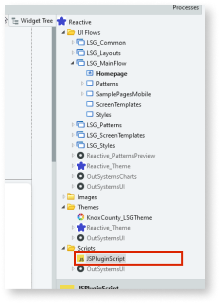
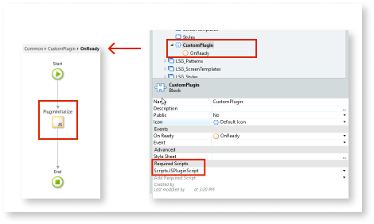
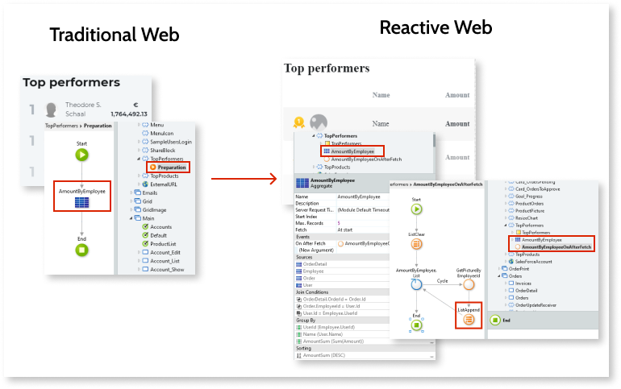

# UI flow elements

This section provides an overview of the UI Flow elements and tips on the migration.

## Custom Patterns using JavaScript plugins

To initialize plugins on a Traditional Web App Screen, you needed to add a **Web Block** to that Screen with the plugin code, and then add an **Expression** with the JavaScript initialization code of the plugin inside script HTML tags.

In Reactive Web App development, the approach is different. You can use a **Block** too, but you need to add the plugin's JavaScript code in a script file used on the Block, as shown in following image.

1. On the **Block** properties, select the scripts used by the Block on the **Required Scripts** properties section. You also have this option on Screens and in the Module itself.

1. Add an **OnReady** event on the properties of the Block or Screen using your script.

1. Open the **OnReady** logic, and add a **JavaScript** node to initialize it.

Read more about adding JavaScript at [Extend Your Mobile and Reactive Apps Using JavaScript](https://success.outsystems.com/Documentation/11/Extensibility_and_Integration/JavaScript/Extend_Your_Mobile_and_Reactive_Apps_Using_JavaScript).

## Entry point { #entry-point }

There is no direct conversion for the **Entry** point element. The first thing you need to do is to evaluate the Traditional Web Screen with the Entry point to check what you can reuse and what not. Here are some things to consider:

* You can copy and paste Aggregates that don't have dependencies. See [Preparation](ref-frontend-screen-and-block.md#screen-prep) for more details.
* Copy server Actions to client Actions, taking into account the security considerations for creating Reactive Web Apps. For more information about security in Reactive Web Apps, see the [Reactive Web security best practices](https://success.outsystems.com/Documentation/Best_Practices/Security/Reactive_web_security_best_practices).

In the Reactive Web App, right-click a Screen in the elements tree and select **Mark as Default Screen** to set the Screen as an "entry" point to a Module.

For more information about entry points, see the [UI Flows](https://success.outsystems.com/Documentation/11/Developing_an_Application/Design_UI/Navigation/UI_Flows) documentation.

## External site

Migrate the element to the [**External Site**](https://success.outsystems.com/Documentation/11/Reference/OutSystems_Language/Interfaces/Navigating_in_the_Application/External_Site) in the Reactive Web App. All the input parameters and properties should have a direct mapping.

Pay attention to the **External Sites** with relative URLs to different Modules, as these may fail due to different URL endings (URLs no longer end with `.aspx` or `.jsf`). An internal router handles the relative URLs to different Modules, so you need to use the full URLs.

## Flow exception handler { #flow-exception-handler }

The **OnException** handlers are on the client side. For the server-side errors, you need to use the exception handlers on the Serven Action flows if you want to handle the exception server-side. If you don't mind having exceptions bubbling up to the client side, then you can handle them either on the client-side Action that called the Server Action or on the **OnException** handler on the UI Flow.

Refer to the [HandleExceptions](https://success.outsystems.com/Documentation/11/Developing_an_Application/Implement_Application_Logic/Handle_Exceptions) documentation for more information.

Check also the recommendations for [Screen Actions](ref-frontend-screen-and-block.md#screen-action).

## Public exception handler

There are no public exception handlers in Reactive Web Apps. You need to replicate them in all your application Modules. You can reuse the login and the error Screens by setting the **Public** property to **Yes** on the Screen properties.

## Screen

Create new Screens in your Reactive Web App or reference them from other Modules, with the following in mind:

* You shouldn't store sensitive information in Local Variables.
* As the client side contains the generated UI, the Screens load before the role validation.
* Where possible, transform JavaScript logic into logic that uses client Actions.

Do the following changes:

* Change the **Title** property value so that it's a text value instead of an **Expression**.

* Copy the **Name**, **Description**, and **Screen Roles** from the Traditional Web App.

* Migrate the JavaScript property to the new JavaScript element.

**HTTP Security**, **Integrated Authentication**, and **Cache In Minutes** have no mappings in the Reactive Web App. Note that you have HTTPS enabled by default.

## Web Block { #webblock }

Check the introductory notes for [Screen](#screen).

`Notify` and `NotifyGetMessage` aren't available in Reactive Web. Use [Events](https://success.outsystems.com/Documentation/11/Reference/OutSystems_Language/Interfaces/Navigating_in_the_Application/Event) and create corresponding handler Actions.

This section uses an example of a **Web Block** on an order management app that displays the sales top performers and their pictures, to guide you on the migration of Web Blocks.

In Traditional Web Apps, the Preparation fetches the data needed to display the sales top performers using an Aggregate. in this example, the **AmountByEmployee** Aggregate.

In Reactive Web, this Aggregate is at the Screen level, inside a **Block** widget. Right-click that Block, select the **Fetch data from database** option in the menu, and then select the same Aggregate you had in the Preparation. In this example, the **AmountByEmployee** Aggregate.

On the **OnAfterFetch** event of this Aggregate, you can add a Screen Action to get the employees' photos and add a local record list to get the records and to display them on the Block list.

The figure shows the difference between these Blocks in Traditional and Reactive Web.

## Referenced Web Block

Insert Referenced Web Blocks using dependencies. See the [Web Blocks](https://success.outsystems.com/Documentation/11/Reference/OutSystems_Language/Traditional_Web/Web_Interfaces/Navigating_in_the_Application/Web_Block) documentation for more information.

Continue to [Screen and Block logic](<ref-frontend-screen-and-block.md>).

---

Documents in this section:

* [Introduction to migrating Traditional Web to Reactive Web Apps](intro.md)
* [Differences to consider between Traditional and Reactive Web Apps](differences.md)
* [Suggested stages of Traditional to Reactive Web App migration](stages.md)
* [Traditional to Reactive Web App migration reference](reference.md)
    * [Module elements](ref-module-elements.md)
    * [Front-end](ref-frontend-intro.md)
        * [User Interface](ref-frontend-ui.md)
        * [UI Flow elements](ref-frontend-ui-flows.md)
        * [Screen and Block logic](ref-frontend-screen-and-block.md)
        * [System Actions](ref-system-actions.md)
    * [Core Widgets](ref-core-widgets.md)
