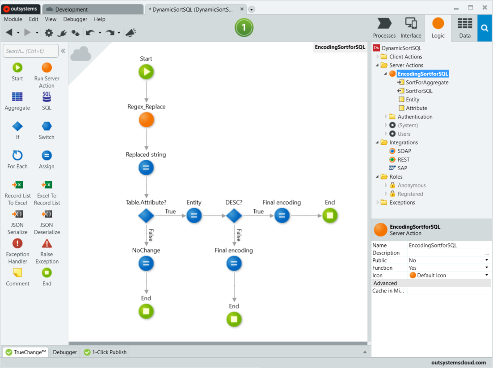

# How to use dynamic sorting in a Table fed by a SQL query

You can enable dynamic sorting for a Table by selecting **(New On Sort Client Action)** on the **On Sort** event. Service Studio creates an action with the sorting logic that uses the **Sort Attribute** of each **Header Cell**. The format of the **Sort Attribute** is optimized for Aggregates and the **Sort Attribute** needs to be encoded before using it in a SQL query.

To enable the dynamic sorting in a Table that has a SQL query as the data source follow these steps:

1. To create a new action to handle the On Sort event of the Table, select the **Table** and add a **(New On Sort Client Action)** to the **On Sort** event.

    

    Selecting **(New On Sort Client Action)** on the **On Sort** event also adds two Local Variables, **TableSort** and **StartIndex**.

1. To define the default sort attribute, select the **TableSort** variable, and set the **Default Value** property to `"<Sort Attribute>"`, where `<Sort Attribute>` is the value of the **Sort Attribute** of a **Header Cell**.

    For example, setting the **Default Value** to `"User.Name"` sets the **Name** attribute of the User entity as the default sort attribute.

1. In the new **OnSort** action flow, set the **Data Source** of the **Refresh Data** element to the **Data Action** that contains the **SQL** query that feeds data to your Table.

    

1. Add a **Query Parameter** to the **SQL** query, set the **Name** to `SortForSQL` and set the **Expand Inline** property to **Yes**.

    Setting the `Expand Inline` property to `Yes` allows the use of the Query Parameter as part of the SQL code that's sent to the database at runtime without first being evaluated and turned into a literal by the SQL engine.

1. Add the SQL snippet `ORDER BY @SortForSQL` to your **SQL** query.

    

1. Create a new **Function**, `EncodingSortForSQL`, to encode the TableSort variable used by the OnSort action to a format that's usable by a SQL query.

    
    
    1. In the **Logic** tab, create a new **Server Action** and add the following Variables:
        
        * `SortForAggregate` Input Parameter.
        * `SortForSQL` Output Parameter.

    1. Set the **Name** of the new action to `EncodingSortForSQL` and set the **Function** property to **Yes**.

    1. Open **Manage Dependencies**, and from the **Text** producer, add the **Regex_replace** server action as a dependency.
    
    1. Add the **Text.Regex_Replace** server action between the **Start** and **End** elements, and set the following properties:
        
        * **Text** = `SortForAggregate`
        * **Pattern** = `"[^\w. ]"`
        * **Replace** = `""`

        

        
        This action removes all characters that aren't a word character (alphanumeric characters and underscore, `[^A-Za-z0-9_]`), a period (`.`), or a space (` `). This is used to prevent SQL injection.
        
        

    
    1. Add an **Assign** between the **Text.Regex_Replace** and **End** elements. Add the following assignments:
    
        * `SortForSQL` = `"{" + Replace(SortForAggregate, ".",  "}.[") + "]"`
        * `SortForSQL` = `Replace(SortForSQL, " DESC]", "] DESC")`

        

        
        The first assignment encodes the sort attribute, by wrapping the entity with curly brackets, `{}`, and wrapping the attribute with square brackets  `[]`.
        The second assignment corrects the encoding when the sort attribute includes a `DESC`command, moving the closing square bracket, `]`, to the correct location.
        
        

1. Set the **SortForSQL** parameter of your **SQL** query to `EncodingSortforSQL(TableSort)`.

    
