# How to automate container deployment by using LifeTime API v2 and Jenkins

## Introduction

The following guide provides a step-by-step description of how to automate the deployment of OutSystems Applications to containers using an automation server such as [Jenkins](https://jenkins.io/) and the LifeTime API.

Please refer to the API [documentation](https://success.outsystems.com/Documentation/11/Reference/OutSystems_APIs/LifeTime_API_v2) to familiarize yourself with the concepts of Environments, Applications, Deployment Zones and Deployment Plans mentioned extensively throughout this guide. To authenticate any request to the LifeTime API, you will need to generate an Authentication Token (for a LifeTime Service Account), as explained [here](<https://success.outsystems.com/Documentation/11/Reference/OutSystems_APIs/LifeTime_API_v2/REST_API_Authentication>).

## Prerequisites

To complete the steps described in this guide, please confirm that you have the following prerequisites installed:

Prerequisite | Version used for this guide  
---|---  
Copy Artifact Plugin | 1.41  
Environment Injector Plugin | 2.1.6  
Extended Choice Parameter Plugin | 0.76  
Jenkins Automation Server | 2.121.2  
Parameterized Trigger plugin | 2.35.2  
PowerShell Plugin | 1.3  
Windows PowerShell | 5.1  
  
For installing Jenkins plugins, please refer to the Jenkins [documentation](https://jenkins.io/doc/book/managing/plugins).

Although the automation process relies heavily on the usage of PowerShell and Groovy scripts, actual PowerShell and Groovy knowledge is not required to carry out the steps of this guide, as you will only be required to copy/paste from the provided template scripts.

## Step-by-step configuration guide

### Create a Folder in Jenkins

Start by creating a new Jenkins Folder to store the Jenkins Projects that will be created in the following steps.

From the Jenkins Dashboard, go to New Item, select Folder and name it `OutSystems`.

 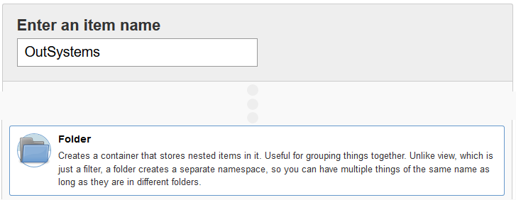

In the **Folder** configuration page, provide the following configuration values:

  * Name: OutSystems
  * DisplayName: OutSystems
  * Description: Contains projects for automating the deployment of OutSystems applications.

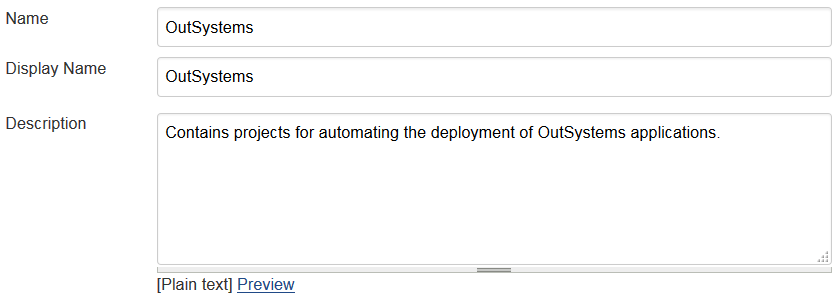

### Retrieve the list of Environments, Applications and Deployment Zones from LifeTime

Secondly, you will be creating a Jenkins Project to fetch the latest Environment, Application and Deployment Zone data from your LifeTime environment.

This information, including names and unique keys, will be used to specify the content of your automated deployment plans.

From the created OutSystems Folder, go to New Item, select Freestyle project and name it `FetchLifeTimeData`.


In the General section, provide the following configuration values:

  * **Description**: Fetch the latest Environment, Deployment Zone and Application data in LifeTime for invoking the LifeTime API.

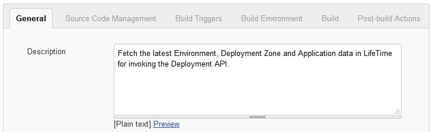

In the **Build Trigger** section, check the **Build periodically** option and provide a scheduling configuration using the cron syntax (e.g.: every day, around midnight):

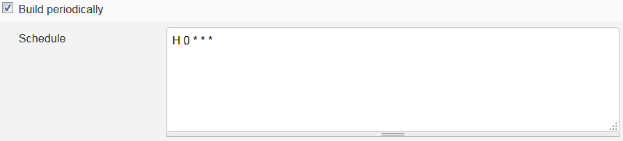

This will ensure that the information about OutSystems Environments, Deployment Zones and Applications is regularly retrieved by Jenkins and kept up-to-date.

In the **Build Environment** section, check the option **Inject environment variables to the build process** and copy/paste the following properties definition to the **Properties Content** field:

```
LifeTimeUrl=(URL of LifeTime environment)  
AuthorizationToken=(Authorization Token of LifeTime service account)
```


In the **Build** section, select **Add build step** and choose the **Windows PowerShell** option. Next, copy/paste the contents of the following PowerShell script to the **Command** field:

```
https://github.com/OutSystems/jenkins/blob/master/scripts-v2/powershell/FetchLifeTimeData.ps1
```

In the **Post-build Actions** section, select **Add post-build step** and choose the **Archive the artifacts** option, while providing the following configuration value:

  * **Files to archive**: `*.json`

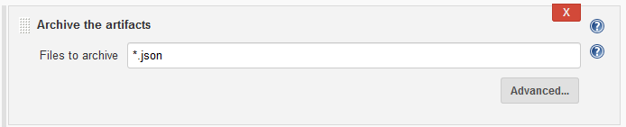

This step is needed to make these artifacts retrievable from other Projects.

Click the **Save** option to persist changes to the Project.

Press **Build Now** to trigger a new build for this Project.

You can check the progress of the ongoing build through the **Console Output** option. This source provides additional troubleshooting information in case the build fails.


For each successful build of this project, the following artifacts will be created in the project workspace:

Artifact | Description  
---|---
applications.json | Mapping file between Application names and unique keys  
environments.json | Mapping file between Environments names and unique keys  
environment_deployment_zones.json | File with deployment zone information for each environment  
  
### Select the Deployment Zones for each Application across Environments

Thirdly, you will be creating a Jenkins Project to configure the Deployment Zones where a LifeTime application should be placed in each Environment.

From the created OutSystems Folder, go to **New Item**, select **Freestyle project** and name it `SetApplicationDeploymentZones`.

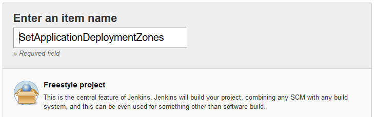

In the **General** section, provide the following configuration values:

  * **Description**: Set the Deployment Zones for each Application across Environments


In the **General** section, check the option **This project is parameterized** and configure the following build parameters:

Build Parameter | Configuration Values  
---|---  
Application Deployment Zones | Select Add Parameter and choose the Extended Choice Parameter option: %% - Name: application_deployment_zones %% - Description: Application Deployment Zones %%%% Select the **JSON Parameter Type** and **JSON Parameter Config Groovy Script** option and copy/paste to the text area the [content of this script](<https://github.com/OutSystems/jenkins/blob/master/scripts-v2/groovy/SetApplicationDeploymentZone.groovy>). Replace the `host` and `port` tags with the host and port where your Jenkins server is running. %% 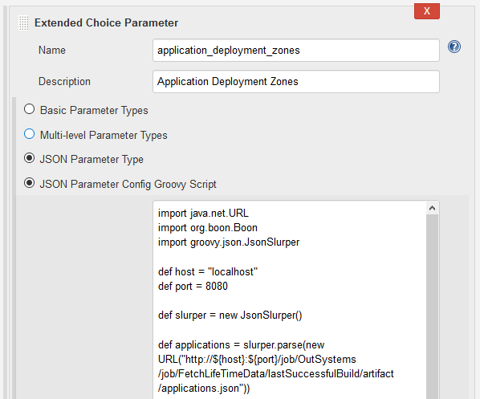  
  
In the **Build** section, select **Add build step** and choose the **Windows PowerShell** option. Next, copy/paste the contents of the following PowerShell script to the Command field:

```
https://github.com/OutSystems/jenkins/blob/master/scripts-v2/powershell/SetApplicationDeploymentZone.ps1
```

In the **Post-build Actions** section, select **Add post-build step** and choose the **Archive the artifacts** option, while providing the following configuration value:

  * **Files to archive**: `*.json`


From this point onwards, you can set the Deployment Zones for each Application by triggering a new **Build with Parameters** of this Project and select the Deployment Zone to be used by each Application for each Environment. You can set an Application to be deployed in a container Deployment Zone.

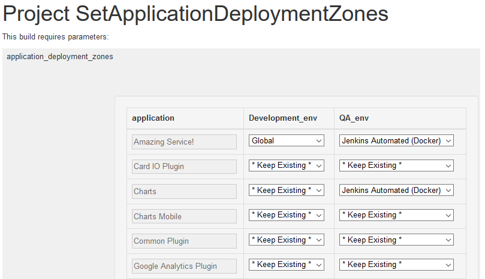

You can check the progress of an ongoing build through the **Console Output** option. This source provides additional troubleshooting information in case the build fails.

For each successful build of this project, the following artifacts will be created in the project workspace:

Artifact | Description  
---|---  
app_deployment_zones.json | A file containing the deployment zones where applications will be deployed in each environment  
  
### Deploy latest Application tags to target LifeTime environment

Finally, you will be creating a Jenkins Project to deploy a list of LifeTime applications from a Source environment to a Target environment via the LifeTime API.

When creating the deployment plan to execute, the latest tags of each application to deploy will be selected and added to the plan. This means that after a developer tags his code in the source environment (using the appropriate version number and tag description), Jenkins can automatically discover this application tag and deploy it to the target environment without further human intervention.

From the created **OutSystems Folder**, go to **New Item**, select **Freestyle project** and name it `DeployLatestTagsToTargetEnv`.


In the General section, provide the following configuration values:

  * **Description**: Deploy to target environment the latest tags of configured Applications.

In the General section, check the option This project is parameterized and configure the following build parameters:

Build Parameter | Configuration Values  
---|---  
Source Environment | Select Add Parameter and choose the Extended Choice Parameter option: %% - Name: SourceEnvironment %% - Description: Source environment when creating the deployment plan. %%%% After selecting the **Basic Parameter Types** option: %% - Parameter Type: Single Select %% - Number of Visible Items: 5 %%%% In the **Choose Source for Value** section, select the **Groovy Script** option and copy/paste to the text area the [content of this script](<https://github.com/OutSystems/jenkins/blob/master/scripts-v2/groovy/DeployLatestTagsToTargetEnvEnvs.groovy>). Replace the `host` and `port` tags with the host and port where your Jenkins server is running   
Target Environment | Select Add Parameter and choose the Extended Choice Parameter option: %% - Name: TargetEnvironment %% - Description: Target environment when creating the deployment plan. %%%% After selecting the Basic Parameter Types option: %% - Parameter Type: Single Select %% - Number of Visible Items: 5 %%%% In the **Choose Source for Value** section, select the **Groovy Script** option and copy/paste to the text area the contents of the [content of this script](<https://github.com/OutSystems/jenkins/blob/master/scripts-v2/groovy/DeployLatestTagsToTargetEnvEnvs.groovy>). Replace the `host` and `port` tags with the host and port where your Jenkins server is running   
Applications To Deploy | Select Add Parameter and choose the Extended Choice Parameter option: %% - Name: ApplicationsToDeploy %% - Description: List of applications to include in the deployment plan. %%%% After selecting the **Basic Parameter Types** option: %% - Parameter Type: Check Boxes %% - Number of Visible Items: 15 %%%% In the **Choose Source for Value** section, select the **Groovy Script** option and  copy/paste to the text area the [content of this script](<https://github.com/OutSystems/jenkins/blob/master/scripts-v2/groovy/DeployLatestTagsToTargetEnvApps.groovy>). Replace the `host` and `port` tags with the host and port where your Jenkins server is running   
  
In the **Build Environment** section, check the option **Inject environment variables to the build process** and copy/paste the following properties definition to the **Properties Content** field:

```
LifeTimeUrl=(URL of LifeTime environment)
AuthorizationToken=(Authorization Token of LifeTime service account)  
DeploymentTimeoutInSecs=300  
SleepPeriodInSecs=20
```

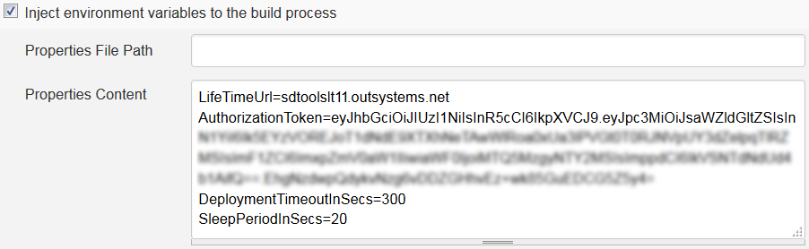

In the **Build** section, select **Add build step** and choose the **Copy artifacts from another project** option, while providing the following configuration values:

  * Project name: `FetchLifeTimeData`
  * Which build: `Latest successful build`
  * Artifacts to copy: `*.json`

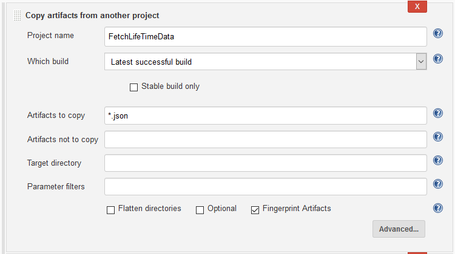

Still in the **Build** section, select **Add build step** again and choose the **Copy artifacts from another project option**, while providing the following configuration values:

  * Project name: `SetApplicationDeploymentZones`
  * Which build: `Latest successful build`
  * Artifacts to copy: `*.json`


Still in the **Build** section, select **Add build step** and choose the **Windows PowerShell** option. Next, copy/paste the contents of the following PowerShell script to the Command field:

```
https://github.com/OutSystems/jenkins/blob/master/scripts-v2/powershell/DeployLatestTagsToTargetEnv.ps1
```

Click the **Save** option to persist changes to the Project.

From this point onwards, you can perform an automated OutSystems deployment in Jenkins, by triggering a new Build with Parameters of this Project and specifying the values for source and target Environments and selecting the Applications to deploy. The selected Applications will be deployed to the target Environment using the Deployment Zones selected in the Project SetApplicationDeploymentZones.

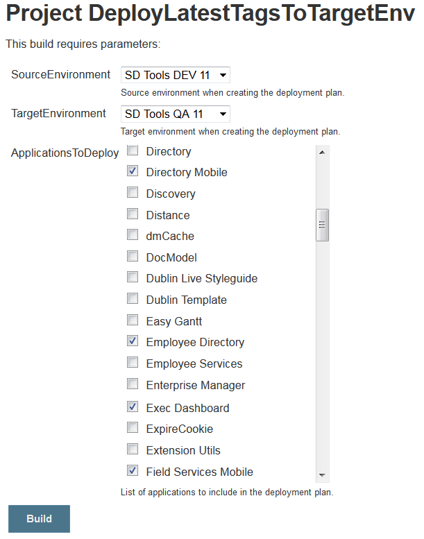

You can check the progress of an ongoing build through the Console Output option. This source provides additional troubleshooting information in case the build fails.

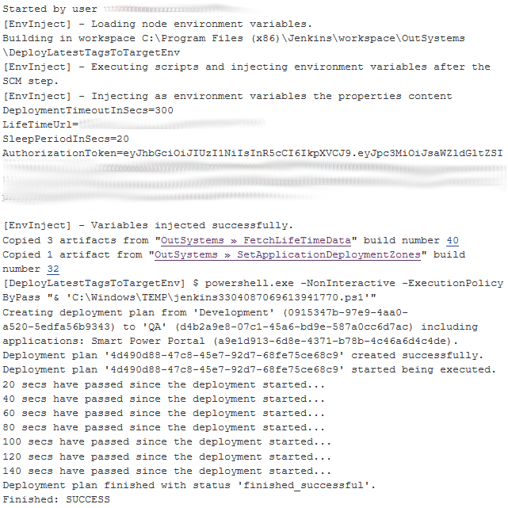

