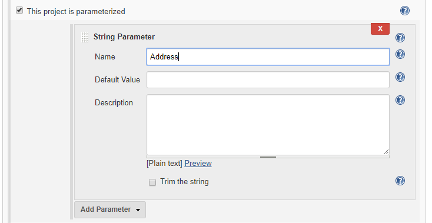
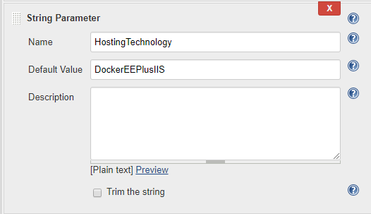

# How to automate Docker container deployment with Jenkins

This document presents an example of the container-hosted setup deployment with OutSystems. The information should be used for internal and testing purposes only. We assume that the readers are familiar with the referenced technologies.

The automation process as shown in this document guarantees that a container is running with the deployed OutSystems application and creates the rewrite rules that ensure the container is reachable from "the outside".

You should read the [documentation about containers in OutSystems](<https://success.outsystems.com/Documentation/11/Managing_the_Applications_Lifecycle/Deploying_to_Containers>). In particular, the parts about [network and deployment zones](<https://success.outsystems.com/Documentation/11/Managing_the_Applications_Lifecycle/Deploying_to_Containers/Recommended_Network_Architecture>) and [publishing to a Docker container](<https://success.outsystems.com/Documentation/11/Managing_the_Applications_Lifecycle/Deploying_to_Containers/Running_Your_Application_in_a_Container/Deploying_an_Application_to_a_Docker_Container>).

## 1. Set up the servers

To follow the instructions, you need two servers with IIS as the reverse proxy (OutSystems Machine + Containers Machine with IIS as the reverse proxy), or three if you want to use NGINX as the reverse proxy (OutSystems Machine + Containers Machine + reverse proxy with NGINX).

### OutSystems Machine

* Windows Server 2016
* OutSystems Platform Server, including sample apps that can be deployed to containers

### Reverse proxy option 1 - IIS

This setup requires one additional Windows Server and it's the fastest method to set up a working test scenario. Check the document [How to set up IIS as a Reverse Proxy](<reverse-proxy-iis.md>) for the instructions.

### Reverse proxy option 2 - NGINX

This is a more advanced scenario that provides more scalability and flexibility. It requires two additional servers:

* Windows Server for a Container
* Linux Server for NGINX

Check the document [How to set up NGINX as a Reverse Proxy](<reverse-proxy-nginx.md>) for the instructions.

### The deployment scripts

You also need the following two sets of scripts:

* [OutSystems Docker automation scripts](<https://github.com/OutSystems/ContainerAutomation/tree/master/>) - the pipelines use them to deploy the apps  
* [Jenkins pipeline scripts](<https://github.com/OutSystems/ContainerAutomation/tree/master/tools/jenkins/>)  - you use them to configure the pipelines

Check out these repositories in the root folder for this example, which is `C:\jenkins`. 

## 2. Configure the file access

The OutSystems Machine needs to be able to write the application bundle and the configurations to two folders and read the result files from the Containers Machine. The simplest way to achieve this is to create the folders locally in the Container Machine and then create a network share of those folders accessible to the OutSystems machine (with, at least, read and write access for the same user as the one running IIS in that machine). 
You should have these local folders and their network shares: 

* The  **Output Files To** (or **Target Path**): created in `C:\jenkins\bundles`, with the network share at `\\containers.domain.example.com\jenkins\bundles`
* The  **Result** (or **Result Path**): created in `C:\jenkins\results`, with the network share at `\\containers.domain.example.com\jenkins\results`
* The  **Output Config Files To** (or **Config Path**): created in `C:\jenkins\configs`, with the network share at `\\containers.domain.example.com\jenkins\configs`

Here is the overview of the result files:

* `.preparedone` for `ContainerBuild`
* `.deploydone` for `ContainerRun`
* `.undeploydone` for `ContainerRemove`
* `.configsdone` for `UpdateConfigurations`

The emphasized parts correspond to the configuration we will perform later. To get more context about the paths, read the section "Configure the Deployment Zone".

## 3. Copy the Docker automation scripts

Copy the OutSystems automation scripts to `C:\jenkins\` of the Container Machine. The relative paths should remain unchanged. If you place the folders in `<your_custom_folder>`, make sure you maintain the folders like this: `<your_custom_folder>\modules`, `<your_custom_folder>\utils` and so on.

The scripts are used by the pipelines we will set up soon. 

## 4. Set up Jenkins

These are the basic configuration steps to use Jenkins in our testing deployment scenario.

1. Ensure that you have 64-bit version of Jenkins running. Go to **Manage Jenkins** > **System Information** and verify that the value of the **java.vm.name** is "64-Bit". If not, you must configure Jenkins to use Java x64 before continuing.

1. Install the PowerShell plugin by going to **Manage Jenkins** > **Plugin Manager** > **Available** tab, searching for **PowerShell**, checking and selecting **Download now and install after restart**.

1. Allow the build triggers to be called anonymously. Go to **Manage Jenkins** > **Configure Global Security** and set Jenkins authorization to **Anyone can do anything**. This has the advantage of allowing build triggers to be called without additional authorization headers, which is acceptable in our current scenario. However, this level of Access Control option should not be used in production.

1. Allow your containers to access the OutSystems platform `private.key`. The containers need to have a volume where the `private.key` is accessible. Copy it to a suitable location. We assume that the `private.key` was copied to `C:\jenkins\secrets` in the Containers Machine. The most likely location of `private.key` is `C:\Program Files\OutSystems\Platform Server`.

## 5. Set up the pipelines

We are going to configure four pipelines, one for each of the Deployment Operations (build, run, remove, update). We start with the configuration that is common to all pipelines, and then provide the details for the individual pipelines.

1. Create a **Folder** and name it **DockerDeployment**. Go to Jenkins > **New Item**. Select the **Folder** option, enter a name and click OK. It will be used for all pipelines. This keeps things organized.

2. Create the pipeline. Navigate to Jenkins > **DockerDeployment** (in the **Builds** view). Click **New Item**, select **Pipeline**, give it a name relevant to the operation and click OK. We suggest using the names that show the action: **ContainerBuild**, **ContainerRun**, **ContainerRemove**, and **UpdateConfigurations**.

3. Add the required parameters: **Address**, **ApplicationName**, **ApplicationKey**, **OperationId**, **TargetPath**, **ResultPath**, **ConfigPath** and **ModuleNames**. Check the **This project is parameterized** option, select **Add Parameter** and then **String Parameter**. This enables you to create a parameter for the pipeline. Do this for the remaining parameters. Don't forget to click **Apply** as you go along to save the changes.

    

4. Add the additional parameter **HostingTechnology**. This sets the  _Container Automation Module_ which will be used for the deployment process. **Set the Default Value** to the one applicable to your specific Reverse Proxy scenario: `DockerEEPlusIIS` for IIS or `DockerEEPlusNGiNX` for NGINX.

    

5. In the **Build Triggers** section, tick the **Trigger builds remotely** (e.g. from scripts) option and enter an **Authentication Token**. In our example setup you can use anything you like. This is the value used for the token parameter required to call the URL trigger. This is the last step that's common to all the pipelines. Next we add the **Pipeline Scripts** specific to each pipeline.
    
    

6. The **ContainerRun** pipeline requires that you add two additional parameters: **SecretPath** and **PlatformServerFQMN**. Respectively, these represent the folder local to the Docker machine where you placed the `private.key` (e.g. `C:\jenkins\secrets\`) and the fully qualified name of the OutSystems machine (e.g site.domain.example.com). **Set the Default Value** of each of these parameters to what is applicable to your specific scenario.

    

7. For each of the four pipelines, in the **Pipeline** section, have **Pipeline script** selected. Copy the [pipeline script that corresponds to the respective pipeline](<https://github.com/OutSystems/ContainerAutomation/tree/master/tools/jenkins>) and paste it into the **Script** text area, then modify the import path to the applicable to your specific scenario. Click **Save**.

## 6. Configure the Deployment Zone

Now that we have our automation infrastructure we can create a deployment zone that makes use of it. Let us review the configuration in Service Center > Administration > Deployment Zones > the Zone name.

* **Name** - The name you want to give to your deployment zone (e.g. Container Zone)
* **Deployment Zone Address** - The fully qualified network name of the publicly accessible endpoint of the deployment zone (e.g. `containers.domain.example.com`)
* **Output Files To** - The network shared folder in the Container Machine where the OutSystems Machine will place the bundles (e.g. `\\containers.domain.example.com\jenkins\bundles`)
* **Result** - The network shared folder in the Container Machine where the OutSystems Machine will expect the result files (e.g. `\\containers.domain.example.com\jenkins\results`)
* **Output Config Files To** - The network shared folder in the Container Machine where the OutSystems Machine will place the config files for the applications (e.g. `\\containers.domain.example.com\jenkins\configs`)
* **Container Build Trigger URL** - The build trigger for the Container Build Jenkins Pipeline we configured (e.g. `http://containers.domain.example.com:8080/job/DockerDeployment/job/ContainerBuild/buildWithParameters?token=YW1hemluZyE=`)
* **Container Run Trigger URL** - The build trigger for the Container Run Jenkins Pipeline we configured (e.g. `http://containers.domain.example.com:8080/job/DockerDeployment/job/ContainerRun/buildWithParameters?token=YW1hemluZyE=`)
* **Update Configurations Trigger URL** - The build trigger for the Update Configurations Jenkins Pipeline we configured (e.g. `http://containers.domain.example.com:8080/job/DockerDeployment/job/UpdateConfigurations/buildWithParameters?token=YW1hemluZyE=`)
* **Container Remove Trigger URL** - The build trigger for the Container Remove Jenkins Pipeline we configured (e.g. `http://containers.domain.example.com:8080/job/DockerDeployment/job/ContainerRemove/buildWithParameters?token=YW1hemluZyE=`)

## 7. Test the pipelines

Now that the configuration of Jenkins is finished, try deploying an OutSystems application configured for the deployment zone. You can do it by using Service Center. Check the status of the pipelines in Jenkins > **DockerDeployment** (following our example). Each build should have a log with more details.
