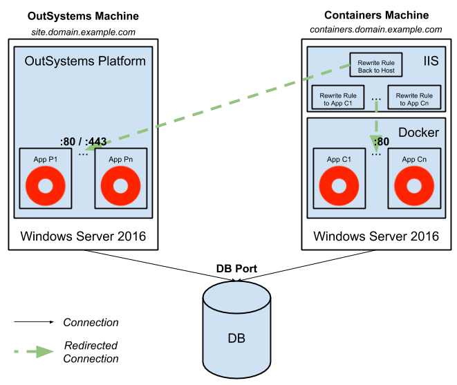

# How to set up IIS as a Reverse Proxy

This document is part of the document [How to automate Docker container deployment with Jenkins](<faq-jenkins.md>) and instructs you how to set up Internet Information Services (IIS) for Windows as a reverse proxy for the test scenario.

In this example, we use a single Windows Server as both our Containers Machine and the reverse proxy.

**The Containers Machine**

* Windows Server 2016
* IIS (version 10+), to be used as a reverse proxy
* Docker Enterprise Edition (latest version)
* Jenkins (version 2+ 64 bit)

**Additional IIS setup requirements**

Make sure you: 

 * Configure the HTTPS binding
 * Install the [Application Request Routing](https://www.iis.net/downloads/microsoft/application-request-routing) extension
 * Install the [URL Rewrite](https://www.iis.net/downloads/microsoft/url-rewrite) extension

Install the extensions on your own, or use this [script to automate the installation](<https://github.com/OutSystems/ContainerAutomation/blob/master/misc/prerequisites/windowserver2016/install_arr_url_rewrite.ps1>). 
Note that this script requires that the PowerShell Execution Policy is set to `Unrestricted`. For more info check [About Execution Policies](<https://docs.microsoft.com/en-us/powershell/module/microsoft.powershell.core/about/about_execution_policies?view=powershell-6>) at Microsoft PowerShell documentation.

## Configure the network

Configure your network like this:

* The OutSystems Machine is accessible from the address defined in the Global Deployment Zone (e.g site.domain.example.com)
* The Container Machine is accessible from the given address defined in a Deployment Zone (e.g containers.domain.example.com)
* The Container Machine is accessible to the OutSystems Machine from the port configured for Jenkins (default is 8080)
* Both machines can reach the OutSystems database

