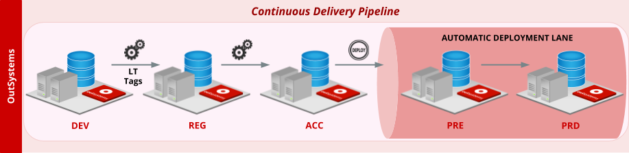

# How to build an OutSystems continuous delivery pipeline

Continuous delivery is the principle of building applications that can be released safely to production at any time, on demand. To accomplish this, you need an automatic deployment pipeline for that can rapidly assess the impact of changes made to your applications (from a production readiness perspective) and deploy them to production in a swift manner, with the least amount of intervention required from a human operator.

We provide **outsystems-pipeline**, an [open-source accelerator](https://github.com/OutSystems/outsystems-pipeline) that allows you to extend the built-in capabilities of LifeTime, such as governance over which applications and environments you are authorized to manipulate or the built-in impact analysis that simplifies correctly deploying complex application portfolios across environments. This accelerator includes Python scripts built on top of the LifeTime APIs, pipeline templates, and documentation to simplify integrating with any CI/CD platform. Soon, OutSystems will also be able to accept contributions from the community to help evolve and improve **outsystems-pipeline**. With this accelerator:

* Release managers can benefit from a fully automated deployment pipeline that helps reduce human errors and the lead-time
* Developers will build software with high quality with the help of faster feedback loops for each change

The following is an example continuous delivery pipeline that consists of five distinct environments:

The sections below describe each stage of the recommended OutSystems pipeline in more detail, and the following step-by-step guides allow you to build the pipeline using the accelerator **outsystems-pipeline** and two leading CI/CD platforms as an example:

* [Building an OutSystems continuous delivery pipeline with Jenkins](https://github.com/OutSystems/outsystems-pipeline/wiki/Building-an-OutSystems-pipeline-with-Jenkins)
* [Building an OutSystems continuous delivery pipeline with Azure DevOps](https://github.com/OutSystems/outsystems-pipeline/wiki/Building-an-OutSystems-pipeline-with-Azure-DevOps)

## Development

**Development (DEV)** is the primary environment for developing your OutSystems applications. Once the development of a new feature or change request is complete, developers can create a release candidate by [tagging](https://success.outsystems.com/Documentation/11/Managing_the_Applications_Lifecycle/Deploy_Applications/Tag_a_Version) one or more LifeTime applications and providing a meaningful version number and description for each one, according to the changes made.

The act of tagging applications in LifeTime is what defines the scope of changes (or changeset) to be validated by the pipeline. This action is known as the **commit stage** and serves as the trigger for running the continuous delivery pipeline.

## Regression testing

Following the commit stage, the newly created LifeTime tags are automatically deployed to the **Regression (REG)** environment where an automatic regression suite is run to assess the deployability of the latest code version of your applications. This regression suite includes the unit tests written earlier during the development phase, and may also include other elements like UI tests (for critical end user flows) or code analysis procedures.

To enable a successful continuous delivery practice in your low-code factory, it is highly recommended to develop your applications with testability in mind. This means not only complying with development best practices (such as the [Architecture Canvas](https://success.outsystems.com/Support/Enterprise_Customers/Maintenance_and_Operations/Designing_the_Architecture_of_Your_OutSystems_Applications/The_Architecture_Canvas)) that promote proper isolation of business concepts in your architecture, but also ensuring that your developers write unit tests as part of their development activities.

The proposed approach relies on unit tests written with the [BDD Framework](https://www.outsystems.com/forge/component/1201/bddframework/) Forge component for the automatic regression stage. [This article](https://www.outsystems.com/blog/posts/intro-bddframework-testing/) provides additional insights on how to write tests using this framework. Also, as a best practice, consider isolating your unit test code in separate LifeTime applications to prevent it from being deployed to production along with your application code.

## Acceptance testing

If the regression suite is executed successfully in REG, then the release candidate versions are automatically deployed to the **Acceptance (ACC)** environment where they will wait for approval by a business representative. In the meantime, this environment allows for manual and exploratory testing of the release candidate, much like a Quality Assurance environment of a typical low-code factory.

## Pre-production and Production

After the release candidate is accepted by the business, deployment to the **Production (PRD)** environment is triggered by an authorized user using a "push-button" approach. This means that pushing a button (literally!) is all it takes to perform the necessary actions for deploying to production a release candidate that has successfully gone through your deployment pipeline.

Although it is **technically** possible to have a deployment pipeline with less environments than the proposed configuration, it should be noted that such an option would increase the risks associated with your delivery process: for example, promoting a new release candidate for acceptance without going through an automated regression check first, or deploying changes to production without dry-running them in a production-like environment first.

