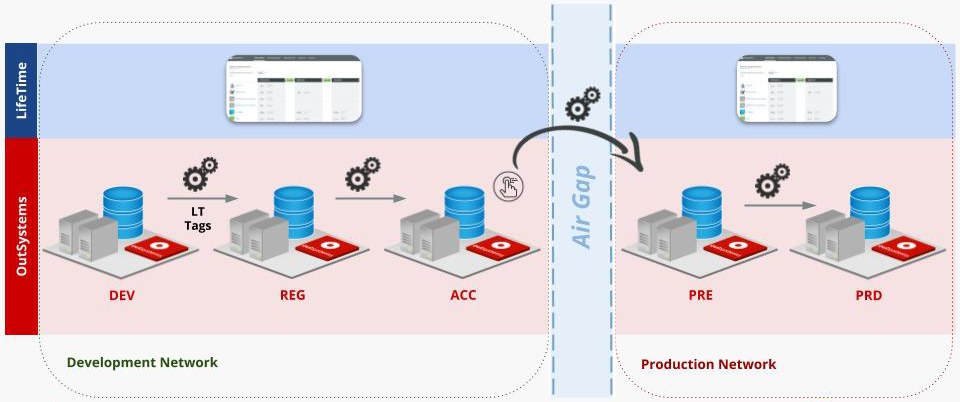

---
summary:
tags:
---

# Building an OutSystems pipeline with Air Gap stage

## Introduction

LifeTime is a unified console with visibility of all the environments on the same OutSystems platform infrastructure. It manages the IT users and their permissions, and also the deployment of applications across environments within an OutSystems infrastructure.

However, organizations in finance, healthcare, public sector agencies, and other highly regulated industries have added security and compliance requirements.

These cases create a need to balance a healthy and automated CI/CD pipeline with additional infrastructure restrictions such as network access or other high security standards. One of the most common scenarios is the segregation of networks where there are two distinct and isolated network zones which aren't able to communicate with each other.

## Air Gap reference model overview

The above deployment pipeline it's based on the [OutSystems continuous delivery pipeline reference model](https://success.outsystems.com/Documentation/How-to_Guides/DevOps/How_to_build_an_OutSystems_continuous_delivery_pipeline) with the required segregation of networks. To move the application versions between the networks, it's necessary to write the binary data to a shared drive.

The **LifeTime on the Development Network** won't only enforce the defined access control, it also performs the necessary impact analysis to assure the deployability of the application versions on its managed environments.

After the validation and approval of the release candidate versions in ACC, the  **Air Gap deployment** is then triggered manually using a “push-button” approach, and the application versions are exported from the ACC environment to a file share location.

To guarantee a successful code promotion, the **deployment order** is determined by the result of the topological sort of the application versions dependencies.

Once the deployment order is sorted out, each application version is then deployed to the PRE environment by calling the [Solution Pack Tool](https://success.outsystems.com/Documentation/11/Setting_Up_OutSystems/Unattended_Installation_and_Upgrade/Solution_Pack_Tool_(OSPTool)_Command_Line_Reference) (OSPTool).

Finally, the application version tags are synchronized to the **LifeTime on the Production Network.**

## Step-by-step Air Gap pipeline configuration

### 1. Configure Air Gap specific variables

To configure the Air Gap stage, configure the following information, required to run the Air Gap stage:

|             **Name**             | **Value**                                                    | **Example Value**                                        |
| :------------------------------: | ------------------------------------------------------------ | -------------------------------------------------------- |
|           OSPToolPath            | `<Path of the OSPTool to be called via command line>`          | C:\Program Files\Common iles\OutSystems\11.0\OSPTool.com |
|            AirGapUser            | `<User with Change & Deploy permissions on the target environment>` | air_gap_user                                        |
|            AirGapPass            | `<Password of AirGapUser>`                                     |                                                          |
| PreProductionEnvironmentHostName | `<Hostname of the target environment>`                         | preprod.example.com                                      |

### 2. Configure Air Gap stage

Once all the Air Gap specific variables are in place, there is the need to create a stage that calls the [deploy\_apps\_to\_target\_env\_with\_airgap](https://github.com/OutSystems/outsystems-pipeline/blob/master/outsystems/pipeline/deploy_apps_to_target_env_with_airgap.py) method and provide the necessary information as input.

Templates for [Jenkins](https://github.com/OutSystems/outsystems-pipeline/blob/master/examples/jenkins/Windows-GlobalAgent-AirGap.Jenkinsfile) and  [Azure DevOps Pipelines Task Group](https://github.com/OutSystems/outsystems-pipeline/blob/master/examples/azure_devops/windows_azure_task_group_deploy_to_destination_env_with_airgap.json) are available on [this github repository](https://github.com/OutSystems/outsystems-pipeline/tree/master/examples).
