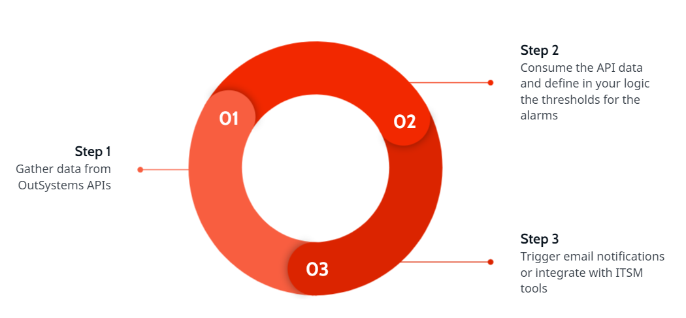

# How to create alerts based on monitoring thresholds

Using OutSystems APIs and metadata you can:

* Extend OutSystems built-in monitoring
* Create your own logic for alarms with thresholds
* Integrate with external ITSM tools

## Step 1 - gather data

OutSystems provides a set of APIs that can be used to analyze application events and even register events defined by you.

The [PerformanceMonitoring API](https://success.outsystems.com/Documentation/11/Reference/OutSystems_APIs/PerformanceMonitoring_API) provides a **GET RequestEvents** method to gather over 100 properties of request event details related to both client and server side metrics. 

As and example, you can gather information regarding:

* **Request duration** - time that passed from the moment the user made the request until the browser finished processing the response.
* **Browser load time** - time that the browser took to process the response. The load time includes for example the page rendering and the JavaScript execution.
* **Request server time** - total time the server spent serving the request.
* **Query, service action, integration, timer and extension time** - total time spent executing queries, calling service, integration, and extension actions as well as the time spent executing timers.
* Number of errors executing queries, screens, integrations, extensions and timers.

Check the [PerformanceMonitoring API resources](https://success.outsystems.com/Documentation/11/Reference/OutSystems_APIs/PerformanceMonitoring_API#Resources) for all the details.

To gather details about each specific error, you can also [query the log data](https://success.outsystems.com/Documentation/11/Managing_the_Applications_Lifecycle/Monitor_and_Troubleshoot/Logging_database_and_architecture/Query_log_data).

You can also define your own custom events either using the [POST RequestEvents of the PerformanceMonitoring API](https://success.outsystems.com/Documentation/11/Reference/OutSystems_APIs/PerformanceMonitoring_API#POST_RequestEvents) or the [LogMessage](https://success.outsystems.com/Documentation/11/Reference/OutSystems_APIs/System_Actions#LogMessage) built-in action to [log informations in your application flows](https://success.outsystems.com/Documentation/11/Developing_an_Application/Troubleshooting_Applications/Log_Information_in_Action_Flows).

## Step 2 - consume data and define thresholds

Both the API data and the log data can them be consumed by an application where you can define your own custom logic to define thresholds that will trigger alarms. You can build it using [OutSystems logic](https://success.outsystems.com/Documentation/11/Developing_an_Application/Implement_Application_Logic) or consume this data in any other third party application.

## Step 3 - trigger notifications

Thresholds defined in your logic can trigger email notifications or call webservices to:

* create tickets in ITSM tools such as ServiceNow, Zendesk, Jira or Opsgenie
* send Slack messages
* integrate with any external service that exposes a webservice

OutSystems **Email** capabilities allow you to send emails from both [web](https://success.outsystems.com/Documentation/11/Developing_an_Application/Implement_Application_Logic/Send_an_Email_From_a_Web_Application), [reactive and mobile apps](https://success.outsystems.com/Documentation/11/Developing_an_Application/Implement_Application_Logic/Technical_Preview_-_Emails_in_Mobile_and_Reactive_Web_Apps/Sending_Emails).

You can even customize and extend the design of your emails using the [Emails API](https://success.outsystems.com/Documentation/11/Reference/OutSystems_APIs/Emails_API).

Most ITSM and messaging tools expose functionality in the form of webservices, such as the [ServiceNow REST API](https://docs.servicenow.com/bundle/paris-application-development/page/integrate/inbound-rest/concept/c_RESTAPI.html), [Slack API](https://api.slack.com/apis/connections), [Jira API](https://developer.atlassian.com/cloud/jira/platform/rest/v3/intro/) and [Opsgenie API](https://docs.opsgenie.com/v1.0/docs/alert-api) just to name a few.

With OutSystems you can integrate with anything, [consuming REST APIs](https://success.outsystems.com/Documentation/11/Extensibility_and_Integration/REST/Consume_REST_APIs) and [SOAP Web Services](https://success.outsystems.com/Documentation/11/Extensibility_and_Integration/SOAP/Consuming_SOAP_Web_Services) easily. Use these capabilities to create tickets or incidents to be handled by your IT services.
