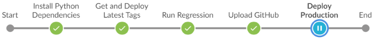
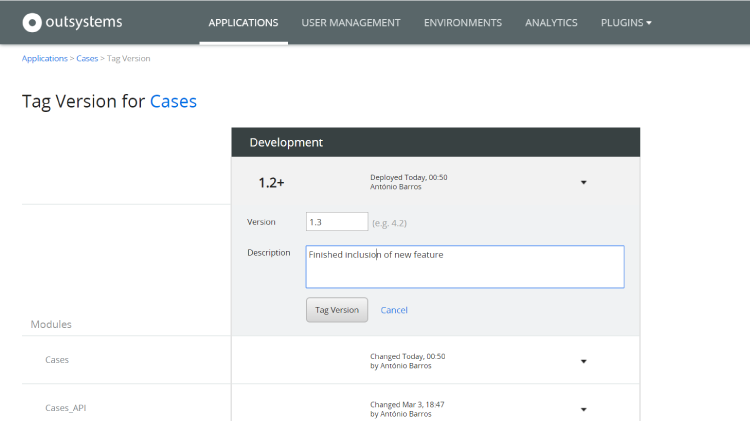
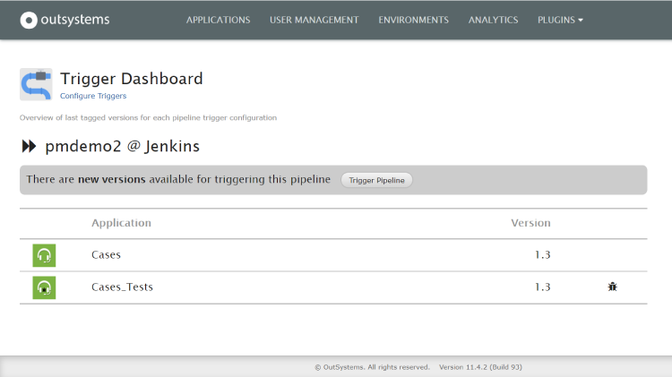
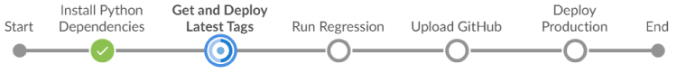
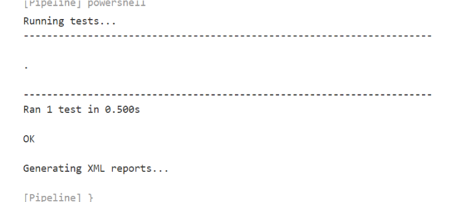
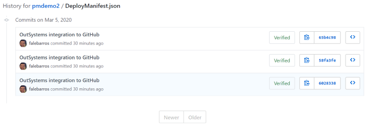
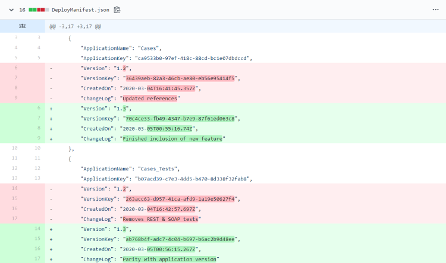

# Integrate OutSystems with external version controls

This article explains how to store OutSystems applications and modules in external version control systems. 

We'll use GitHub as an example since it tends to be mentioned the most, but the same procedure can be applied to others, as GitLab, SVN, or Azure Repos. 

SysOps teams can keep looking into GitHub before deploying new application versions to Pre-production or Production. Every change is documented there, and each change is linked to user stories. 

OutSystems is highly extensible, based on [OutSystems APIs](https://success.outsystems.com/Documentation/11/Reference/OutSystems_APIs/LifeTime_API_v2) and [GitHub APIs](https://docs.github.com/en/rest) is quickly possible to do the integration, providing visibility into the history of OutSystems application deployments in GitHub.

## Build a GitHub integration as part of CI/CD pipeline

Following the steps described in [OutSystems CI/CD](https://www.outsystems.com/blog/posts/low-code-ci-cd/) it's possible to set up a Jenkins pipeline with 3 or more environments as: Development, Test, and Production.

Then you should add an additional step after running tests: "upload to GitHub" and remove the steps related to other environments if not needed. When the pipeline reaches that step, it uploads the manifest file in the configured Git repo.

[Here](https://www.outsystems.com/blog/-/media/images/blog/posts/integrating-application-deployment-pipeline-github/files/jenkinsfile.txt) is a JenkinsFile example. 

The pipeline looks like this:

[Here](https://www.outsystems.com/blog/-/media/images/blog/posts/integrating-application-deployment-pipeline-github/files/upload_github.py) is the Python script, as example, where the pipeline calls in the "Upload to GitHub" step.

Then, based on public GitHub APIs it is possible to create a component like [GitHub Connector](https://www.outsystems.com/forge/component-overview/2419/github-connector), so that manifest files are uploaded to GitHub.

So the deployment flow is now as follows:

1. The developer tags an application when it is ready to move forward in the pipeline:
   
    

1. The TriggerPipeline LifeTime Plugin periodically scans for newly tagged application versions. If one is found, the Jenkins pipeline is triggered:
   
    

1. Applications and their tests are deployed to my test environment:
    
    

1. The tests are executed (and they pass):
   
    

1. The deployment manifest is then uploaded into GitHub.

1. The full execution log is available in Jenkins. [Here](https://www.outsystems.com/blog/-/media/images/blog/posts/integrating-application-deployment-pipeline-github/files/consoleoutput.txt) is an example.

1. SysOps can go now to the GitHub repository and sees it updated:
    
    
    
    

## Other use cases

Based on the same procedure is possible to:

* Upload OutSystems application packages so that code is stored in an external repository.
* Integrating GitHub with JIRA so that changes are connected to user stories.

