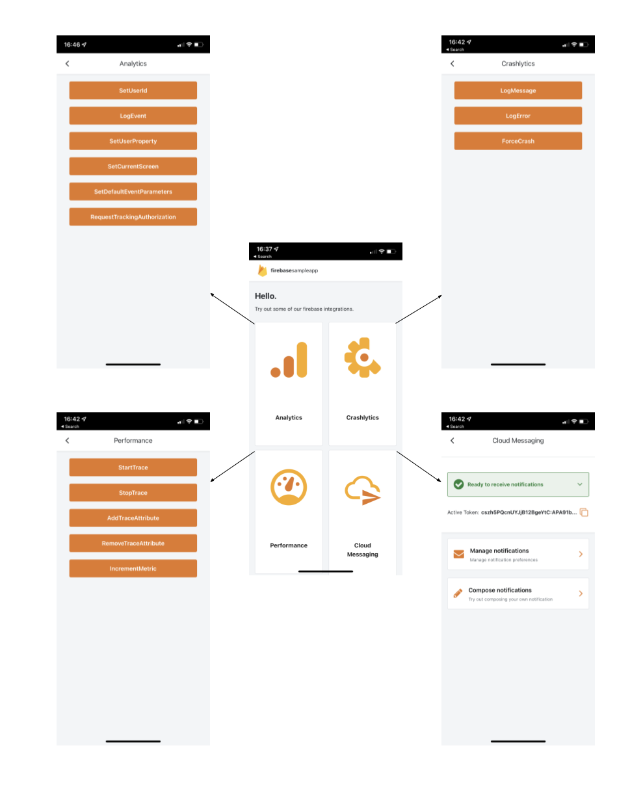
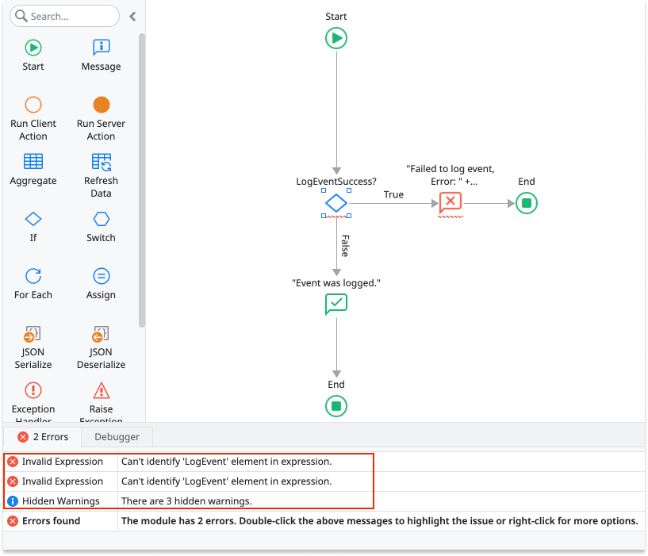
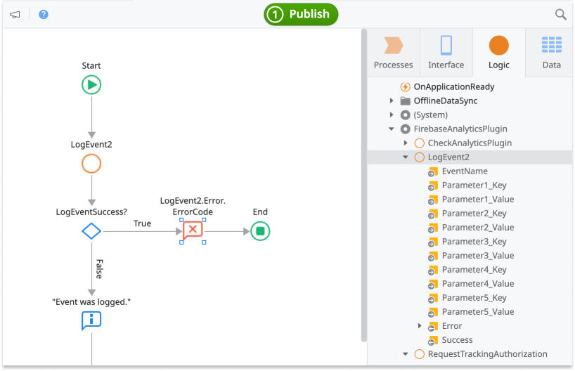
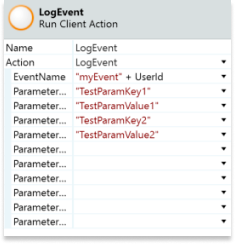

# Migrating to the supported Firebase-based mobile plugins

You can use two types of Firebase-based plugins in your apps: **supported plugins** and **unsupported plugins**. This document provides guidance on how to migrate from older unsupported Firebase-based plugins (namely **Firebase Mobile**), to the newer and supported plugins. To migrate from an unsupported plugin to a supported one, refactor your apps by replacing actions in your logic. This is a straightforward process as plugins behave the same way, adopt the same parameters, and follow similar naming conventions. 

Firebase-based plugins offer an integration with Firebase. Firebase is a Google mobile development platform. It speeds up many of the common development patterns for mobile apps. OutSystems recommends that you use the **supported plugins**, as that's in the best interest of both end users and developers of the apps. By using OutSystems supported plugins you can count on the following advantages:

* Dedicated plugin for each feature with own release cycle
* OutSystems support teams to assist you
* Regular updates and visibility over changes
* Compatibility at day zero with new versions of MABS
* New features, particularly in the Performance and Crash Reporting plugins
* [Dynamic Links](https://www.outsystems.com/forge/component-overview/10988/dynamic-links-plugin-firebase), a new Firebase-based plugin 

| Supported plugin                                                                                   | Description                                                                            |
| -------------------------------------------------------------------------------------------------- | -------------------------------------------------------------------------------------- |
| [Analytics](https://www.outsystems.com/forge/component-overview/10704/firebase-analytics-plugin)   | Understand user behavior by viewing live usage data with real-time reporting.          |
| [Performance Monitoring](https://www.outsystems.com/forge/Component_Overview.aspx?ProjectId=10706) | Gain insight into the performance of your mobile apps.                                 |
| [Crash Reporting](https://www.outsystems.com/forge/Component_Overview.aspx?ProjectId=10705)        | Get real-time crash reporting to help you track, prioritize, and fix stability issues. |

This document refers to the OutSystems plugins as **supported plugins**. Forge also contains **unsupported plugins**, which are mostly the plugins contributed by partners and community.

The Analytics, Performance, and Crash Reporting plugins by OutSystems cover all the features with the matching components of the unsupported Firebase-based plugin.

## Setting up the plugins

To function properly, you need to set up the plugin in both the Google console and your app. See the instructions in [Firebase Plugins](https://success.outsystems.com/Documentation/11/Extensibility_and_Integration/Mobile_Plugins/Firebase_Plugins) to set up your plugin.

## Sample app

Install [Firebase Sample App](https://www.outsystems.com/forge/Component_Overview.aspx?ProjectId=10707&ProjectName=firebase-mobile-sample-app) from Forge and open the app in Service Studio. The sample app contains logic for common use cases, which you can examine and recreate in your apps. For example, the sample app shows how to:

* Log app custom events (for example, user signs in)
* Set the UserId property
* Set user properties (for example, user language)
* Set the current screen name, to specify the app visual context.
* Set the parameters that the plugin sends with every event logged from the device, including automatic events.

## Example of migrating a logging event with Analytics Plugin

If you are using the **LogEvent** of the unsupported plugin, follow these steps to migrate to the supported Analytics plugin. You can log events anywhere inside a logic flow. To log an event, drag the **LogEvent** action provided by the Analytics Plugin to the logic inside of the part of the app where you want to create a log event.

See [Reference of the plugin actions](#reference-of-the-plugin-actions) for more information.

1. Delete the **LogEvent** action of the unsupported plugin.

    

1. Solve the errors Service Studio highlighted after you deleted  the former LogEvent action. Start by dragging LogEvent action from the supported Analytics plugin folder. Service Studio automatically renames the action to **LogEvent2** in logic flows where the module references both plugins.

    

1. Substitute all parameters from the old **LogEvent** action with equivalent parameters from the new **LogEvent2** action.

    

1. Optionally, set any other parameters to capture additional information and get metrics from the Google Console dashboard.
  
    

## Reference of the plugin actions

This section contains the comparison of the relevant actions between supported and unsupported plugins. To migrate to a supported plugin, refactor your apps by replacing the actions in the logic. The input and output parameters of these actions behave in the same way.

### Analytics

The list of relevant actions in the two plugins.

| Firebase Mobile (unsupported) | Analytics Plugin (supported) |
| ----------------------------- | ---------------------------- |
| LogEvent                      | LogEvent                     |
| SetAnalyticsCollectionEnabled | SetEnabled                   |
| SetScreenName                 | SetCurrentScreen             |
| SetUserProperty               | SetUserProperty              |

Check out the [sample app](#sample-app) to see how to:

* Log an application custom event (for example, the user signs in)
* Set the UserId property
* Set a user property (for example, the user's language)
* Set the current screen name
* Set the parameters that the apps sends with every event logged from the device, including automatic events

### Crash Reporting

The list of relevant actions in the two plugins.

| Firebase Mobile (unsupported) | Crash Reporting Plugin (supported) |
| ----------------------------- | ---------------------------------- |
| LogError                      | LogError                           |
| SetCrashlyticsUserId          | SetUserId                          |
| -                             | SetEnabled                         |
| -                             | Log                                |

Check out the [sample app](#sample-app) to see how to:

* Log a Message
* Log an Error
* Force an app crash

### Performance

The list of relevant actions in the two plugins.

| Firebase Mobile (unsupported)   | Performance (supported) |
| ------------------------------- | ----------------------- |
| AddTraceAttribute               | AddTraceAttribute       |
| IncrementCounter                | IncrementMetric         |
| SetPerformanceCollectionEnabled | SetEnabled              |
| StartTrace                      | StartTrace              |
| StopTrace                       | StopTrace               |
| -                               | RemoveTraceAttribute    |

Check out the [sample app](#sample-app) to see how to:

* Start or stop a trace
* Add or remove a trace attribute
* Increment a specific metric
