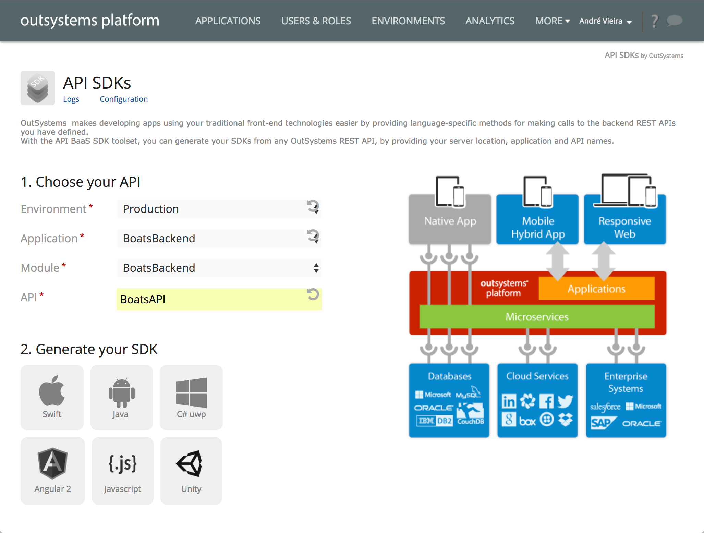

<b>Internal</b>

<b>Content produced for analysts eyes only! Do not use it without contacting Product Management</b>

# Generate Native SDKs for APIs
OutSystems allows generating native SDKs for the backend services APIs in order to use OutSystems as a mobile backend for mobile apps developed with traditional technologies.

To generate the native SDK do the following:

1. Open the lifecycle management console
2. Select the option 'API SDKs' under the More option in the top menu
3. Select the environment and the application that contains the service for which to generate the native SDK
4. Specify the name of the REST API service
5. Choose the native SDK to be generated
6. Repeat steps 4 and 5 for other services

