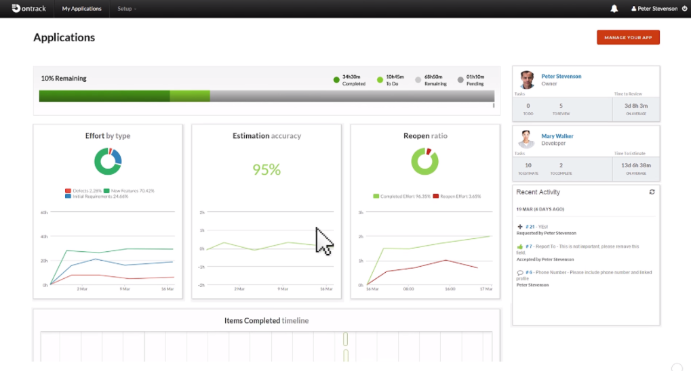
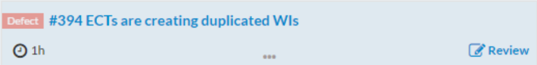
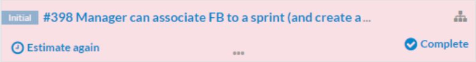
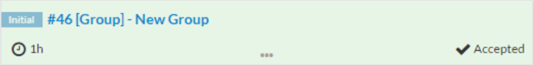
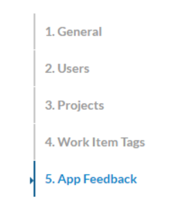
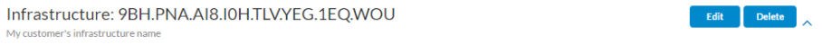
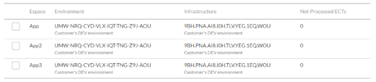
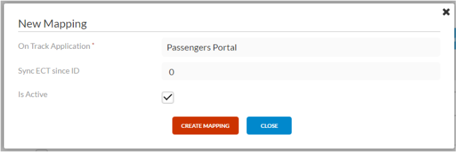
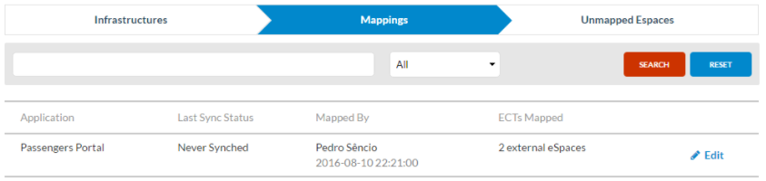
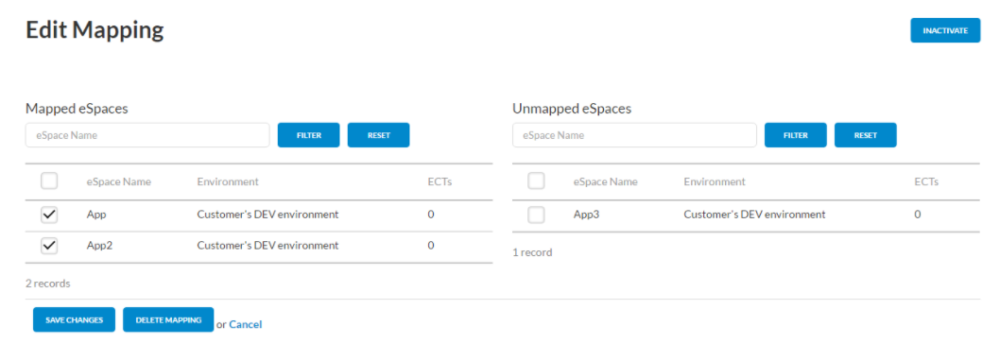

# OnTrack - OutSystems backlog management 

OnTrack offers a powerful, yet simple, project tracking and collaboration, to support fast continuous delivery of your applications.



With OnTrack you can visualize your project progress with dashboards adapted to each user profile and share them with your project team, managers and stakeholders.

It is very visual, simple, made for agile projects. It allows you to have a light project management tool customizable to fit the way **you** work.

OnTrack includes the following functionality:

* **Define requirements**: Create new project requirements directly on the app, or have them automatically created from OutSystems App Feedback submitted by end-users.
* **Prioritize work items:** Estimate, assign, prioritize and track delivery of all work items in a Kanban-like board that gives you constant visibility of progress.
* **Confirm User Acceptance**: mini-demo videos and instructions for testing can be added to enable business users to confirm completion and ease adoption.
* **Monitor and optimize**: monitor project budget, stay on top of deviations, optimize against estimates, and make sure you have the most performant app delivery team.

Detailed step-by-step training can be found here:

* [Overview](https://outsystems.wistia.com/medias/e0qwz4su0v)
* [Configuration](https://www.youtube.com/watch?v=KPl4riVGpXc&list=PLaxrSw3Eft4FgXe0zZQtL93FUFPvNWQNw&index=5)
* [How To Create an Application](https://www.youtube.com/watch?v=6jzUcuAAtqA&list=PLaxrSw3Eft4FgXe0zZQtL93FUFPvNWQNw&index=12)
* [How To Manage the Backlog](https://www.youtube.com/watch?v=6MMR3rLt5qw&list=PLaxrSw3Eft4FgXe0zZQtL93FUFPvNWQNw&index=13)


## Start using Ontrack


OnTrack is available in [Forge](https://www.outsystems.com/forge/component-overview/1177/ontrack-o11). To access, you should use a community account (create a [new account](https://www.outsystems.com/home/signup.aspx) if not registered yet). 
You will need a "Manager role" in your infrastructure in order to do this setup process.

### Work item color scheme

* **Blue** - When there’s an unread notification related with the work item, like a note or set as complete.

    

* **Red** - Work item was rejected.

    

* **Green** - Work item was accepted.

    


## How to link AppFeedback to OnTrack

### Setting up

**On each environment:**

1. Ensure you have ECT_Provider installed, since it's a part of the system components, most likely ECT_Provider is already installed.

1. Download and install [ECT_Client_Connector](http://www.outsystems.com/forge/component/455/ect-client-connector/).

1. Configure ECT_Client_Connector by changing in Service Center the ECT_Server_WS web service URL to point to ```https://ontrack.outsystems.com/ECT_Server_Connector/ECT_Server_WS.asmx```.


**At Ontrack:**

1. Access the application configuration (it’s only accessible to the users with Manager role).

1. On the left pane, select **5. App Feedback**:

    

1. If you are setting up ECT for the first time on your application:
    1. Click on **Infrastructures**:

        

    1. Enter the Activation Code of your infrastructure as in the example:

        
    
    1. You'll see the newly added infrastructure. Enrich the data by giving it a name:

        

1. If you were already receiving ECT from you customer’s environments, just double check the data.


### Map the modules

**On each environment:**

1. Create at least one ECT for each module that you want to receive feedback on.
1. Go to Service Center and run the timer on ECT_Client_Connector (The timer will run every 15 minutes, this is just to speed-up the process).


**At Ontrack:**

1. Access the application configuration and select the option **5. App Feedback**. The "Mappings" option should be selected, as depicted below:

    

1. Click the **Sync Now** blue button on the top right corner.

1. Go to the **Unmapped Espaces**:

    

1. Check the modules names in the list. You may relate them to the ones that you have created:

    

1. Press **Save** in the bottom left corner.

1. On the popup, tick **Is Active** and click **Create Mapping** to finish the process.

    

1. You are redirected to the Mappings screen, where the information of mapped ECTs should be visible.

    

1. Press again the **Synch Now** button, to process the mappings.
1. After a few moments, the ECTs created should be visible on your project.


I want to add more modules. What should I do?

1. Create the ECTs on the customer side.
1. Trigger the timer on the ECT_Client connector.
1. Run **Synch Now** on Ontrack.
1. On the mappings section, click on the **Edit** link.
1. Select your modules on the right side ("Unmapped eSpaces") by checking the box:

    

1. Press **Save changes**.

<div class="info" markdown="1">

The button **Delete mapping** will remove **all** mapped modules. Be careful when using it.

</div>

