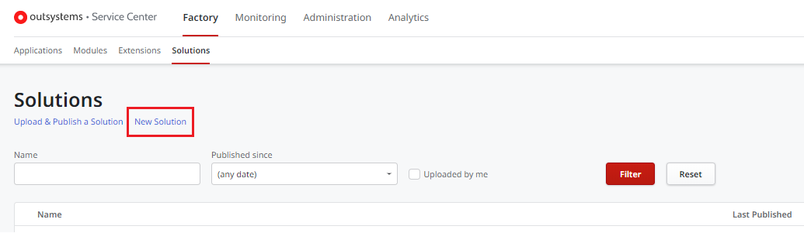
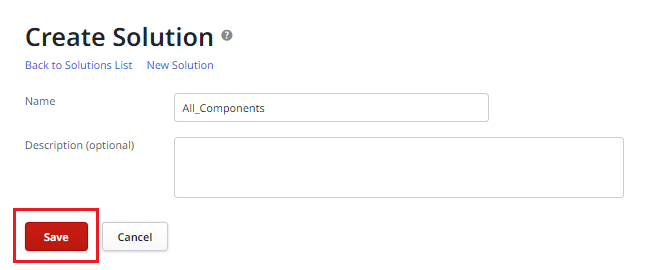
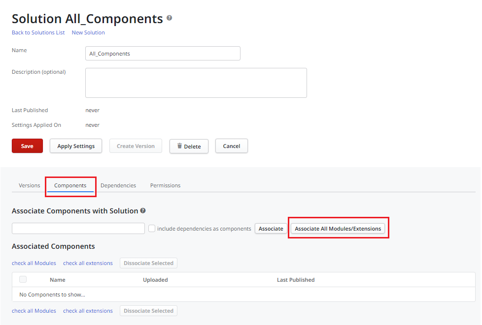
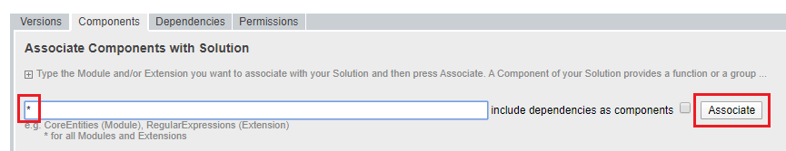
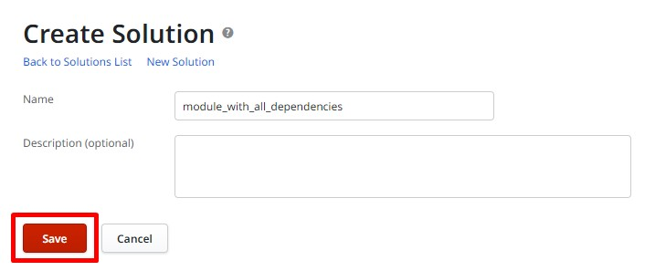
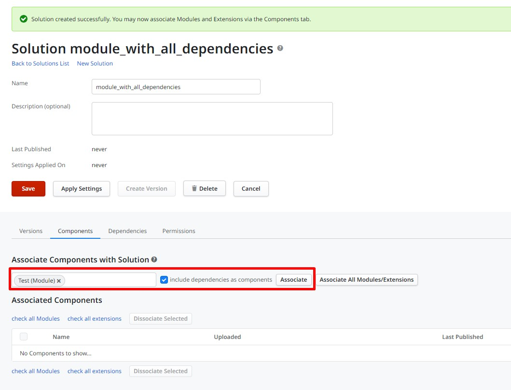
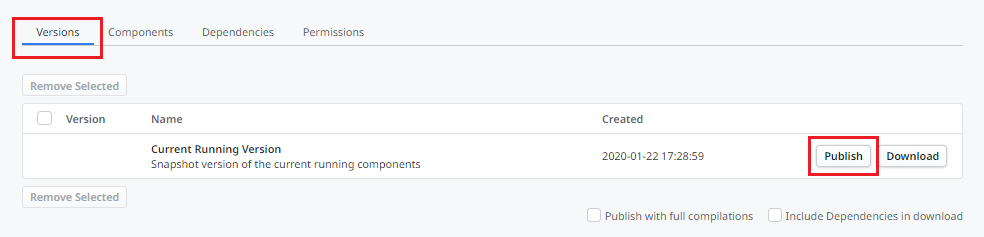
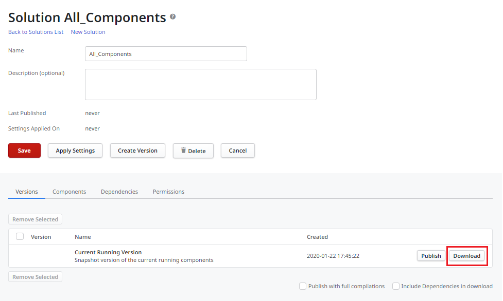

# Creating and using a solution

It's a common practice in OutSystems Factory management to create and use a solution. This is either a Factory solution containing all the components, a solution for a specific module or an application with all its dependencies. It's used to:

* Refresh references in environments used for development purposes.
* Republish application modules after an update or upgrade.
* Troubleshoot some tasks.

For feature availability in different environments check [here]( https://success.outsystems.com/Documentation/11/Setup_and_maintain_your_OutSystems_infrastructure/Setting_Up_OutSystems/Configure_your_OutSystems_environment#feature-availability-for-different-purposes).

A solution can also be used to publish a version of a specific application in another environment as an alternative to a LifeTime staging. For example, an "All Components" solution will publish and deploy all associated components.

## Creating an "All Components" solution

If you don't have an "All Components" solution yet:

1. Go to Service Center (`https://<YOUR_ENVIRONMENT>/ServiceCenter`).

1. Under **Factory** -> **Solutions**, click the **New Solution** link.

    

1. Name the solution "All_Components" and click the **Save** button.

    

### Adding the components

On the "All Components" solution screen:

1. Go to the **Components** tab.

1. Click the **Associate All Modules/Extensions** button.

    

    For previous versions of Service Center, type "*" and click the **Associate** button:

    

## Creating a solution for a module and all its dependencies

1. Go to Service Center (`https://<YOUR_ENVIRONMENT>/ServiceCenter`).
1. Under **Factory** > **Solutions**, click the **New Solution** link

    

1. Name the solution and click the **Save** button.

    

### Adding the components

1. Go to the **Components** tab.
1. Search for the module name, tick the **include dependencies as component** checkbox.
1. Click the **Associate** button.

    

### How to use

* Whenever you want to **republish your whole factory**, click the **Publish** button for the "Current Running Version".

    

* If you want to **deploy the whole solution to another environment** or just download the solution for **troubleshooting** purposes, you can click the **Download** button for the "Current Running Version", or any other version you have created (you can then save the .osp file in your file system).

      

The publishing operation by itself doesn't impact application availability at runtime. However, you should consider any possible breaking changes (for example, after an upgrade or update) or broken references as not to impact the applications' behavior.

There is generally no need to create versions for this solution. If you do, remember that publishing a solution version may revert some applications to the version they were in when the solution version was created.

