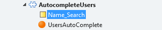
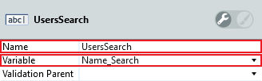
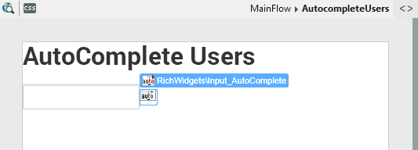
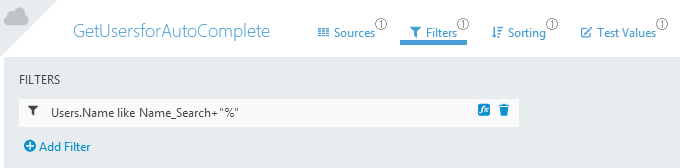
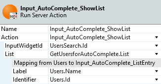
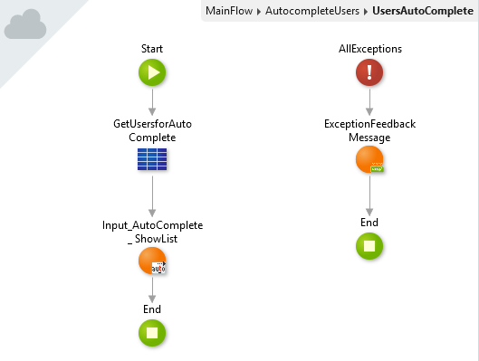

# How to create a search field with autocomplete in a Traditional Web App

If you have a long list of results to filter, using the [Dropdown Select](https://success.outsystems.com/Documentation/11/Developing_an_Application/Design_UI/Patterns/Using_Traditional_Web_Patterns/Controls/Dropdown_Select) pattern may impact the performance of your app since it returns the unfiltered results before filtering them in the client side.

To filter the results in the server side and send the filtered list to your app you can use the **Input_AutoComplete** rich widget.

To use **Input_AutoComplete** with an input widget follow these steps:

1. In the module which contains the input widget to which you want to add the auto complete to, open **Manage Dependencies** and add the following dependencies:

    * Add the **Input_AutoComplete** rich widget and the **Input\_AutoComplete\_ShowList** action from the **RichWidgets** producer.

1. Set the **Name** and **Variable** properties of the search field input widget to a **Local Variable** (in this case `UserSearch` and `Name_Search`).

    

    

1. Add an **Input_AutoComplete** RichWidget next to the input widget and set the **InputWidgetId** property to the Id of the input.

    

    

1. Set the **On Notify**>**Destination** property of Input_AutoComplete to a newly created Screen Action, in this case **UsersAutoComplete**.

    

1. Add an Aggregate to the Screen Action and create a Filter using the Local Variable to limit the query results according to what's typed in the Input Widget.

    

    In this case the Filter `Users.Name like Name_Search+"%"` only retrieves users whose `Name` Attribute starts with what's typed in the Input Widget.

1. Add an **Input\_AutoComplete\_ShowList** Server Action after the Aggregate.

1. Set the **Action**>**InputWidgetId** property to the Id of the Input and the **Action**>**List** to the Aggregate's List, in this case `GetUsersforAutoComplete.List`.

    

    Be sure to map the **Label** and **Identifier** properties. The **Label** holds the value displayed in the autocomplete list, and the **Identifier** holds the Identifier of those values.

    The Screen Action should look similar to the following image.

    

    The action queries the database for the **autocomplete** suggestions that appear below the Input field.

1. Publish the module by selecting **1-Click Publish**.

After these steps the search field in your app shows a list of suggestions that changes as you type.

To access the Identifier of the selected user use the **Input\_AutoComplete\_GetIdentifier** Server Action from the **RichWidgets** module. Before using this action you have to add it as a dependency to your module.

