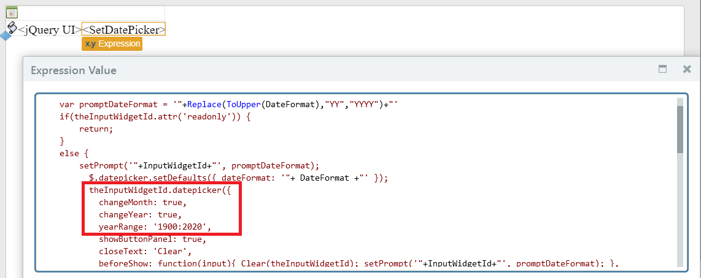
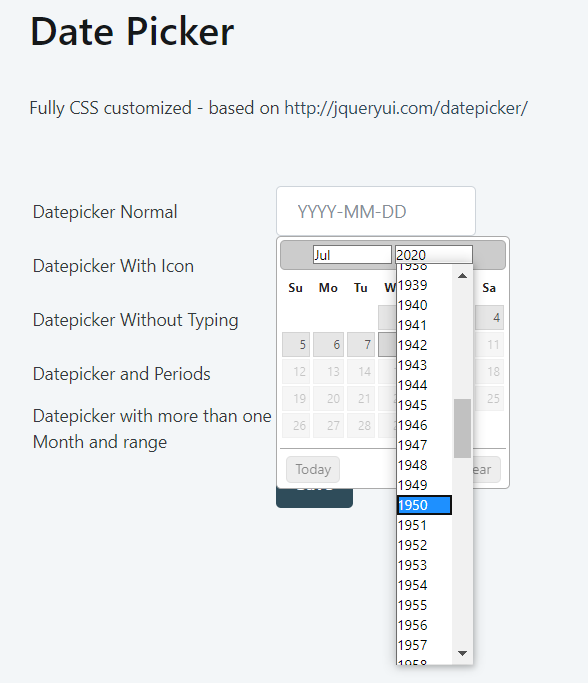

# How to have a date picker with year selection

## Question

I want an input_calendar widget to enter a date of birth, which could easily be many years ago.

The standard input_calendar widget doesn't allow the direct selection of the year.

## Answer

Use the component [DatePicker](http://www.outsystems.com/forge/component/351/datepicker/) from the OutSystems Forge.

The component uses the jQuery plugin [DatePicker](http://jqueryui.com/datepicker/#dropdown-month-year), which has options to select the month and the year through drop down menus.

You must modify the plugin to add the options changeMonth and changeYear, as shown below:

The widget should appear as follows:

