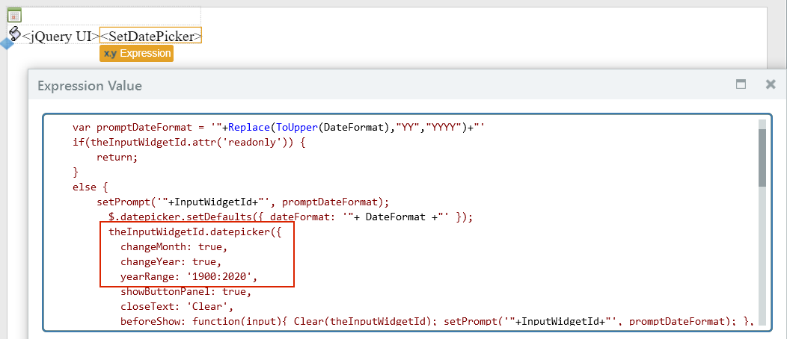

# How to have a date picker with year selection

## Question

I want an Input Calendar widget to enter a date of birth, which could easily be many years ago.

The standard Input Calendar widget doesn't allow the direct selection of the year.

## Answer

Use the [DatePicker](http://www.outsystems.com/forge/component/351/datepicker/) component from the OutSystems Forge.

This component uses the [DatePicker jQuery plugin](http://jqueryui.com/datepicker/#dropdown-month-year) which can display dropdown fields for selecting the month and the year. You must set the plugin options `changeMonth` and `changeYear` to `true` to display these fields.

By default, the year dropdown displays the last 10 years available for selection. Since you want to collect a date of birth, you need to extend the range of year values available in the year dropdown. You can do this using the `yearRange` option, specifying both the start and end years of the range separated by a colon character (`:`), for example, `'1900:2020'`.

In summary, you must modify the plugin to add the options `changeMonth`, `changeYear` and `yearRange`, as shown below:

The widget should appear as follows:

