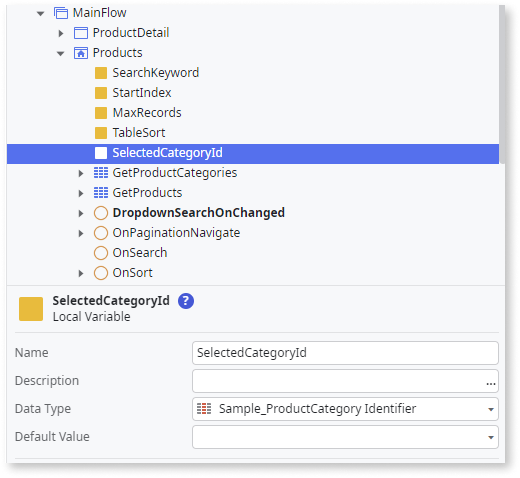
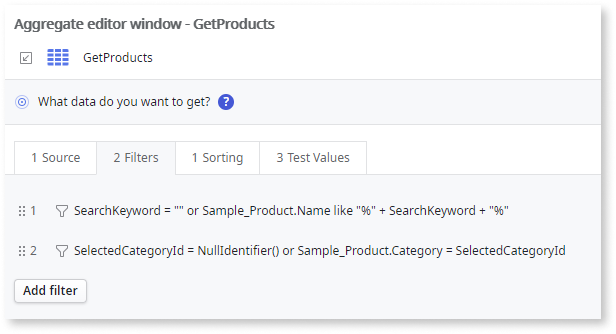
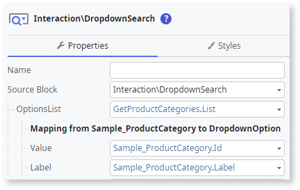
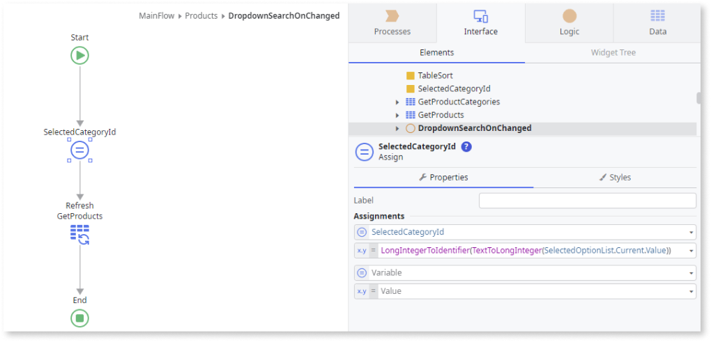

---
tags:
summary: OutSystems 11 (O11) tutorial on using Dropdown Search to filter aggregates by a single attribute.
guid: 908BBD05-3D83-4F19-BD95-75BE9EFA76D9
locale: en-us
app_type: traditional web apps, mobile apps, reactive web apps
platform-version: o11
figma: https://www.figma.com/file/kY6LwaHBP6HdTslYHlSadB/Front-End?node-id=1049:836
---

# How to use the Dropdown Search to filter an aggregate with a single attribute

The Dropdown Search is a good way to select a filter from a relatively small list. In the following example, we use it to filter a product list by category.

## Prerequisites

A reference to the **Sample_Product** and **Sample_ProductCategory** entities in the **OutSystemsSampleDataDB** module.

### Setting up the screen

1. Open the **Interface** tab and double-click your **MainFlow**.
1. Open the **Data** tab and expand the **OutSystemsSampleDataDB** module. 
1. Drag the **Sample_Product** to the **MainFlow**. 
    This creates a **Products** screen and a **ProductDetail** screen. This example focuses on the **Products** screen.

    

### Preparing the data for the Dropdown Search

1. On the **Products** screen, add a new aggregate using the  **Sample_ProductCategory** entity.

    

1. Add a screen variable called **SelectedCategoryId** with the **Sample_ProductCategory Identifier** type.

    

1. On the **GetProducts** aggregate, click on the filters, and add the following filter: ``SelectedCategoryId = NullIdentifier() or Sample_Product.Category = SelectedCategoryId``.

    

### Preparing the data for the Dropdown Search

1. On the **Products** screen, add a new aggregate using the  **Sample_ProductCategory** entity.
1. Add a screen variable called **SelectedCategoryId** with the **Sample_ProductCategory Identifier** type.
1. On the **GetProducts** aggregate, click on the filters, and add the following filter: ``SelectedCategoryId = NullIdentifier() or Sample_Product.Category = SelectedCategoryId``.

### Adding the Dropdown Search

1. From the Toolbox, drag the Dropdown Search widget to the screen and on the **Properties** tab, from the **OptionsList** dropdown, select **GetProductCategories.List**.
1. In the **Mapping** section, set the **Value** to **Sample_ProductCategory.Id** and  **Label** to **Sample_ProductCategory.Label**.

    

1. To create a new client action for the **OnChanged** event, from the **Handler** dropdown, select  **New Client Action**.
1. Drag an **Assign** to the action and assign the **SelectedCategoryId** local variable to the **SelectedOptionsList.Current.Value** wrapped in a casting function to obtain the correct data type by entering: ``LongIntegerToIdentifier(TextToLongInteger(SelectedOptionList.Current.Value))``.

    

1. To create a new client action for the **OnChanged** event, from the **Handler** dropdown, select  **New Client Action**.
1. Drag an **Assign** to the action and assign the **SelectedCategoryId** local variable to the **SelectedOptionsList.Current.Value** wrapped in a casting function to obtain the correct data type by entering: ``LongIntegerToIdentifier(TextToLongInteger(SelectedOptionList.Current.Value))``.
1. To create a GetProducts refresh action, drag the **GetProducts** aggregate to the action. 

