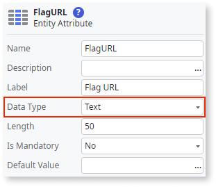
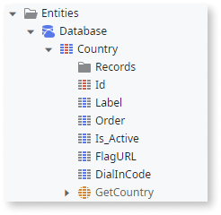
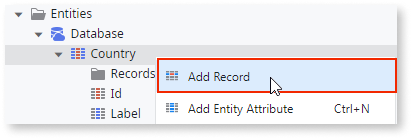
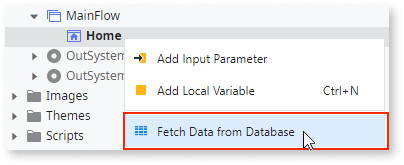
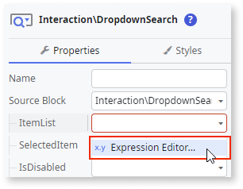
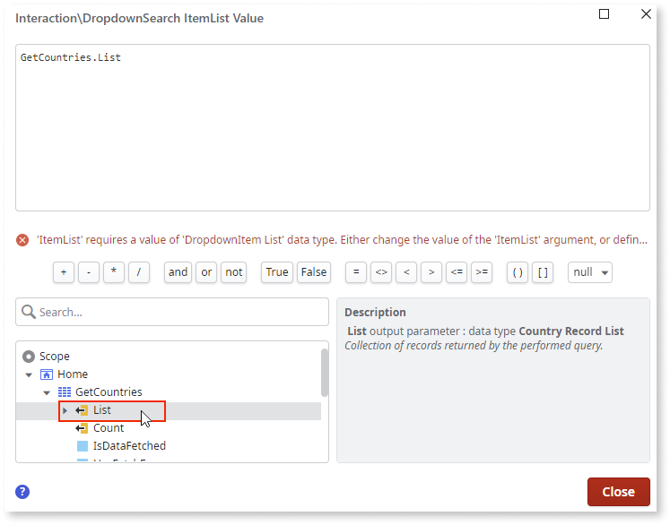
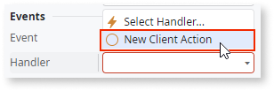

---
tags:
summary: Learn how to implement a dropdown search with country dial codes and flags.
guid: ebed2507-61c6-49a4-bbe0-cdfecd253dbc
locale: en-us
app_type: traditional web apps, mobile apps, reactive web apps
platform-version: o11; odc;
figma: https://www.figma.com/file/kY6LwaHBP6HdTslYHlSadB/Front-End?node-id=1242:644
---

# How to implement a dropdown search with country dial-in codes and flags

This article describes how to implement a dropdown search with country dial-in codes and flags using [Dropdown Search OutSystems UI pattern](https://success.outsystems.com/documentation/11/developing_an_application/design_ui/patterns/using_mobile_and_reactive_patterns/interaction/dropdown_search/).

This article guides you on developing this UI pattern from scratch. Alternatively, you can skip some of steps by using some Forge assets. For more information, go to this [section](#forge-assets).

The key steps to create this UI pattern are the following:

1. [Create a static entity to store the list of countries with flags and dial-in codes](#static-entity).
1. [Add the country data to the static entity](#country-data).
1. [Display the data in a dropdown search](#display).
1. [[Optional] Change the style of the flag icons](#flag-style)

## Create a static entity to store the list of countries with flags and dial-in codes { #static-entity }

To setup the list of countries in your app, follow these steps:

1. In **Service Studio**, go to the **Data** tab, right-click the **Entities** folder, and select **Add Static Entity to Database**.

    

1. Rename the entity to `Country`.

1. Right-click the **Country** static entity, select **Add Entity Attribute**, and name it `FlagURL`.

1. On the **Properties** tab, set the **Data Type** to **Text**.

    

1. Add a new entity attribute, name it `DialInCode`, and set it's data type to **Integer**. 

After completing these steps, this is the expected outcome:



## Add the countries data to the entity { #country-data }

To add the countries data to the static entity, follow these steps:

1. Right-click the **Country** static entity and select **Add Record**.

    

1. Name the new record with the name or abbreviation of the country's name, for example `USA`.

1. Set the following attributes:

    1. Set **Label** to the country's name, for example `United States of America`.

    1. Set **FlagURL** to a URL with the country's flag. Wikipedia can be a good source for the flag image URL. In this case, you can set **FlagURL** to  `https://upload.wikimedia.org/wikipedia/en/thumb/a/a4/Flag_of_the_United_States.svg/16px-Flag_of_the_United_States.svg.png`.

    1. Set **DialInCode** to the country's dial in code, for example `1`.

1. Repeat these steps for each country you want to include in the dropdown.

## Display the data in a dropdown search { #display }

Now, let's display the country data you added in a dropdown search. If you haven't done it yet, [create a new empty Screen](https://success.outsystems.com/documentation/11/developing_an_application/design_ui/screen/). Otherwise, do the following in the screen where you want to include the dropdown search:

To get the data from the static entity, follow these steps:

1. Right-click the newly created screen and select **Fetch Data from Database**.

1. Click the empty space in the opened aggregate.

1. Select the Country static entity.

    

To use the dropdown search pattern, follow these steps:

1. Open the Screen, and in the Toolbox, search for ``dropdown``.

1. Drag and drop the **Dropdown Search** widget to the screen.

1. On the **Properties** tab, click the **OptionsList** dropdown and select **Expression Editor**.

    

1. In the Expression Editor dialog, in the list of elements in Scope, expand the **GetCountries** aggregate and double-click the **List** element to select it.

    

To map the data in the aggregate to what is shown in the dropdown, follow these steps:

1. In the properties of the **Dropdown Search**, enter the following values:

    * Set **Value** as `Country.Id`.
    * Set **Label** as `"(+" + Country.DialInCode + ") " + Country.Label`.
    * Set **ImageUrlOrIconClass** as `Country.FlagURL`.

1. In the **Events** section of the properties panel, for the **OnChanged** event, open the **Handler** dropdown and choose **New Client Action**.

    

    <div class="info" markdown="1">

    Add the logic that uses the value selected in the dropdown in this newly created action.

    </div>

1. Publish the module by click **1-Click Publish**.

## [Optional] Change the style of the flag icons { #flag-style }

The default look of the icons in the dropdown is circular. To change the look of the icons in the dropdown, follow these steps:

1. On the **Interface** tab, expand the **Themes** folder and double-click the already available theme.

1. Add the following CSS to the theme:

    ```css
    .osui-dropdown-option-image {
        border-radius: 0;
        background: none;
        height: 16px;
        width: 16px;
    } 
    ```

1. Publish the module by click **1-Click Publish**.

## Forge assets to the rescue { #forge-assets }

You can skip some steps with the help of a few Forge components. Here's how:

<div class="info" markdown="1">

Bear in mind that none of the following components are supported by OutSystems.

</div>

* Get the list of all existing countries and dial-in codes:
    * [Geo](https://www.outsystems.com/forge/component-overview/439/geo)
    * [Location](https://www.outsystems.com/forge/component-overview/906/location)
    * [Countries](https://www.outsystems.com/forge/component-overview/7931/countries)
* Get countries and its flags
    * [Flags Services](https://www.outsystems.com/forge/component-overview/14259/flags-services)
    * [Country Flags](https://www.outsystems.com/forge/component-overview/11309/country-flags)
    * [Countries Flags](https://www.outsystems.com/forge/component-overview/12668/countries-flags)
