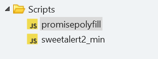
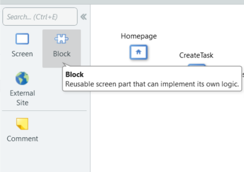
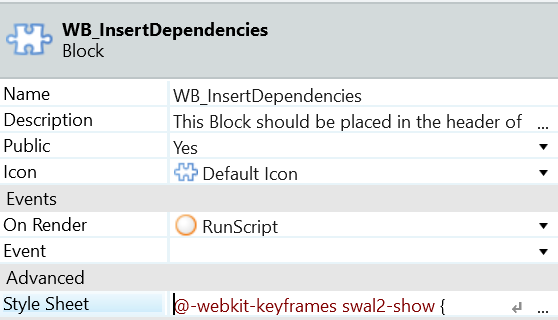
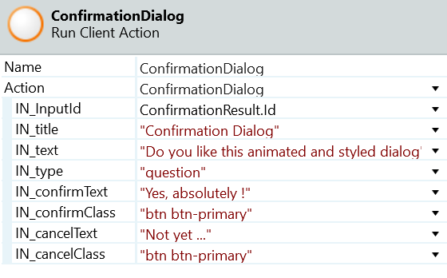
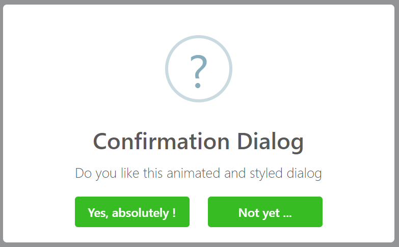

# How to create animated and styled dialog messages

This article was written by [Rúben Bonito](https://www.outsystems.com/profile/87379/), OutSystems MVP.

This article shows how to implement animated and styled dialog messages on **OutSystems Reactive Web Apps**.

To do it:

1. Upload the 2 JavaScript libraries ([promisepolyfill](https://www.jsdelivr.com/package/npm/promise-polyfill) and [sweetalert2_min](https://www.jsdelivr.com/package/npm/sweetalert2)) into your OutSystems application, by clicking the Scripts folder, with the opposite button and select Import Script.

    

    

1. Create a Block by dragging it to the editor area:

    

1. Inside the block, go to the advanced properties of the block and paste the style sheet, provided by the same source as the libraries:

    

1. On the event "On Render" associate a client action to execute the following JavaScript code:

        var latetoast = sessionStorage.getItem("latetoast");

        if (latetoast === "True") {
            sessionStorage.setItem("latetoast", "False");
            //
            swal({
                title: sessionStorage.getItem("IN_title"),
                text: sessionStorage.getItem("IN-text"),
                allowOutsideClick: false,
                allowEscapeKey: false,
                allowEnterKey: false;
                showConfirmButton: false,
                showCancelButton: false,
                timer: sessionStorage.getItem("IN_timeout"),
                toast: true,
                type:sessionStorage.getItem("IN_type"),
                Position: 'center'
            });
        }    

1. Drag the block to your application's layout header.

    

    To make this how-to shorter, it only describes the implementation for the most complex type of dialog messages, the confirmation dialog message. All the other types have a very similar or easier implementation process.

    

1. Create a client action with all the inputs visible in the following picture:

    

1. Inside the action flow, add a JS node and execute a JavaScript with the following code:

        swal({
            type: $parameters.IN_type,
            title: $parameters.IN_title,
            text: $parameters.IN_text,

            showCancelButton: true,
            reverseButtons: false,
            cancelButtonColor: '#d33',
            cancelButtonText: $parameters.IN_cancelTxt,
            cancelButtonClass: $parameters.IN_cancelClass,
            confirmButtonClass: $parameters.IN_confirmClass,
            confirmButtonColor: '#3085d6',
            confirmButtonText: $parameters.IN_confirmTxt,
            buttonsStyling: false,
        }).then(function (result) {
            if (result.value) {
                document.getElementById($parameters.IN_InputId,).value = "True";
            } else {
                document.getElementById($parameters.IN_InputId,).value = "False";
            }
            document.getElementById($parameters.IN_InputId,).change();
        });

1. Create a button in your screen that when clicked by the user executes a screen action.

    This screen action has the Confirmation Dialog client action (created on Step 6) which require that you fill in the following inputs:

    

Finally, publish your application and the result, when you click on the confirmation button, is:

This implementation is [available as a reusable component in the Forge](https://www.outsystems.com/forge/component-overview/8395/animated-styled-dialogs-alerts).

