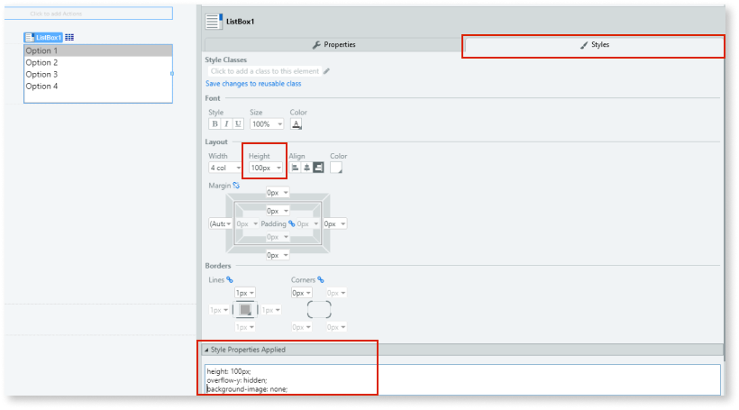
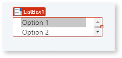
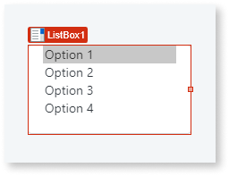

# How to hide the scroll bar of a List Box

How do I hide the vertical scroll bar in a List Box widget?

For example: I set the Layout **Height** property to **100px** so all values are visible at runtime, and now I want to hide the unnecessary scroll bar.

## Answer

1. Drag the **List Box** widget into the **Main Content** area of your screen.

    

1. Select the **Styles** tab, and add the following style properties to the **Style Properties Applied** text box:

        overflow-y: hidden;
        background-image: none;

    `overflow-y: hidden` disables the scroll bar and  `background-image: none` removes the down arrow.

    

    **Note**: Height is already set to 100px.

## Result

**Before**

**After**

