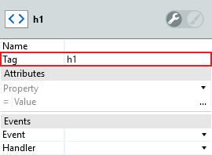

# How to generate HTML tags

How can I generate HTML tags around elements of my Application?

For example: I am concerned with the accessibility of my Application and I want to apply heading styles in a way that provides semantic markup.

When I apply a heading style in Service Studio, the following HTML is generated:
    
    Hello

But I want to ensure semantic markup and use HTML heading tags instead:    

    <h1>Hello</h1>
    
## Answer

To generate HTML tags around elements of your **Mobile App** and **Reactive Web App** use the **HTML Element** Widget and define the `Tag` Property. Note that the `Tag` Property must be a constant value.  Use the `Attributes` fields to define HTML attributes.

To generate HTML tags around elements of your **Traditional Web Application** use a **Container** or **Placeholder** Widget and add `OSTagName` = `"<html_tag>"` as an `Extended Property`, where `<html_tag>` is the HTML tag you want to use. Note that the `OSTagName` `Extended Property` can be a constant or dynamic value. Use the `Extended Properties` fields to define HTML attributes.

Note: When using `OSTagName` it is possible to preview (at design time) the effects of the following HTML tags:
    
    fieldset section pre nav
    h1 h2 h3 h4 h5 h6
    ol ul li p
    button footer header hr small strong
