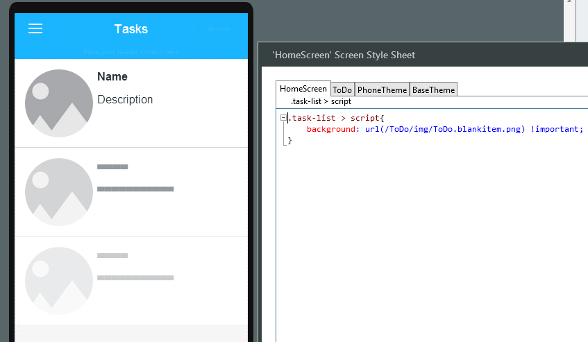
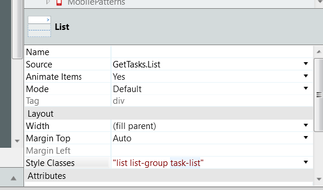

# How to improve list slowness on low-end devices

## Question

How to improve list slowness on low-end devices and provide good scroll experience, preventing some blank spaces from appearing?

## Answer

Create an image to a be the preview for list items without data.

Then, do the following:

1. Import the image to your application.

    

1. Open the CSS Editor and create a new class to use the image as background.
 
        .task-list > script {                               
            background: url(...) !important;
            /* Drag and drop the image to set the URL of the image */
        }

      

1. Add the new CSS class to the **Style Classes** of the List widget.

    
